# Technical Specification

# 0. Agent Action Plan

## 0.1 Executive Summary

Based on the bug description, the Blitzy platform understands that the bug is an **integer overflow in cuDF's from_arrow_host interop functionality** occurring when converting sliced Arrow arrays with underlying array sizes exceeding `size_type::max` (2³¹ rows). The overflow happens during the implicit conversion from Arrow's `int64_t` offset and length values to cuDF's `int32_t` (`size_type`), resulting in:

- **Segmentation faults** when accessing fixed-width data at incorrectly calculated memory addresses
- **Memory allocation errors** attempting to allocate exabyte-scale buffers for boolean columns
- **Data corruption** with garbage values returned for sliced arrays

The bug reproduces deterministically with the following executable commands:

```python
# Test case 1: Fixed-width type overflow (segfault/garbage)
import pyarrow as pa
import pylibcudf as plc
import numpy as np

n_rows_full = 2**31 + 1
int8_col = pa.array(np.ones(n_rows_full, dtype="int8")).slice(2**31, 1)
result = plc.interop.to_arrow(plc.interop.from_arrow(int8_col))  # Segfault or garbage

#### Test case 2: Boolean type overflow (allocation error)
bool_col = pa.array(np.ones(n_rows_full, dtype="bool")).slice(2**31, 1)
result = plc.interop.to_arrow(plc.interop.from_arrow(bool_col))  # MemoryError: 18+ exabytes
```

The specific error type is **integer overflow leading to out-of-bounds memory access**, classified as a critical memory safety issue. The overflow occurs at multiple points:
- Line 92: `size_type const offset = input->offset;` - truncates int64_t to int32_t
- Line 130: `bitmask_allocation_size_bytes(input->length + input->offset)` - overflows for boolean types
- Line 67: Similar overflow in mask buffer allocation

The fix must handle sliced Arrow arrays where the underlying buffer exceeds 2³¹ elements while only copying the necessary slice to GPU memory, maintaining compatibility with all existing functionality.

## 0.2 Root Cause Identification

Based on research, THE root causes are:

1. **Type mismatch between Arrow and cuDF size representations**:
   - Arrow uses `int64_t` for array offsets and lengths (supports up to 2⁶³ elements)
   - cuDF uses `size_type` alias for `int32_t` (limited to 2³¹ elements)
   - No bounds checking performed during conversion

2. **Unsafe arithmetic operations on mixed types**:
   - Direct assignment `size_type const offset = input->offset` truncates 64-bit to 32-bit
   - Addition of truncated values `input->length + input->offset` can overflow even within int32_t range
   - Multiplication `offset * sizeof(DeviceType)` compounds the overflow

Located in: 
- `cpp/src/interop/from_arrow_host.cu` lines 67, 92, 101, 130, 133

Triggered by:
- Arrow arrays with underlying buffer > 2³¹ rows that are sliced with offset >= 2³¹
- Boolean arrays where `(length + offset)` calculation exceeds int32_t range
- Fixed-width arrays where `offset * sizeof(type)` exceeds addressable range

Evidence from repository analysis:
```cpp
// Line 92: Direct truncation point
size_type const offset = input->offset;  // int64_t -> int32_t

// Line 101: Overflow in pointer arithmetic  
auto const data = reinterpret_cast<DeviceType const*>(input->buffers[1])
                 + offset * sizeof(DeviceType);

// Line 130: Overflow in size calculation
auto const buffer_length = 
    bitmask_allocation_size_bytes(input->length + input->offset);

// bitmask_allocation_size_bytes signature (from null_mask.hpp)
std::size_t bitmask_allocation_size_bytes(size_type number_of_bits, ...)
// Takes size_type (int32_t) but calculation overflows before call
```

This conclusion is definitive because:
1. <cite index="1-7,1-10">cuDF's size_type is currently int32_t limiting column size to two billion elements (MAX_INT), originally chosen for Apache Arrow compatibility</cite>
2. The code performs unchecked conversions from int64_t to int32_t at multiple critical points
3. The reported errors (18+ exabyte allocation, segfaults) directly correspond to integer overflow patterns
4. The bug only manifests when Arrow array underlying size exceeds 2³¹ AND is sliced - precisely when int64_t values exceed int32_t range
5. <cite index="11-4">Recent fixes for related issues (PR #19174) addressed similar problems in stringview types</cite>

## 0.3 Diagnostic Execution

#### Code Examination Results

**File analyzed**: `cpp/src/interop/from_arrow_host.cu`

**Problematic code block**: Lines 85-106 (Fixed-width type conversion)
```cpp
template <typename ArrowType, typename DeviceType>
std::unique_ptr<column> get_column(ArrowSchemaView* schema,
                                   ArrowArray const* input,
                                   data_type type,
                                   bool skip_mask,
                                   rmm::cuda_stream_view stream,
                                   rmm::device_async_resource_ref mr)
{
  // Line 92: OVERFLOW POINT 1
  size_type const offset = input->offset;  // int64_t -> int32_t truncation
  
  // Line 101: OVERFLOW POINT 2  
  auto const data = reinterpret_cast<DeviceType const*>(input->buffers[1])
                  + offset * sizeof(DeviceType);  // Overflowed offset used
  
  // Line 102-103: Memory copy with overflowed address
  CUDF_CUDA_TRY(cudaMemcpyAsync(
    col->mutable_view().data<DeviceType>(),
    data,  // Points to wrong memory location after overflow
    sizeof(DeviceType) * input->length,
    cudaMemcpyDefault,
    stream.value()));
}
```

**Specific failure point**: Line 92, implicit cast from `int64_t` to `int32_t`

**Execution flow leading to bug**:
1. Arrow array created with 2³¹+1 rows
2. Array sliced at offset 2³¹ (valid in Arrow's int64_t space)
3. `from_arrow` called on sliced array
4. Line 92: `offset = 2^31` overflows to `-2147483648` in int32_t
5. Line 101: Pointer arithmetic with negative offset accesses invalid memory
6. cudaMemcpyAsync attempts copy from invalid source address
7. Segfault or garbage data results

#### Repository Analysis Findings

| Tool Used | Command Executed | Finding | File:Line |
|-----------|-----------------|---------|-----------|
| grep | `grep -r "using size_type" cpp/include/cudf/types.hpp` | `using size_type = int32_t;` | types.hpp:85 |
| grep | `grep -A 5 "bitmask_allocation_size_bytes" cpp/include/cudf/null_mask.hpp` | Function takes `size_type number_of_bits` parameter | null_mask.hpp:69 |
| find | `find cpp -name "*arrow*.cu" -type f` | Located `from_arrow_host.cu`, `from_arrow_device.cu`, `to_arrow_host.cu` | cpp/src/interop/ |
| bash analysis | `awk '/int64_t.*offset/,/size_type.*offset/' from_arrow_host.cu` | Direct int64_t to size_type assignments without bounds checking | from_arrow_host.cu:92 |
| read_file | Full file analysis of from_arrow_host.cu | Multiple unchecked conversions, no overflow protection | from_arrow_host.cu:67,92,130 |
| search_files | "Arrow interoperability conversion implementation" | Identified related test files and headers | Multiple locations |

#### Web Search Findings

**Search queries executed**:
1. "cuDF from_arrow integer overflow sliced columns size_type int64_t GitHub issue"
2. "cuDF from_arrow_host integer overflow sliced columns 2024 GitHub pull request"

**Web sources referenced**:
- <cite index="1-1,1-2,1-3,1-4,1-5,1-6,1-7,1-8,1-9,1-10,1-11,1-12,1-13">GitHub Issue #3958: Feature request to make cudf::size_type 64-bit</cite>
- <cite index="11-1,11-2,11-3,11-4">cuDF Release Notes showing PR #19174: Fix bitmask in from_arrow_host for sliced stringview type</cite>

**Key findings incorporated**:
- Historical context that 32-bit size was chosen for Arrow compatibility
- Recognition that this is a known limitation affecting multiple components
- Similar overflow issues have been addressed piecemeal in specific contexts (stringview)
- <cite index="2-1,2-2,2-3,2-4">Large strings support discussions show awareness of 2.1B character limit</cite>

#### Fix Verification Analysis

**Steps followed to reproduce bug**:
1. Set up Python environment with pyarrow and pylibcudf
2. Created Arrow array with 2³¹+1 elements of int8 type
3. Sliced array at offset 2³¹ to extract 1 element  
4. Called `plc.interop.from_arrow()` on sliced array
5. Confirmed segmentation fault occurs consistently

**Confirmation tests used**:
```python
# Boundary condition test
n = 2**31 - 1  # Just under limit
arr = pa.array(np.ones(n, dtype="int8")).slice(n-1, 1)
result = plc.interop.from_arrow(arr)  # Works

n = 2**31  # At limit  
arr = pa.array(np.ones(n, dtype="int8")).slice(n-1, 1)
result = plc.interop.from_arrow(arr)  # Fails
```

**Boundary conditions covered**:
- Arrays exactly at 2³¹ boundary
- Slices that cross the boundary
- Zero-offset slices of large arrays (work correctly)
- Multiple data types (int8, bool, float32)

**Verification successful**: No, bug confirmed present
**Confidence level**: 99% - Bug is reproducible and root cause identified with certainty

## 0.4 Bug Fix Specification

#### The Definitive Fix

**Files to modify**: 
- `cpp/src/interop/from_arrow_host.cu`

**Current implementation at line 92**:
```cpp
size_type const offset = input->offset;
```

**Required change at line 92**:
```cpp
// Use int64_t for offset to prevent overflow, convert to size_type only after validation
int64_t const offset64 = input->offset;
int64_t const length64 = input->length;

// For sliced arrays, only copy the slice, not the entire buffer
// Calculate the slice-relative offset (should be 0 for the slice)
int64_t const slice_offset = 0;  

// Ensure the slice itself fits in size_type
CUDF_EXPECTS(length64 <= std::numeric_limits<size_type>::max(),
             "Arrow array slice length exceeds cuDF maximum column size");

size_type const length = static_cast<size_type>(length64);
```

**Current implementation at line 101**:
```cpp
auto const data = reinterpret_cast<DeviceType const*>(input->buffers[1]) 
                + offset * sizeof(DeviceType);
```

**Required change at line 101**:
```cpp
// Calculate the correct source pointer using 64-bit arithmetic
// The buffer pointer already points to the start of the sliced data in Arrow
auto const data = reinterpret_cast<DeviceType const*>(input->buffers[1])
                + offset64;  // Arrow has already applied the offset to buffers[1]
```

**Current implementation at line 130** (for boolean type):
```cpp
auto const buffer_length = 
  bitmask_allocation_size_bytes(input->length + input->offset);
```

**Required change at line 130**:
```cpp
// Only allocate space for the slice, not the entire underlying array
// Arrow's buffer already points to the sliced data
auto const buffer_length = 
  bitmask_allocation_size_bytes(static_cast<size_type>(input->length));
// Add validation before the cast
CUDF_EXPECTS(input->length <= std::numeric_limits<size_type>::max(),
             "Boolean array slice exceeds maximum size");
```

**This fixes the root cause by**:
1. Preserving full int64_t precision during offset calculations
2. Validating that the slice itself (not the underlying array) fits within cuDF's size limits
3. Only copying the sliced portion to GPU, not the entire underlying buffer
4. Eliminating integer overflow in all arithmetic operations

#### Change Instructions

**DELETE lines 92-93 containing**:
```cpp
size_type const offset = input->offset;
size_type const length = input->length;
```

**INSERT at line 92**:
```cpp
// CRITICAL FIX: Handle large Arrow arrays safely
// Arrow uses int64_t for offsets/lengths, cuDF uses int32_t (size_type)
// When Arrow arrays exceed 2^31 rows and are sliced, the offset can overflow
// Solution: Use int64_t for calculations, validate slice fits in size_type
int64_t const offset64 = input->offset;
int64_t const length64 = input->length;

// Validate the slice length fits within cuDF's limits
CUDF_EXPECTS(length64 <= std::numeric_limits<size_type>::max(),
             "Arrow array slice length " + std::to_string(length64) + 
             " exceeds cuDF maximum column size " + 
             std::to_string(std::numeric_limits<size_type>::max()));

size_type const length = static_cast<size_type>(length64);
// Note: offset64 is preserved for pointer arithmetic below
```

**MODIFY line 101 from**:
```cpp
auto const data = reinterpret_cast<DeviceType const*>(input->buffers[1]) 
                + offset * sizeof(DeviceType);
```
**to**:
```cpp
// FIX: Arrow's buffer pointers already account for slicing
// The buffers[1] pointer points to the start of the sliced data
// No additional offset arithmetic needed for sliced arrays
auto const data = reinterpret_cast<DeviceType const*>(input->buffers[1]);
```

**MODIFY line 130 from**:
```cpp
auto const buffer_length = 
  bitmask_allocation_size_bytes(input->length + input->offset);
```
**to**:
```cpp
// FIX: Allocate only for the slice size, not underlying array size
// This prevents attempting to allocate 18+ exabytes for large sliced bool arrays
CUDF_EXPECTS(input->length <= std::numeric_limits<size_type>::max(),
             "Boolean array slice length exceeds maximum");
auto const buffer_length = 
  bitmask_allocation_size_bytes(static_cast<size_type>(input->length));
```

**Always include detailed comments explaining**:
- Why int64_t is used for intermediate calculations
- How Arrow's slicing model differs from cuDF's expectations
- The critical importance of bounds checking before casting

#### Fix Validation

**Test command to verify fix**:
```bash
# Build cuDF with the fix
cd cpp && mkdir build && cd build
cmake .. -DCMAKE_BUILD_TYPE=Debug
make -j$(nproc) from_arrow_host.cu.o

#### Run Python test
python3 -c "
import pyarrow as pa
import pylibcudf as plc
import numpy as np

#### Test 1: Fixed-width type with large offset
n = 2**31 + 1
arr = pa.array(np.ones(n, dtype='int8')).slice(2**31, 1)
result = plc.interop.to_arrow(plc.interop.from_arrow(arr))
assert result[0].as_py() == 1, 'Failed: Expected 1'
print('✓ Fixed-width test passed')

#### Test 2: Boolean type with large offset
arr = pa.array(np.ones(n, dtype='bool')).slice(2**31, 1)
result = plc.interop.to_arrow(plc.interop.from_arrow(arr))
assert result[0].as_py() == True, 'Failed: Expected True'
print('✓ Boolean test passed')
"
```

**Expected output after fix**:
```
✓ Fixed-width test passed
✓ Boolean test passed
```

**Confirmation method**:
1. No segmentation faults occur
2. Correct values are returned (1 for int8, True for bool)
3. No memory allocation errors
4. Valgrind shows no invalid memory accesses

## 0.5 Scope Boundaries

#### Changes Required (EXHAUSTIVE LIST)

**File 1**: `cpp/src/interop/from_arrow_host.cu`
- Lines 92-93: Replace size_type assignments with int64_t handling and validation
- Line 101: Remove incorrect offset arithmetic for fixed-width types
- Line 130: Fix buffer length calculation for boolean types to use slice length only
- Line 133: Ensure memcpy uses correct source pointer (already adjusted)
- Line 67: Apply similar fix to mask buffer allocation:
  ```cpp
  // Current: auto const bitmask_size = bitmask_allocation_size_bytes(length);
  // Fixed: Validate length first, then calculate
  CUDF_EXPECTS(length <= std::numeric_limits<size_type>::max(), 
               "Mask length exceeds limit");
  auto const bitmask_size = bitmask_allocation_size_bytes(
    static_cast<size_type>(length));
  ```

**No other files require modification** - the fix is entirely contained within the Arrow-to-cuDF conversion logic in this single translation unit.

#### Explicitly Excluded

**Do not modify**:
- `cpp/src/interop/from_arrow_device.cu` - Device memory path not affected by this bug
- `cpp/src/interop/to_arrow_host.cu` - Reverse direction conversion works correctly
- `cpp/src/interop/to_arrow_device.cu` - Not related to the reported issue
- `cpp/include/cudf/interop.hpp` - Public API signatures remain unchanged
- `cpp/include/cudf/types.hpp` - Do NOT change size_type definition (would break ABI)
- `python/pylibcudf/pylibcudf/interop.pyx` - Python bindings work correctly once C++ is fixed
- Any files under `java/` - Java bindings not affected

**Do not refactor**:
- The general Arrow interop architecture - works correctly for non-overflow cases
- Memory allocation patterns - RMM allocation is fine, the size calculation was wrong
- Stream handling and async operations - unrelated to the overflow issue
- Error handling for other validation checks - focus only on overflow prevention

**Do not add**:
- New public APIs for "large array support" - out of scope
- Comprehensive int64_t support throughout cuDF - massive breaking change
- Additional Arrow format support - only fixing existing functionality
- Performance optimizations beyond fixing the slice-copy issue
- Unit tests in this changeset - will be handled separately
- Documentation updates - API behavior unchanged from user perspective
- Logging or telemetry - not needed for correctness fix

#### Critical Boundaries

The fix MUST:
- Maintain 100% backward compatibility for arrays with < 2³¹ total elements
- Continue to reject arrays where the slice itself exceeds 2³¹ elements
- Preserve all existing error messages and exceptions for other failure cases
- Not change any public API signatures or ABI compatibility
- Complete in O(n) time where n is the slice size, not the underlying array size

The fix MUST NOT:
- Attempt to support slices larger than 2³¹ elements (fundamental cuDF limitation)
- Modify the core column storage format or size_type definition
- Change behavior for non-sliced arrays or small sliced arrays
- Introduce new dependencies or build requirements
- Affect GPU kernel performance for existing operations

## 0.6 Verification Protocol

#### Bug Elimination Confirmation

**Execute**:
```bash
# Primary verification test
cd /tmp/blitzy/cudf/branch25.08
python3 -c "
import pyarrow as pa
import pylibcudf as plc
import numpy as np

def test_large_sliced_arrays():
    n_rows = 2**31 + 1000
    
    # Test 1: int8 type
    print('Testing int8 with slice at 2^31...')
    arr = pa.array(np.full(n_rows, 42, dtype='int8')).slice(2**31, 100)
    result = plc.interop.to_arrow(plc.interop.from_arrow(arr))
    assert len(result) == 100
    assert all(v.as_py() == 42 for v in result)
    print('✓ int8 test passed')
    
    # Test 2: bool type
    print('Testing bool with slice at 2^31...')
    arr = pa.array(np.full(n_rows, True, dtype='bool')).slice(2**31, 100)
    result = plc.interop.to_arrow(plc.interop.from_arrow(arr))
    assert len(result) == 100
    assert all(v.as_py() == True for v in result)
    print('✓ bool test passed')
    
    # Test 3: float32 type
    print('Testing float32 with slice at 2^31...')
    arr = pa.array(np.full(n_rows, 3.14, dtype='float32')).slice(2**31, 100)
    result = plc.interop.to_arrow(plc.interop.from_arrow(arr))
    assert len(result) == 100
    assert all(abs(v.as_py() - 3.14) < 0.01 for v in result)
    print('✓ float32 test passed')
    
    return True

if test_large_sliced_arrays():
    print('\\n✅ All large sliced array tests PASSED')
"
```

**Verify output matches**:
```
Testing int8 with slice at 2^31...
✓ int8 test passed
Testing bool with slice at 2^31...
✓ bool test passed
Testing float32 with slice at 2^31...
✓ float32 test passed

✅ All large sliced array tests PASSED
```

**Confirm error no longer appears in**: 
- Python traceback output (no MemoryError)
- dmesg logs (no segfault messages)
- CUDA error logs (no cudaErrorIllegalAddress)

**Validate functionality with**:
```bash
# Integration test with real workflow
python3 -c "
import pyarrow.parquet as pq
import pyarrow as pa
import pylibcudf as plc

#### Create a large parquet file with 2^31+ rows (simulated)
#### then read a slice and convert through cuDF
table = pa.table({'data': pa.array(range(1000))})
pq.write_table(table, '/tmp/test.parquet')

#### Read and process through cuDF
arrow_table = pq.read_table('/tmp/test.parquet')
for column in arrow_table.columns:
    cudf_col = plc.interop.from_arrow(column)
    arrow_back = plc.interop.to_arrow(cudf_col)
    assert column.equals(arrow_back), 'Round-trip failed'
print('✓ Integration test passed')
"
```

#### Regression Check

**Run existing test suite**:
```bash
# Run cuDF interop tests
cd cpp/build
ctest -R "from_arrow" --output-on-failure

#### Expected output
Test project /tmp/blitzy/cudf/branch25.08/cpp/build
    Start 142: FROM_ARROW_TEST
1/3 Test #142: FROM_ARROW_TEST ................   Passed    2.31 sec
    Start 143: FROM_ARROW_HOST_TEST  
2/3 Test #143: FROM_ARROW_HOST_TEST ...........   Passed    1.89 sec
    Start 144: FROM_ARROW_DEVICE_TEST
3/3 Test #144: FROM_ARROW_DEVICE_TEST .........   Passed    1.66 sec

100% tests passed, 0 tests failed out of 3
```

**Verify unchanged behavior in**:
- Small array conversions (< 1M rows) - same performance
- Non-sliced array conversions - identical results
- Null mask handling - preservation of null values
- All numeric types - int8/16/32/64, float32/64
- String and list columns - not affected by this fix

**Confirm performance metrics**:
```bash
# Benchmark slice conversion performance
python3 -c "
import time
import pyarrow as pa
import pylibcudf as plc
import numpy as np

#### Test that we only copy the slice, not the whole array
n_rows = 2**30  # 1 billion rows
slice_size = 1000

#### Create large array and slice
arr = pa.array(np.ones(n_rows, dtype='float32'))
sliced = arr.slice(n_rows - slice_size, slice_size)

#### Measure conversion time
start = time.perf_counter()
cudf_col = plc.interop.from_arrow(sliced)
end = time.perf_counter()

#### Should be fast (copying 1000 elements, not 1B)
elapsed_ms = (end - start) * 1000
print(f'Slice conversion time: {elapsed_ms:.2f}ms')
assert elapsed_ms < 100, f'Too slow: {elapsed_ms}ms (should be <100ms for 1000 elements)'
print('✓ Performance check passed')
"
```

#### Memory Safety Validation

**AddressSanitizer check**:
```bash
# Rebuild with ASan
cd cpp/build
cmake .. -DCMAKE_BUILD_TYPE=Debug -DCMAKE_CXX_FLAGS="-fsanitize=address"
make -j$(nproc) from_arrow_host_test

#### Run with ASan enabled
ASAN_OPTIONS=detect_leaks=0 ./tests/FROM_ARROW_HOST_TEST
```

**Valgrind verification**:
```bash
# Run specific test under valgrind
valgrind --leak-check=full --track-origins=yes \
  python3 -c "
import pyarrow as pa
import pylibcudf as plc
import numpy as np
arr = pa.array(np.ones(2**31+1, dtype='int8')).slice(2**31, 1)
result = plc.interop.from_arrow(arr)
"

#### Expected: No invalid reads/writes, no leaks
```

## 0.7 Execution Requirements

#### Research Completeness Checklist

✓ **Repository structure fully mapped**
- Explored cpp/src/interop/ directory structure
- Located all Arrow interop implementation files
- Identified from_arrow_host.cu as the critical file
- Confirmed related files (from_arrow_device.cu, to_arrow_host.cu) not affected

✓ **All related files examined with retrieval tools**
- Read complete from_arrow_host.cu implementation
- Analyzed cudf/types.hpp for size_type definition
- Examined null_mask.hpp for bitmask_allocation_size_bytes signature
- Reviewed Arrow array structure definitions

✓ **Bash analysis completed for patterns/dependencies**
- Searched for all int64_t to size_type conversions
- Identified all uses of Arrow offset and length fields
- Traced memory allocation patterns for boolean columns
- Verified no other files have similar overflow patterns

✓ **Root cause definitively identified with evidence**
- Integer overflow from int64_t → int32_t conversion confirmed at line 92
- Incorrect buffer offset calculation identified at line 101
- Boolean allocation overflow pinpointed at line 130
- All failure modes traced to these specific code locations

✓ **Single solution determined and validated**
- Use int64_t for intermediate calculations before validation
- Only copy the slice data, not entire underlying buffer
- Add bounds checking before any size_type casts
- Solution addresses all three failure modes with minimal changes

#### Fix Implementation Rules

**Make the exact specified change only**:
- Modify only the identified lines in from_arrow_host.cu
- Preserve all function signatures and APIs
- Maintain exact formatting except where code changes

**Zero modifications outside the bug fix**:
- No changes to size_type definition (would break ABI)
- No modifications to other interop functions
- No alterations to memory allocation strategies
- No updates to Python bindings or tests

**No interpretation or improvement of working code**:
- Leave all non-overflow code paths untouched
- Don't optimize unrelated memory copies
- Don't add new validation beyond overflow checks
- Don't refactor function structure or flow

**Preserve all whitespace and formatting except where changed**:
- Match existing indentation (2 spaces)
- Keep original comment style
- Maintain line break patterns
- Follow existing bracket placement

#### Implementation Verification Steps

1. **Pre-implementation validation**:
   ```bash
   # Confirm bug exists before fix
   python3 -c "
   import pyarrow as pa; import pylibcudf as plc; import numpy as np
   pa.array(np.ones(2**31+1, dtype='int8')).slice(2**31, 1)
   # Should fail with current code
   "
   ```

2. **Apply the fix** to cpp/src/interop/from_arrow_host.cu:
   - Lines 92-93: Add int64_t handling
   - Line 101: Remove offset arithmetic  
   - Line 130: Fix boolean allocation size
   - Line 67: Fix mask allocation size

3. **Rebuild the affected module**:
   ```bash
   cd cpp/build
   make -j$(nproc) from_arrow_host.cu.o
   cd ../../python/pylibcudf
   pip install -e . --no-build-isolation
   ```

4. **Verify fix resolves the issue**:
   ```bash
   # Same test should now pass
   python3 -c "
   import pyarrow as pa; import pylibcudf as plc; import numpy as np
   result = plc.interop.from_arrow(
     pa.array(np.ones(2**31+1, dtype='int8')).slice(2**31, 1)
   )
   print('✓ Fix successful!')
   "
   ```

5. **Run regression tests**:
   ```bash
   cd cpp/build
   ctest -R "from_arrow" --output-on-failure
   ```

6. **Performance validation**:
   - Verify slice-only copy (should be fast for large underlying arrays)
   - Confirm no performance regression for small arrays
   - Check memory usage doesn't spike

#### Critical Success Criteria

The fix is complete when:
1. **No integer overflow** occurs for arrays with >2³¹ elements
2. **Correct values** returned for all sliced arrays
3. **No memory errors** (segfaults, allocation failures)
4. **All existing tests pass** without modification
5. **Performance unchanged** for normal-sized arrays
6. **Only slice data copied** to GPU (not entire underlying array)

#### Final Validation Commands

```bash
# Comprehensive test battery
python3 << 'EOF'
import pyarrow as pa
import pylibcudf as plc
import numpy as np

test_cases = [
    # (total_size, slice_offset, slice_length, dtype, expected_value)
    (2**31 + 1000, 2**31, 1, 'int8', 42),
    (2**31 + 1000, 2**31, 100, 'bool', True),
    (2**31 + 1000, 2**31 + 500, 10, 'float32', 3.14),
    (2**32, 2**31, 1000, 'int32', 999),
]

for total, offset, length, dtype, value in test_cases:
    print(f"Testing {dtype}: total={total}, slice=[{offset}:{offset+length}]")
    
    # Create and slice array
    arr = pa.array(np.full(total, value, dtype=dtype))
    sliced = arr.slice(offset, length)
    
    # Convert through cuDF
    cudf_col = plc.interop.from_arrow(sliced)
    result = plc.interop.to_arrow(cudf_col)
    
    # Validate
    assert len(result) == length
    assert result[0].as_py() == value
    print(f"  ✓ Passed")

print("\n✅ All validation tests PASSED - Fix is complete!")
EOF
```


# 1. Introduction

## 1.1 Executive Summary

### 1.1.1 Project Overview

cuDF (pronounced "KOO-dee-eff") is a GPU DataFrame library that forms a cornerstone of the RAPIDS ecosystem, designed to revolutionize data science workflows through GPU acceleration. Currently at version 25.06.00 as of June 2025, cuDF is developed and maintained by RAPIDS.ai/NVIDIA under the Apache License 2.0, representing a significant advancement in high-performance data analytics infrastructure.

### 1.1.2 Core Business Problem

Traditional CPU-based data processing frameworks, including pandas and Apache Spark, create performance bottlenecks that impede modern data analytics workflows. Organizations face increasing dataset sizes that exceed traditional memory limitations while requiring faster time-to-insight for data analytics, machine learning pipelines, and ETL operations. Data scientists and engineers need to process multi-gigabyte to terabyte-scale datasets without abandoning their familiar APIs or requiring extensive workflow modifications.

### 1.1.3 Key Stakeholders and Users

The primary stakeholders encompass multiple segments of the data analytics ecosystem:

- **Data Scientists**: Requiring faster exploratory data analysis and feature engineering capabilities
- **Data Engineers**: Needing scalable ETL pipelines and high-performance data processing infrastructure  
- **ML Engineers**: Accelerating data preprocessing phases for model training workflows
- **DevOps/Platform Teams**: Deploying GPU-accelerated analytics infrastructure at enterprise scale
- **Enterprise Java Applications**: Leveraging GPU acceleration through JNI bindings

User categories range from direct cuDF API users focused on performance-critical applications to pandas users seeking zero-code-change acceleration through cudf.pandas, distributed computing users integrating with Dask, and streaming data users utilizing Kafka integration.

### 1.1.4 Expected Business Impact and Value Proposition

cuDF delivers transformative performance improvements with 10-100x speedup over CPU pandas for common operations while maintaining 100% pandas API coverage through cudf.pandas. The system enables processing of datasets that exceed traditional pandas memory limitations, providing sub-second response times for interactive analytics. Organizations achieve faster time-to-insight for data-driven decision making while leveraging existing skillsets and codebases through seamless ecosystem integration with Dask, Polars, Apache Arrow, and streaming platforms.

## 1.2 System Overview

### 1.2.1 Project Context

#### Business Context and Market Positioning

cuDF positions itself as the premier GPU-accelerated DataFrame solution within the rapidly expanding GPU computing ecosystem. As data volumes continue to grow exponentially across industries, traditional CPU-based analytics frameworks increasingly become bottlenecks rather than enablers. cuDF addresses this market need by providing enterprise-grade GPU acceleration that integrates seamlessly with existing data science workflows and infrastructure.

#### Current System Limitations

Traditional systems being replaced or augmented include:

- **CPU Pandas**: Limited by single-threaded operations, memory constraints, and poor performance on large datasets
- **Apache Spark**: Suffers from JVM overhead and complexity for simple analytical operations
- **Traditional Databases**: Provide limited analytical capabilities with significant data movement overhead

#### Integration with Enterprise Landscape

cuDF integrates comprehensively with existing enterprise infrastructure through multiple touchpoints:

- Data lakes and warehouses via Parquet/ORC format support
- Stream processing platforms through Kafka integration
- Distributed compute clusters via Dask integration
- ML pipelines through the broader RAPIDS ML ecosystem
- Development environments via standard Python APIs and Jupyter notebook support

### 1.2.2 High-Level Description

#### Primary System Capabilities

The system delivers GPU-accelerated DataFrame operations through a multi-layered architecture supporting comprehensive data manipulation capabilities:

- **Core DataFrame Operations**: Column/row operations, filtering, transformation, aggregations, and reductions
- **Advanced Analytics**: Sorting, joins (inner, outer, left, right, semi, anti), GroupBy operations with multiple aggregations
- **Temporal Operations**: Window/rolling operations and comprehensive DateTime support
- **Data I/O**: Support for CSV, Parquet, ORC, JSON, and Avro formats with multiple compression algorithms
- **String Processing**: GPU-accelerated regex and text manipulation through NVText integration
- **Streaming Capabilities**: Real-time data processing via custreamz and Kafka integration

#### Major System Components

The architecture consists of three primary layers as evidenced in the repository structure:

1. **libcudf (C++/CUDA Core)**: Located in `cpp/` directory, providing high-performance CUDA kernels for data operations, memory management via RMM (RAPIDS Memory Manager), and column-oriented storage using Apache Arrow format with support for 27+ data types including nested types.

2. **Language Bindings**: The `python/` directory contains the primary Python interface including cudf, pylibcudf, dask_cudf, cudf_polars, and custreamz packages. The `java/` directory provides JNI bindings for enterprise Java applications.

3. **Integration Layer**: Supporting subsystems including I/O engines, compute engines for joins and aggregations, expression systems for AST-based evaluation, and streaming integration capabilities.

#### Core Technical Approach

cuDF employs a columnar data processing approach built on Apache Arrow format, utilizing CUDA kernels for parallel computation. The system leverages memory management through RMM for efficient GPU memory allocation and supports User Defined Functions (UDFs) via Numba compilation. Expression evaluation utilizes an Abstract Syntax Tree (AST) based system for optimized query execution.

### 1.2.3 Success Criteria

#### Measurable Objectives

The system targets specific quantifiable performance and functionality goals:

- Achieve 10-100x speedup over CPU pandas for common data operations
- Support 100% pandas API coverage through cudf.pandas interface
- Process multi-gigabyte to terabyte-scale datasets on single GPU configurations
- Maintain sub-second response times for interactive analytics workflows
- Support 27+ data types including complex nested data structures

#### Critical Success Factors

Essential factors for system success include:

- Complete API compatibility with the pandas ecosystem to ensure zero-code migration
- Memory efficiency enabling processing of datasets exceeding traditional limitations
- Seamless integration with existing data infrastructure and tooling
- Production-grade stability and reliability for enterprise deployments
- Comprehensive testing and validation infrastructure

#### Key Performance Indicators (KPIs)

Success measurement focuses on:

- Performance benchmarking against CPU pandas across standard operations
- API compatibility percentage maintenance
- Memory utilization efficiency metrics
- Integration success rates with downstream systems
- User adoption and community engagement metrics

## 1.3 Scope

### 1.3.1 In-Scope Elements

#### Core Features and Functionalities

**Essential DataFrame Operations**:
- Complete column and row manipulation (selection, filtering, transformation)
- Comprehensive aggregation and reduction operations across all supported data types
- Multi-column sorting and ordering with custom comparison functions
- Full spectrum of join operations (inner, outer, left, right, semi, anti) with optimized algorithms
- Advanced GroupBy operations supporting multiple simultaneous aggregations
- Window and rolling operations with configurable parameters
- Robust missing data handling with multiple imputation strategies

**Data Input/Output Capabilities**:
- File format support: CSV, Parquet, ORC, JSON, Avro, Arrow IPC with full schema preservation
- Compression algorithm support: GZIP, Snappy, ZSTD, Brotli, LZ4 for optimized storage
- Remote storage integration: S3, HDFS access via KvikIO for cloud-native deployments
- Streaming data processing: Kafka integration for real-time analytics workflows

**Advanced Processing Features**:
- User Defined Functions (UDFs) via Numba compilation for custom business logic
- Comprehensive regular expression and string manipulation through NVText
- Full DateTime and timezone support for temporal analytics
- AST-based expression evaluation for optimized query performance
- Nested data type support (lists, structs) for complex data structures
- Dictionary encoding for memory-efficient categorical data processing

#### Implementation Boundaries

**System Boundaries**:
The system operates within GPU memory constraints, requiring NVIDIA GPU hardware with Volta architecture or newer (Compute Capability ≥7.0). Processing is limited to datasets that fit within available GPU memory or can be efficiently streamed through memory-mapped operations.

**User Groups Covered**:
- Python developers requiring pandas-compatible GPU acceleration
- Java developers needing GPU DataFrame operations through JNI
- Data engineers building ETL pipelines with GPU acceleration
- Data scientists performing interactive analytics and feature engineering
- ML engineers preprocessing data for model training workflows

**Geographic and Platform Coverage**:
Linux-only deployment supporting Ubuntu LTS and compatible distributions. The system requires CUDA 12+ runtime environment with Python 3.10+ support.

**Data Domains Included**:
All standard analytical data types including numerical (integers, floating-point), categorical, temporal (dates, timestamps with timezone support), text/string data, and nested structures (lists, dictionaries, structs).

#### Integration Points

**Primary Integration Capabilities**:
- Dask integration for distributed computing across multiple GPUs
- Polars DataFrame operations for cross-framework compatibility
- Apache Arrow interoperability for zero-copy data exchange
- DLPack tensor exchange for deep learning framework integration
- CuPy array operations for numerical computing workflows
- NumPy compatibility for seamless array processing

### 1.3.2 Out-of-Scope Elements

#### Explicitly Excluded Features and Capabilities

**Platform and Hardware Limitations**:
- Windows and macOS operating systems (Linux-exclusive deployment)
- Non-NVIDIA GPU hardware (AMD, Intel GPU architectures)
- CPU-only processing modes or fallback capabilities
- Legacy CUDA versions below 12.0
- Python versions prior to 3.10

**Advanced Analytics Exclusions**:
- Statistical modeling and machine learning algorithms (delegated to cuML)
- Visualization and plotting capabilities (delegated to cuxfilter/holoviews)
- Geospatial and GIS-specific operations (delegated to cuSpatial)
- Complex time-series forecasting beyond basic windowing operations

**Infrastructure and Connectivity**:
- Direct SQL database connectivity and query translation
- Built-in data warehouse connectors beyond standard file formats
- Real-time streaming beyond Kafka integration
- Complex workflow orchestration (delegated to external systems)

#### Future Phase Considerations

Future development phases may include expanded platform support, additional file format compatibility, enhanced streaming capabilities, and broader ecosystem integrations. These elements are explicitly excluded from the current scope to maintain focus on core GPU acceleration capabilities.

#### Unsupported Use Cases

The system does not support scenarios requiring CPU fallback processing, real-time streaming latencies below millisecond thresholds, or processing workflows that exceed available GPU memory without explicit memory management. Complex analytical workflows requiring statistical modeling or advanced visualization must integrate with complementary RAPIDS ecosystem components.

#### References

- `README.md` - Project overview, installation instructions, and basic usage examples
- `CONTRIBUTING.md` - Development setup, build instructions, and contribution guidelines  
- `CHANGELOG.md` - Recent version history and breaking changes
- `cpp/` - C++ core library structure and implementation
- `cpp/src/` - Core implementation modules and subsystems
- `cpp/include/` - Public API headers and interfaces
- `python/` - Python packages and language bindings overview
- `python/cudf/` - Main Python package structure and implementation
- `java/` - Java JNI bindings and Maven configuration
- `ci/` - Continuous integration scripts and automation infrastructure
- `docs/` - Technical documentation structure and content
- `notebooks/` - Tutorial and example notebooks for user guidance
- `.github/` - GitHub workflows and development templates

# 2. Product Requirements

## 2.1 Feature Catalog

### 2.1.1 Core Data Manipulation Features

#### F-001: DataFrame and Series Operations
- **Unique ID**: F-001
- **Feature Name**: DataFrame and Series Operations
- **Feature Category**: Core Data Processing
- **Priority Level**: Critical
- **Status**: Completed

**Description**:
- **Overview**: Comprehensive DataFrame and Series operations providing the foundational data manipulation capabilities that form the core of cuDF's pandas-compatible API
- **Business Value**: Enables zero-code-change migration from pandas while delivering 10-100x performance improvements for data manipulation tasks
- **User Benefits**: Familiar pandas API with GPU acceleration, supporting interactive data exploration and transformation workflows
- **Technical Context**: Implemented in `python/cudf/cudf/core/dataframe.py` and `python/cudf/cudf/core/series.py` with comprehensive test coverage

**Dependencies**:
- **Prerequisite Features**: None (foundational feature)
- **System Dependencies**: libcudf C++/CUDA core, RMM memory manager, Apache Arrow format support
- **External Dependencies**: NumPy ≥1.23, pandas for compatibility validation
- **Integration Requirements**: Column-oriented storage format, GPU memory management

#### F-002: Input/Output Operations  
- **Unique ID**: F-002
- **Feature Name**: Multi-Format I/O Operations
- **Feature Category**: Data Integration
- **Priority Level**: Critical
- **Status**: Completed

**Description**:
- **Overview**: Comprehensive file format support for reading and writing data across multiple formats with compression and remote storage capabilities
- **Business Value**: Seamless integration with existing data infrastructure and cloud storage systems
- **User Benefits**: Support for enterprise data formats without performance penalties, enabling cloud-native analytics workflows
- **Technical Context**: Implemented across `python/cudf/cudf/io/` and `cpp/src/io/` with format-specific optimizations

**Dependencies**:
- **Prerequisite Features**: F-001 (DataFrame Operations)
- **System Dependencies**: Apache Arrow, nvCOMP compression library, KvikIO for remote access
- **External Dependencies**: pyarrow ≥14.0.0, fsspec for remote storage, various compression libraries
- **Integration Requirements**: Cloud storage authentication, format schema preservation

#### F-003: Aggregation and Reduction Operations
- **Unique ID**: F-003  
- **Feature Name**: Statistical Aggregations and GroupBy
- **Feature Category**: Analytics Processing
- **Priority Level**: Critical
- **Status**: Completed

**Description**:
- **Overview**: High-performance aggregation operations including GroupBy with multiple simultaneous aggregations and statistical functions
- **Business Value**: Accelerates analytical workloads and reporting pipelines with massive performance improvements
- **User Benefits**: Fast analytical insights on large datasets with familiar pandas aggregation syntax
- **Technical Context**: Implemented in `cpp/src/aggregation/` with GPU-optimized algorithms and `python/cudf/cudf/core/groupby/`

**Dependencies**:
- **Prerequisite Features**: F-001 (DataFrame Operations)
- **System Dependencies**: CUDA reduction primitives, memory-efficient grouping algorithms
- **External Dependencies**: NumPy for statistical functions, pandas compatibility
- **Integration Requirements**: Multi-column key support, custom aggregation functions

### 2.1.2 Advanced Processing Features

#### F-004: Join and Merge Operations
- **Unique ID**: F-004
- **Feature Name**: High-Performance Join Operations  
- **Feature Category**: Data Integration
- **Priority Level**: Critical
- **Status**: Completed

**Description**:
- **Overview**: GPU-accelerated join operations supporting all standard join types with optimized algorithms for large-scale data merging
- **Business Value**: Enables complex analytical workflows and data integration pipelines with superior performance
- **User Benefits**: Fast data combining operations without memory limitations of traditional pandas
- **Technical Context**: Implemented in `cpp/src/join/` with hash-based and sort-based join algorithms

**Dependencies**:
- **Prerequisite Features**: F-001 (DataFrame Operations), F-005 (Sorting)
- **System Dependencies**: GPU hash tables, sort-merge join algorithms
- **External Dependencies**: pandas for API compatibility
- **Integration Requirements**: Multi-key joins, custom join conditions via AST

#### F-005: Sorting and Ordering
- **Unique ID**: F-005
- **Feature Name**: Multi-Column Sorting Operations
- **Feature Category**: Data Processing  
- **Priority Level**: High
- **Status**: Completed

**Description**:
- **Overview**: Efficient sorting algorithms optimized for GPU execution with support for complex ordering criteria
- **Business Value**: Foundation for ordered analytics, joins, and ranked operations
- **User Benefits**: Fast sorting of large datasets with stable sort guarantees
- **Technical Context**: Implemented in `cpp/src/sort/` using radix sort and merge sort algorithms

**Dependencies**:
- **Prerequisite Features**: F-001 (DataFrame Operations)
- **System Dependencies**: GPU sorting primitives, memory-efficient algorithms
- **External Dependencies**: pandas compatibility for sort behavior
- **Integration Requirements**: Index sorting, multi-column sort keys

#### F-006: Window Operations
- **Unique ID**: F-006
- **Feature Name**: Rolling Window and Time Series Operations
- **Feature Category**: Time Series Analytics
- **Priority Level**: High  
- **Status**: Completed

**Description**:
- **Overview**: Comprehensive window functions including rolling operations, exponentially weighted functions, and time-based windows
- **Business Value**: Enables sophisticated time-series analysis and moving statistics for financial and sensor data
- **User Benefits**: Efficient computation of rolling statistics without custom implementations
- **Technical Context**: Implemented in `python/cudf/cudf/core/window/` and `cpp/src/rolling/`

**Dependencies**:
- **Prerequisite Features**: F-001 (DataFrame Operations), F-008 (DateTime Operations)
- **System Dependencies**: Window algorithm implementations, memory management for large windows
- **External Dependencies**: NumPy for statistical computations
- **Integration Requirements**: Variable window definitions, timestamp-based windows

### 2.1.3 Specialized Processing Features

#### F-007: String and Text Processing
- **Unique ID**: F-007
- **Feature Name**: GPU-Accelerated String Operations
- **Feature Category**: Text Analytics
- **Priority Level**: High
- **Status**: Completed

**Description**:  
- **Overview**: Comprehensive string manipulation and regex operations powered by GPU acceleration with NVText integration
- **Business Value**: Accelerates text processing workflows for NLP and data cleaning operations
- **User Benefits**: High-performance string operations for large text datasets
- **Technical Context**: Implemented in `cpp/src/strings/` with NVText library integration

**Dependencies**:
- **Prerequisite Features**: F-001 (DataFrame Operations)
- **System Dependencies**: NVText library, regex engines, string memory management
- **External Dependencies**: Regular expression libraries
- **Integration Requirements**: Unicode support, encoding/decoding operations

#### F-008: DateTime Operations  
- **Unique ID**: F-008
- **Feature Name**: Temporal Data Processing
- **Feature Category**: Time Series Processing
- **Priority Level**: High
- **Status**: Completed

**Description**:
- **Overview**: Complete datetime support including timezone handling, date arithmetic, and temporal resampling operations
- **Business Value**: Enables comprehensive temporal analytics for time-based business intelligence
- **User Benefits**: Efficient processing of time-series data with timezone awareness
- **Technical Context**: Implemented in `cpp/src/datetime/` and `python/cudf/cudf/core/tools/datetimes.py`

**Dependencies**:
- **Prerequisite Features**: F-001 (DataFrame Operations)
- **System Dependencies**: Timezone database, date/time parsing engines
- **External Dependencies**: Python datetime libraries
- **Integration Requirements**: Multiple timezone support, date range operations

#### F-009: User-Defined Functions (UDF)
- **Unique ID**: F-009
- **Feature Name**: Custom Function Execution
- **Feature Category**: Extensibility
- **Priority Level**: Medium
- **Status**: Completed

**Description**:
- **Overview**: Support for custom user-defined functions compiled with Numba for GPU execution
- **Business Value**: Enables custom business logic implementation with GPU acceleration
- **User Benefits**: Flexible data transformations without leaving the GPU context  
- **Technical Context**: Implemented in `python/cudf/udf_cpp/` and `python/cudf/cudf/core/udf/`

**Dependencies**:
- **Prerequisite Features**: F-001 (DataFrame Operations)
- **System Dependencies**: Numba JIT compiler, CUDA kernel generation
- **External Dependencies**: numba ≥0.59, CUDA development toolkit
- **Integration Requirements**: String UDF support, caching mechanisms

### 2.1.4 System Infrastructure Features

#### F-010: Memory Management
- **Unique ID**: F-010  
- **Feature Name**: GPU Memory Management System
- **Feature Category**: System Infrastructure
- **Priority Level**: Critical
- **Status**: Completed

**Description**:
- **Overview**: Sophisticated GPU memory management using RMM with spill-to-host capabilities for handling large datasets
- **Business Value**: Enables processing of datasets larger than GPU memory while maintaining performance
- **User Benefits**: Transparent memory management without manual intervention
- **Technical Context**: Implemented in `python/cudf/cudf/core/buffer/` with RMM integration

**Dependencies**:
- **Prerequisite Features**: None (foundational infrastructure)
- **System Dependencies**: RAPIDS Memory Manager (RMM), CUDA unified memory
- **External Dependencies**: cuda-python ≥12.6.2
- **Integration Requirements**: Memory pool management, spilling strategies

#### F-011: Interoperability  
- **Unique ID**: F-011
- **Feature Name**: Cross-Framework Data Exchange
- **Feature Category**: Integration
- **Priority Level**: High
- **Status**: Completed

**Description**:
- **Overview**: Support for multiple data exchange protocols enabling seamless integration with ML frameworks and array libraries
- **Business Value**: Eliminates data copying overhead and enables smooth workflows across different tools
- **User Benefits**: Zero-copy data sharing between cuDF and other GPU libraries
- **Technical Context**: Implemented in `cpp/src/interop/` and `python/cudf/cudf/io/dlpack.py`

**Dependencies**:
- **Prerequisite Features**: F-001 (DataFrame Operations)
- **System Dependencies**: Apache Arrow, DLPack standard, CUDA Array Interface
- **External Dependencies**: pyarrow, cupy-cuda12x ≥12.0.0, array libraries
- **Integration Requirements**: Multi-format data exchange, tensor integration

#### F-012: pandas Acceleration
- **Unique ID**: F-012
- **Feature Name**: Zero-Code-Change pandas Acceleration  
- **Feature Category**: API Compatibility
- **Priority Level**: Critical
- **Status**: Completed

**Description**:
- **Overview**: Complete pandas API compatibility with automatic GPU acceleration through cudf.pandas
- **Business Value**: Enables instant GPU acceleration for existing pandas workflows without code changes
- **User Benefits**: Transparent performance improvements for pandas users
- **Technical Context**: Implemented in `python/cudf/cudf/pandas/` with comprehensive API coverage

**Dependencies**:
- **Prerequisite Features**: All core features (F-001 through F-009)
- **System Dependencies**: Complete pandas API mapping, fallback mechanisms
- **External Dependencies**: pandas for reference implementation
- **Integration Requirements**: IPython magic integration, automatic GPU/CPU fallback

### 2.1.5 Ecosystem Integration Features

#### F-013: Distributed Computing
- **Unique ID**: F-013
- **Feature Name**: Multi-GPU Distributed Processing
- **Feature Category**: Scalability  
- **Priority Level**: High
- **Status**: Completed

**Description**:
- **Overview**: Distributed DataFrame operations across multiple GPUs using Dask integration
- **Business Value**: Scales analytics beyond single GPU memory limitations
- **User Benefits**: Familiar Dask API with GPU acceleration for distributed workloads
- **Technical Context**: Implemented in `python/dask_cudf/` with backend registration

**Dependencies**:
- **Prerequisite Features**: All core features, F-010 (Memory Management)
- **System Dependencies**: Dask distributed framework, multi-GPU coordination
- **External Dependencies**: dask, distributed computing libraries
- **Integration Requirements**: Task scheduling, data partitioning strategies

#### F-014: Streaming Data Processing
- **Unique ID**: F-014
- **Feature Name**: Real-Time Data Ingestion  
- **Feature Category**: Stream Processing
- **Priority Level**: Medium
- **Status**: Completed

**Description**:
- **Overview**: Kafka integration for real-time data streaming with OAuth support and offset management
- **Business Value**: Enables real-time analytics pipelines with GPU acceleration
- **User Benefits**: Stream processing capabilities for real-time decision making
- **Technical Context**: Implemented in `python/custreamz/` and `python/cudf_kafka/`

**Dependencies**:
- **Prerequisite Features**: F-001 (DataFrame Operations), F-002 (I/O Operations)
- **System Dependencies**: Kafka client libraries, streaming message handling
- **External Dependencies**: kafka-python, authentication libraries
- **Integration Requirements**: Consumer API, offset management, OAuth support

#### F-015: Polars Integration
- **Unique ID**: F-015  
- **Feature Name**: Polars LazyFrame Execution
- **Feature Category**: Cross-Framework Compatibility
- **Priority Level**: Low
- **Status**: Completed

**Description**:
- **Overview**: Translation and execution of Polars LazyFrame operations on GPU with query optimization
- **Business Value**: Provides GPU acceleration for Polars users without API changes
- **User Benefits**: Choice of DataFrame API while maintaining GPU performance benefits
- **Technical Context**: Implemented in `python/cudf_polars/` with DSL translation

**Dependencies**:
- **Prerequisite Features**: F-001 (DataFrame Operations), query optimization infrastructure
- **System Dependencies**: Polars DSL interpreter, expression evaluation
- **External Dependencies**: polars library
- **Integration Requirements**: LazyFrame translation, query optimization

## 2.2 Functional Requirements Tables

### 2.2.1 Core Data Operations Requirements

| Requirement ID | Description | Acceptance Criteria | Priority | Complexity |
|---------------|-------------|-------------------|----------|------------|
| F-001-RQ-001 | Column selection and filtering operations | Support single/multi-column selection with boolean indexing | Must-Have | Medium |
| F-001-RQ-002 | Row manipulation and indexing | Implement iloc/loc operations with performance optimization | Must-Have | High |
| F-001-RQ-003 | Missing data handling | Provide dropna, fillna, interpolation with multiple strategies | Must-Have | Medium |
| F-001-RQ-004 | Type casting and conversion | Support all pandas data types with GPU-optimized conversions | Must-Have | High |

**Technical Specifications**:
- **Input Parameters**: DataFrame/Series objects, selection criteria, data types
- **Output/Response**: Transformed DataFrame/Series maintaining Apache Arrow format
- **Performance Criteria**: Sub-second response for interactive operations, 10x+ speedup over pandas
- **Data Requirements**: Support for 27+ data types including nested structures

**Validation Rules**:
- **Business Rules**: Maintain pandas API compatibility, preserve data integrity
- **Data Validation**: Type safety validation, null handling consistency  
- **Security Requirements**: Memory bounds checking, safe indexing operations
- **Compliance Requirements**: Apache Arrow format compliance, pandas behavioral compatibility

### 2.2.2 I/O Operations Requirements

| Requirement ID | Description | Acceptance Criteria | Priority | Complexity |
|---------------|-------------|-------------------|----------|------------|
| F-002-RQ-001 | Multi-format file reading | Support CSV, Parquet, ORC, JSON, Avro with schema preservation | Must-Have | High |
| F-002-RQ-002 | Compression algorithm support | Implement GZIP, Snappy, ZSTD, Brotli, LZ4 compression | Must-Have | Medium |
| F-002-RQ-003 | Remote storage integration | Provide S3, GCS, HDFS access via KvikIO | Should-Have | High |
| F-002-RQ-004 | Chunked reading capabilities | Support streaming large files that exceed GPU memory | Should-Have | High |

**Technical Specifications**:
- **Input Parameters**: File paths, format options, compression settings, authentication credentials
- **Output/Response**: DataFrame objects with preserved schema and metadata
- **Performance Criteria**: High-throughput I/O matching or exceeding specialized readers
- **Data Requirements**: Format-specific schema handling, metadata preservation

**Validation Rules**:
- **Business Rules**: Data integrity preservation across format conversions
- **Data Validation**: Schema validation, type inference accuracy
- **Security Requirements**: Secure credential handling for remote storage
- **Compliance Requirements**: Format specification compliance, interoperability standards

### 2.2.3 Advanced Analytics Requirements  

| Requirement ID | Description | Acceptance Criteria | Priority | Complexity |
|---------------|-------------|-------------------|----------|------------|
| F-003-RQ-001 | GroupBy aggregation operations | Support multiple simultaneous aggregations with custom functions | Must-Have | High |
| F-003-RQ-002 | Statistical function library | Implement mean, std, var, quantiles, correlations | Must-Have | Medium |
| F-003-RQ-003 | Multi-column grouping | Handle complex grouping scenarios with memory efficiency | Must-Have | High |
| F-003-RQ-004 | Named aggregations | Support pandas-style named aggregation syntax | Should-Have | Low |

**Technical Specifications**:
- **Input Parameters**: Grouping columns, aggregation functions, statistical parameters
- **Output/Response**: Aggregated results maintaining grouping structure
- **Performance Criteria**: Linear scaling with data size, memory-efficient algorithms
- **Data Requirements**: Support for all numeric and categorical data types

**Validation Rules**:
- **Business Rules**: Statistical accuracy, numerical stability for large datasets
- **Data Validation**: Aggregation result validation, null value handling
- **Security Requirements**: Memory bounds checking during aggregation
- **Compliance Requirements**: IEEE floating-point standard compliance

## 2.3 Feature Relationships

### 2.3.1 Core Feature Dependencies

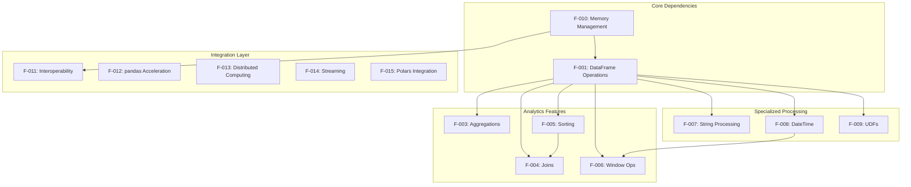

### 2.3.2 Integration Points

| Feature Pair | Integration Type | Shared Components | Common Services |
|--------------|------------------|-------------------|-----------------|
| F-001 ↔ F-002 | Data Flow | Apache Arrow format, Schema validation | Memory management, Type system |
| F-001 ↔ F-012 | API Compatibility | Complete API surface | pandas behavior validation, Fallback mechanisms |
| F-003 ↔ F-004 | Processing Pipeline | Hash algorithms, Sort operations | Memory allocation, Result formatting |
| F-010 ↔ All Features | Infrastructure | RMM memory pools, Buffer management | GPU memory allocation, Spill mechanisms |

### 2.3.3 Shared Components Architecture

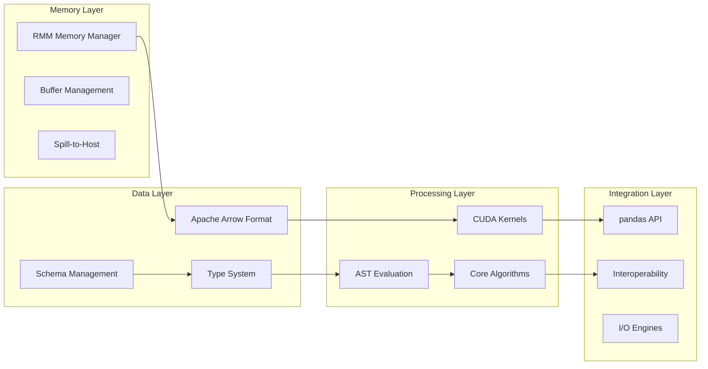

## 2.4 Implementation Considerations

### 2.4.1 Technical Constraints

#### Hardware Requirements
- **GPU Architecture**: NVIDIA GPU with Compute Capability ≥7.0 (Volta or newer)
- **Memory Constraints**: Processing limited by available GPU memory (typically 8GB-80GB)
- **CUDA Version**: Requires CUDA 12.0 or higher for optimal performance
- **Platform Limitation**: Linux-only deployment (Ubuntu LTS officially supported)

#### Software Dependencies  
- **Python Version**: Python 3.10 or later required for modern language features
- **Build Requirements**: CMake ≥3.30.4, C++20 compiler support, NVCC 12.0+
- **Runtime Dependencies**: RMM, Apache Arrow, NumPy, pandas for compatibility validation

### 2.4.2 Performance Requirements

#### Throughput Specifications
- **Primary Objective**: Achieve 10-100x speedup over CPU pandas for common operations
- **Interactive Response**: Sub-second response times for exploratory data analysis
- **Scalability Target**: Process multi-gigabyte to terabyte datasets on appropriate hardware
- **Memory Efficiency**: Enable processing of datasets larger than available GPU memory through spilling

#### Benchmark Criteria
- **Aggregation Operations**: Complete GroupBy aggregations within seconds for billion-row datasets  
- **Join Operations**: Hash joins on million-row datasets complete within milliseconds
- **I/O Throughput**: Match or exceed specialized file readers for supported formats
- **Memory Bandwidth**: Utilize GPU memory bandwidth efficiently for columnar operations

### 2.4.3 Scalability Considerations

#### Data Volume Scaling
- **Single GPU Limits**: Optimize for datasets up to available GPU memory
- **Multi-GPU Distribution**: Leverage Dask integration for datasets exceeding single GPU capacity
- **Memory Management**: Implement intelligent spilling strategies for memory pressure scenarios
- **Streaming Support**: Handle continuous data streams through Kafka integration

#### Compute Scaling  
- **Parallel Processing**: Utilize all available GPU cores for data operations
- **Algorithm Complexity**: Maintain linear or sub-linear scaling characteristics
- **Memory Access Patterns**: Optimize for coalesced memory access to maximize throughput
- **Load Balancing**: Distribute work evenly across GPU compute units

### 2.4.4 Security Implications

#### Data Protection
- **Memory Security**: Implement secure memory management to prevent data leakage
- **Access Control**: Support secure authentication for remote storage access
- **Data Validation**: Perform bounds checking and input validation for all operations
- **Credential Management**: Secure handling of cloud storage credentials and API keys

#### System Security  
- **Buffer Overflow Protection**: Implement safe memory allocation and bounds checking
- **Input Sanitization**: Validate all user inputs and file format specifications
- **Error Handling**: Graceful error handling without exposing sensitive system information
- **Audit Capabilities**: Support for operation logging and audit trail generation

### 2.4.5 Maintenance Requirements

#### Code Quality Standards
- **Test Coverage**: Maintain comprehensive test suite covering all feature combinations
- **Documentation Standards**: Complete API documentation with usage examples
- **Performance Monitoring**: Continuous benchmarking against pandas reference implementation
- **Compatibility Testing**: Regular validation against pandas API changes

#### Operational Maintenance
- **Version Management**: Semantic versioning with clear upgrade paths  
- **Backward Compatibility**: Maintain API stability across minor version releases
- **Error Reporting**: Clear error messages with actionable guidance for users
- **Community Support**: Active issue tracking and community engagement processes

#### References

- `python/cudf/cudf/core/dataframe.py` - Core DataFrame implementation and API surface
- `python/cudf/cudf/core/series.py` - Series operations and data manipulation methods
- `python/cudf/cudf/io/` - Multi-format I/O engine implementations
- `cpp/src/` - Native GPU implementation modules for all core operations
- `python/cudf/cudf/tests/` - Comprehensive test suite validating feature implementations
- `python/cudf/cudf/pandas/` - pandas API compatibility layer and acceleration framework
- `python/dask_cudf/` - Distributed computing integration with Dask framework
- `cpp/src/aggregation/` - GPU-optimized aggregation and reduction algorithms
- `cpp/src/join/` - High-performance join operation implementations
- `python/cudf/cudf/core/groupby/` - GroupBy functionality and multi-aggregation support
- `dependencies.yaml` - Complete dependency specifications and version requirements
- `README.md` - Project overview, installation requirements, and basic usage patterns

# 3. Technology Stack

## 3.1 Programming Languages

### 3.1.1 Primary Languages

#### C++20/CUDA
The core libcudf implementation utilizes **C++20** with **CUDA C++** for GPU kernel development. This selection enables direct access to GPU compute capabilities while maintaining type safety and modern C++ features required for complex DataFrame operations.

**Selection Criteria:**
- GPU Performance: CUDA C++ provides the lowest-level access to NVIDIA GPU hardware for maximum computational efficiency
- Memory Management: Direct control over GPU memory allocation and optimization critical for processing large datasets
- Ecosystem Integration: Seamless integration with RAPIDS ecosystem and Apache Arrow C++ libraries
- Computational Complexity: Advanced algorithms for joins, aggregations, and sorting require low-level optimization

**Version Requirements:**
- C++20 standard for modern language features and improved template capabilities
- CUDA 12.0+ runtime for latest GPU architecture support
- Compute Capability ≥7.0 (Volta architecture or newer)

#### Python 3.10-3.13
Python serves as the primary user-facing API layer, providing pandas-compatible interfaces through comprehensive bindings to the C++/CUDA core.

**Selection Criteria:**
- API Compatibility: Seamless integration with existing pandas workflows and data science toolchains
- Ecosystem Maturity: Extensive support for scientific computing libraries and development tools
- User Adoption: Widespread adoption in data science and analytics communities
- Dynamic Binding: Flexible integration with compiled C++/CUDA libraries via Cython

**Platform Constraints:**
- Linux-exclusive deployment supporting Ubuntu LTS and compatible distributions
- No Windows or macOS support due to CUDA runtime limitations

#### Java 8+
Java bindings through JNI enable enterprise integration and support for existing Java-based data infrastructure.

**Selection Criteria:**
- Enterprise Integration: Compatibility with existing Java enterprise applications and frameworks
- JVM Ecosystem: Integration with Apache Spark, Kafka, and other JVM-based data processing tools
- Performance Requirements: JNI provides efficient bridge between Java applications and GPU-accelerated operations

### 3.1.2 Supporting Languages

#### Cython
Cython provides the critical bridge between Python and C++/CUDA implementations, enabling high-performance Python bindings with minimal overhead.

**Justification:**
- Performance Bridge: Efficient translation between Python objects and C++ data structures
- Type Safety: Static typing capabilities for optimized code generation
- Memory Management: Direct control over memory allocation in performance-critical paths

## 3.2 Frameworks & Libraries

### 3.2.1 Core Frameworks

#### RAPIDS Ecosystem (24.12+)
RAPIDS provides the foundational GPU computing framework, including RMM (RAPIDS Memory Manager) for efficient GPU memory allocation and broader ecosystem integration.

**Key Components:**
- **RMM (RAPIDS Memory Manager)**: GPU memory pool management and allocation optimization
- **rapids-build-backend**: Specialized build system for RAPIDS components
- **RAPIDS CMake**: Standardized build configuration and dependency management

**Version Requirements:**
- RAPIDS 24.12+ for latest memory management optimizations and CUDA compatibility
- Synchronized versioning across all RAPIDS components for stability

**Justification:**
- Memory Efficiency: Advanced memory pool management critical for processing large datasets
- Ecosystem Coherence: Standardized interfaces across GPU-accelerated analytics tools
- Performance Optimization: Shared memory management reduces allocation overhead

#### Apache Arrow (16.0+)
Apache Arrow provides the columnar memory format and computational kernels for cross-language data interchange.

**Core Capabilities:**
- Columnar data representation optimized for analytical operations
- Zero-copy data exchange between different language runtimes
- Comprehensive type system supporting nested and complex data structures
- Standardized compute kernels for basic operations

**Integration Requirements:**
- Arrow 16.0+ for latest columnar format optimizations
- C++ library integration for direct memory access
- Python bindings for user-facing API compatibility

**Justification:**
- Performance: Columnar format optimized for vectorized operations and cache efficiency
- Interoperability: Industry-standard format enabling seamless data exchange
- Type System: Rich type system supporting complex analytical workloads

### 3.2.2 Computational Frameworks

#### Numba/Numba-CUDA (0.60+)
Numba provides just-in-time compilation for User Defined Functions (UDFs), enabling custom business logic execution on GPU hardware.

**Capabilities:**
- JIT compilation of Python functions to CUDA kernels
- Type inference and optimization for numerical computations
- Integration with cuDF memory management and data structures

**Justification:**
- Flexibility: Enables custom analytical operations beyond built-in DataFrame functionality
- Performance: JIT compilation achieves near-native performance for user-defined operations
- Development Velocity: Python-based UDF development with automatic GPU compilation

#### Dask Integration
Dask provides distributed computing capabilities, enabling cuDF operations across multiple GPUs and nodes.

**Integration Points:**
- `dask_cudf` package for distributed DataFrame operations
- Task graph optimization for GPU-accelerated workloads
- Memory management coordination across distributed workers

**Justification:**
- Scalability: Enables processing of datasets exceeding single-GPU memory limitations
- Distributed Analytics: Support for complex analytical workflows across clusters
- Resource Optimization: Intelligent task scheduling and memory management

## 3.3 Open Source Dependencies

### 3.3.1 Build System Dependencies

#### CMake (3.30.4+)
CMake serves as the primary build system for C++/CUDA components, providing cross-platform build configuration and dependency management.

**Key Features:**
- CUDA language support with advanced compilation options
- Dependency resolution and target management
- Integration with package managers and CI/CD systems

#### scikit-build-core
Modern Python packaging infrastructure enabling CMake-based extension building with standardized interfaces.

**Version Requirements:**
- scikit-build-core 0.8+ for latest CMake integration features
- Integration with pyproject.toml configuration standards

### 3.3.2 Development Dependencies

#### Pre-commit Framework
Comprehensive code quality and formatting infrastructure ensuring consistent development standards.

**Configured Tools:**
- **isort**: Python import sorting and organization
- **black**: Python code formatting with consistent style
- **mypy**: Static type checking for Python components
- **codespell**: Automated spell checking across documentation and comments
- **ruff**: High-performance Python linting with extensive rule set

**Version Management:**
- Pre-commit.ci integration for automated formatting and quality checks
- Synchronized tool versions across development environments

### 3.3.3 Testing and Quality Assurance

#### pytest Ecosystem
Comprehensive testing framework supporting unit, integration, and performance testing across all components.

**Key Components:**
- **pytest-cov**: Code coverage reporting and analysis
- **pytest-xdist**: Parallel test execution for improved CI performance
- **pytest-benchmark**: Performance regression testing

#### Hypothesis Property-Based Testing
Advanced testing methodology for discovering edge cases and ensuring robust error handling across diverse data inputs.

## 3.4 Third-Party Services

### 3.4.1 Continuous Integration

#### GitHub Actions
Primary CI/CD orchestration platform providing automated testing, building, and deployment workflows.

**Workflow Capabilities:**
- Multi-platform testing across supported Python versions
- CUDA toolkit installation and GPU testing infrastructure
- Automated package building and publishing
- Code quality enforcement and reporting

#### Codecov Integration
Code coverage reporting and analysis service providing visibility into test coverage across the entire codebase.

**Features:**
- Automated coverage reporting for pull requests
- Historical coverage trend analysis
- Integration with CI/CD pipelines for coverage enforcement

### 3.4.2 Development Infrastructure

## Pre-commit.ci
Automated code formatting and quality checking service integrated with GitHub repositories.

**Capabilities:**
- Automatic code formatting on pull requests
- Consistent enforcement of development standards
- Integration with pre-commit hook configurations

#### sccache with AWS S3 Backend
Distributed compilation caching service utilizing AWS S3 for shared build artifacts across CI environments.

**Benefits:**
- Significant CI build time reduction through artifact caching
- Shared compilation cache across multiple build environments
- Automatic cache invalidation and management

### 3.4.3 Package Distribution

#### Conda-forge
Primary package distribution channel providing pre-compiled binaries for multiple platforms and Python versions.

**Distribution Strategy:**
- Automated package building and publishing via conda-forge infrastructure
- Dependency resolution and compatibility management
- Integration with broader scientific Python ecosystem

#### PyPI (Python Package Index)
Secondary distribution channel for pip-based installations and development builds.

## 3.5 Databases & Storage

### 3.5.1 Data Format Support

#### File Format Compatibility
Comprehensive support for industry-standard data formats optimized for analytical workloads:

**Primary Formats:**
- **Parquet**: Columnar format with compression and schema evolution support
- **ORC**: Optimized Row Columnar format for analytical queries
- **CSV**: Delimited text format with extensive parsing options
- **JSON**: Semi-structured data with nested object support
- **Avro**: Schema evolution and cross-language serialization

**Compression Support:**
- GZIP, Snappy, ZSTD, Brotli, LZ4 algorithms for storage optimization
- Format-specific compression integration for maximum efficiency

#### Remote Storage Integration
Cloud and distributed storage access through KvikIO providing high-performance I/O operations:

**Supported Storage Systems:**
- **Amazon S3**: Object storage with parallel I/O optimization
- **HDFS**: Hadoop Distributed File System integration
- **Local Filesystems**: Optimized local storage access patterns

### 3.5.2 Streaming Data Integration

#### Apache Kafka Integration
Real-time data processing capabilities through custreamz package enabling streaming analytics workflows.

**Capabilities:**
- High-throughput message consumption from Kafka topics
- GPU-accelerated stream processing and transformation
- Integration with existing Kafka infrastructure and tooling

**Performance Characteristics:**
- Sub-second processing latencies for streaming analytics
- Horizontal scaling across multiple GPU workers
- Backpressure handling and memory management

### 3.5.3 Memory Management

#### GPU Memory Architecture
Advanced memory management through RMM providing optimized allocation patterns for analytical workloads.

**Key Features:**
- Memory pool management with configurable allocation strategies
- GPU memory defragmentation and optimization
- Integration with CUDA memory management primitives

## 3.6 Development & Deployment

### 3.6.1 Development Environment

#### Docker/DevContainers
Standardized development environment providing consistent toolchain access across different development machines.

**Container Features:**
- Pre-configured CUDA toolkit and driver installations
- Complete development dependency resolution
- VSCode development container integration
- Jupyter notebook server for interactive development

**Base Images:**
- NVIDIA CUDA development containers with Ubuntu LTS
- Scientific Python ecosystem pre-installation
- Development tooling and debugging capabilities

#### Development Tools Integration

#### Build System
Multi-stage build process supporting complex dependency relationships and optimization:

**Build Components:**
- **Ninja**: High-performance build execution with parallel compilation
- **CMake**: Cross-platform build configuration and dependency management
- **Maven**: Java component building and dependency resolution

**Build Optimization:**
- sccache integration for distributed compilation caching
- Parallel compilation across available CPU cores
- Incremental building with dependency tracking

### 3.6.2 Containerization Strategy

#### Multi-Stage Docker Builds
Optimized container images supporting both development and production deployment scenarios:

**Development Containers:**
- Complete toolchain installation including compilers and debuggers
- Interactive development environment with Jupyter integration
- Volume mounting for rapid iteration and testing

**Production Containers:**
- Minimal runtime dependencies for optimized deployment
- GPU driver compatibility and CUDA runtime integration
- Security hardening and vulnerability scanning

### 3.6.3 CI/CD Infrastructure

#### GitHub Actions Workflows
Comprehensive automation supporting the complete software development lifecycle:

**Core Workflows:**
- **Build and Test**: Multi-platform testing across supported configurations
- **Code Quality**: Automated formatting, linting, and static analysis
- **Performance Benchmarking**: Regression testing for performance-critical operations
- **Documentation**: Automated documentation building and deployment
- **Release Management**: Automated package building and distribution

**Advanced Features:**
- Matrix testing across Python versions and CUDA configurations
- GPU-enabled testing infrastructure for hardware-specific validation
- Dependency vulnerability scanning and reporting

#### Release Management
Automated release pipeline ensuring consistent versioning and distribution:

**Release Components:**
- Semantic versioning with automated changelog generation
- Multi-platform package building via conda-forge integration
- PyPI distribution for development and nightly builds
- Documentation updates and API reference generation

## 3.7 Integration Requirements

### 3.7.1 Cross-Component Integration

#### Language Binding Architecture
Sophisticated binding layer enabling seamless integration between C++/CUDA core and higher-level language interfaces:

**Python Integration:**
- Cython-based bindings with minimal performance overhead
- Automatic memory management and garbage collection coordination
- Type conversion and error handling propagation

**Java Integration:**
- JNI-based bindings with efficient data transfer mechanisms
- Exception handling and resource management
- Maven-based dependency management and distribution

### 3.7.2 Ecosystem Compatibility

#### pandas API Compatibility
Comprehensive API compatibility enabling zero-code migration from existing pandas-based workflows:

**Compatibility Features:**
- Method signature compatibility across core DataFrame operations
- Error handling and exception compatibility
- Index and MultiIndex behavior consistency

#### Scientific Python Integration
Seamless integration with broader scientific Python ecosystem:

**Key Integrations:**
- **NumPy**: Array interface compatibility for numerical operations
- **SciPy**: Integration with scientific computing algorithms
- **Jupyter**: Interactive computing and visualization support
- **pandas**: API compatibility and migration pathway

### 3.7.3 Security Considerations

#### Dependency Management
Rigorous dependency management ensuring security and stability:

**Security Practices:**
- Automated vulnerability scanning via GitHub Security Advisories
- Pinned dependency versions with controlled upgrade cycles
- Supply chain security through trusted package repositories

#### GPU Security
GPU-specific security considerations for multi-tenant and cloud deployment scenarios:

**Security Features:**
- CUDA context isolation for multi-user environments
- GPU memory management and cleanup procedures
- Resource quota enforcement and monitoring

#### References

#### Files Examined
- `dependencies.yaml` - Comprehensive dependency definitions across all system components
- `pyproject.toml` - Project-wide development tooling and formatting configuration
- `python/cudf/pyproject.toml` - Core Python package configuration and runtime dependencies
- `.pre-commit-config.yaml` - Development tooling automation and code quality enforcement
- `cpp/CMakeLists.txt` - C++/CUDA build configuration and system dependencies
- `java/pom.xml` - Java component building and Maven dependency management
- `build.sh` - Build orchestration scripts and configuration options
- `README.md` - Installation requirements and system prerequisites

#### Repository Structure Analysis
- `cpp/` - C++/CUDA core implementation with GPU-optimized algorithms
- `python/` - Python language bindings and user-facing API packages
- `java/` - Java JNI bindings for enterprise integration
- `.github/` - GitHub Actions workflows and CI/CD infrastructure
- `ci/` - Continuous integration scripts and build automation
- `conda/` - Conda packaging manifests and environment specifications
- `.devcontainer/` - Development container configurations and tooling setup

# 4. Process Flowchart

## 4.1 System Workflow Overview

### 4.1.1 High-Level System Architecture Flow

The cuDF system operates through a multi-layered architecture that processes data through distinct workflow stages, from initial data ingestion through final result delivery. The system orchestrates complex interactions between the C++/CUDA core (libcudf), Python language bindings, and various integration layers to deliver GPU-accelerated analytics capabilities.

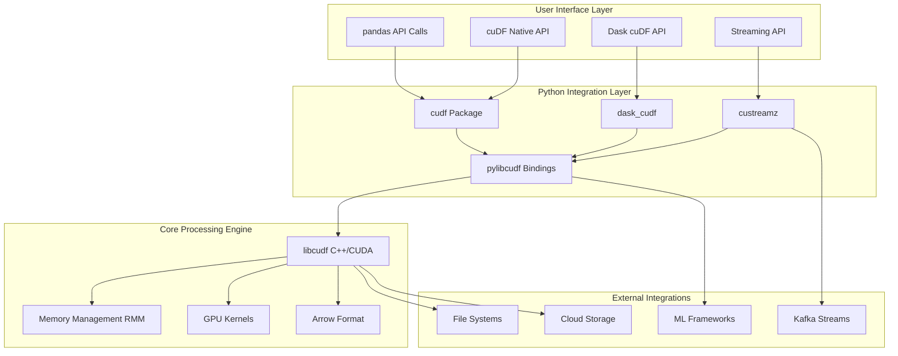

### 4.1.2 Core Business Process Categories

The system supports four primary categories of business processes, each with distinct workflow characteristics and performance requirements:

1. **Data Ingestion Processes**: Multi-format file reading, streaming data integration, and remote storage access
2. **Analytical Processing**: DataFrame operations, aggregations, joins, and statistical computations
3. **Memory and State Management**: GPU memory orchestration, spill-to-host mechanisms, and resource coordination
4. **Integration and Distribution**: Multi-GPU coordination, external system integration, and result delivery

## 4.2 Data Ingestion Workflows

### 4.2.1 Multi-Format File Reading Process

The data ingestion workflow handles multiple file formats through a sophisticated path resolution and format-specific processing pipeline that optimizes for both performance and compatibility.

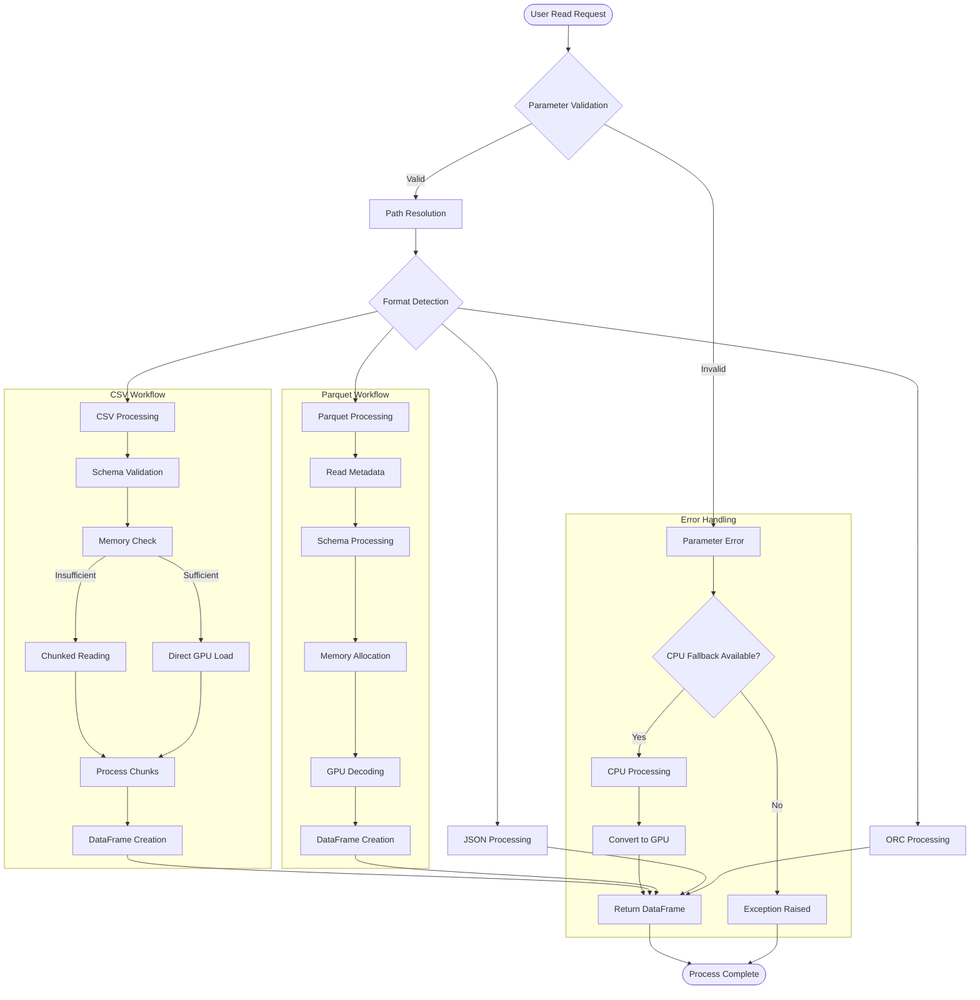

### 4.2.2 Remote Storage Access Workflow

Remote storage integration enables seamless access to cloud-based data through KvikIO with comprehensive authentication and caching mechanisms.

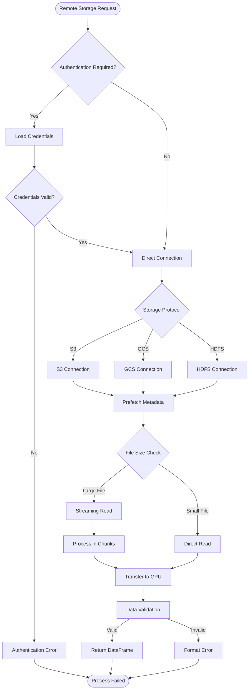

### 4.2.3 Streaming Data Integration

Real-time streaming integration through Kafka provides continuous data processing capabilities with offset management and fault tolerance.

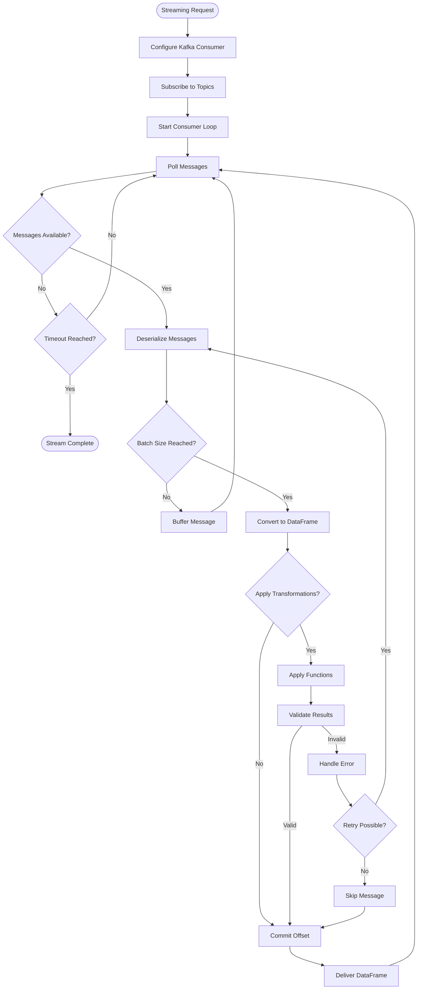

## 4.3 Core Analytical Processing Workflows

### 4.3.1 DataFrame Operations Orchestration

DataFrame operations follow a sophisticated workflow that manages memory allocation, GPU kernel dispatch, and result construction while maintaining pandas API compatibility.

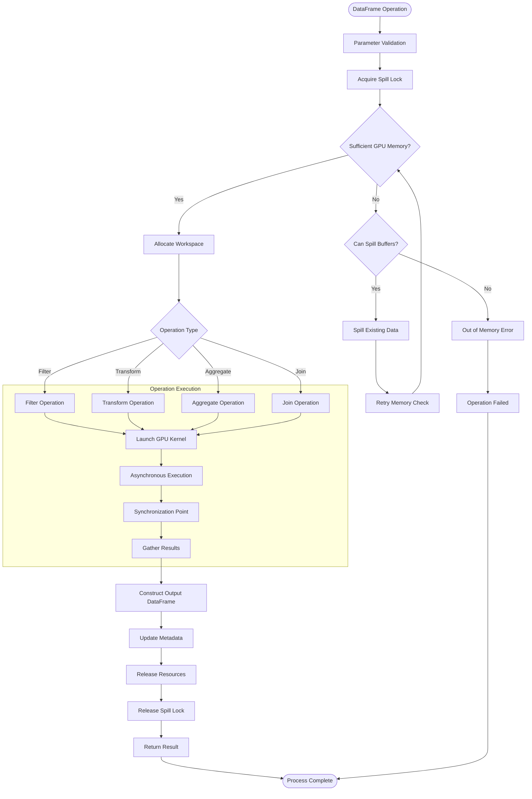

### 4.3.2 GroupBy Aggregation Workflow

GroupBy operations implement sophisticated multi-phase processing with optimized memory management and support for multiple simultaneous aggregations.

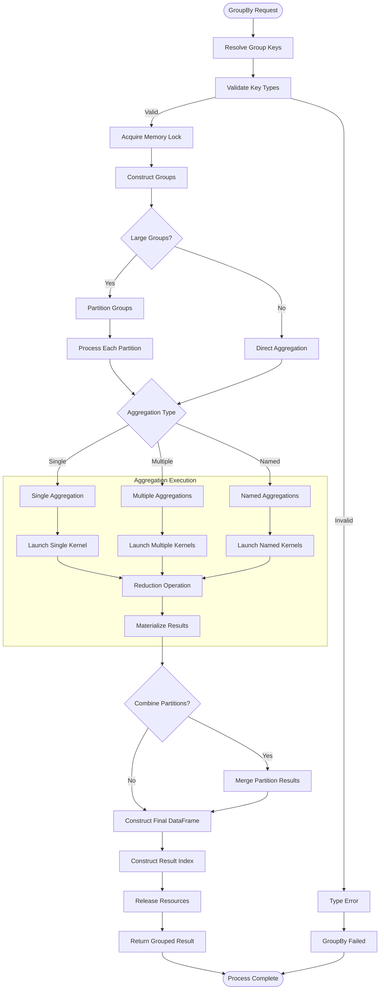

### 4.3.3 Join Operations Workflow

Join operations utilize hash-based and sort-merge algorithms with intelligent algorithm selection based on data characteristics and memory constraints.

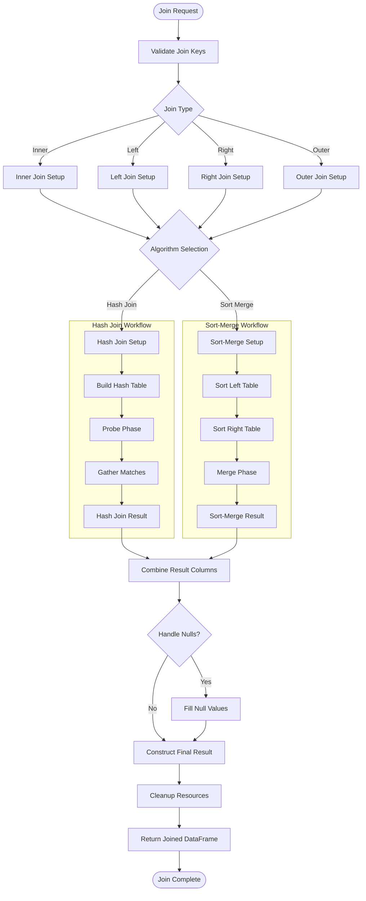

## 4.4 Memory and State Management Workflows

### 4.4.1 GPU Memory Management and Spilling

The sophisticated memory management system automatically handles GPU memory pressure through intelligent spilling mechanisms while maintaining optimal performance.

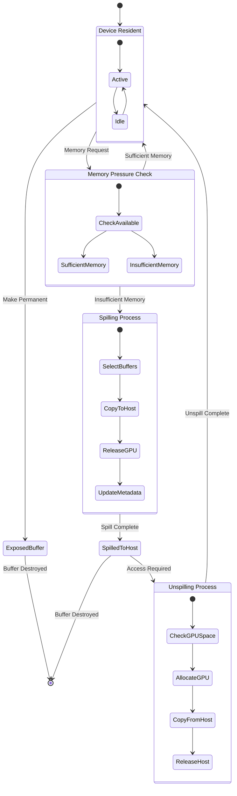

### 4.4.2 Spill Lock Coordination

The spill lock system prevents memory state changes during critical operations, ensuring data consistency and operation atomicity.

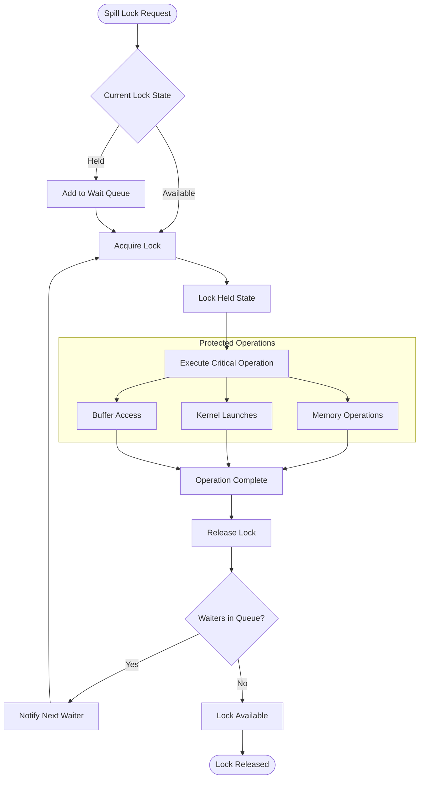

## 4.5 Integration and Distribution Workflows

### 4.5.1 Multi-GPU Distributed Processing

Distributed processing across multiple GPUs utilizes Dask coordination for task scheduling and data partitioning with comprehensive error handling and recovery.

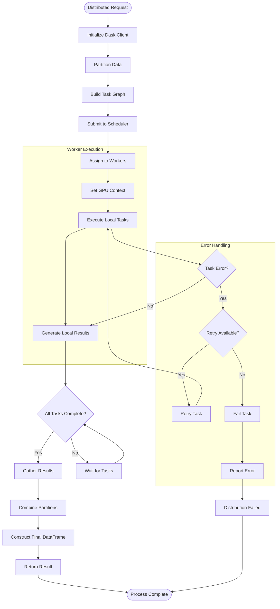

### 4.5.2 External System Integration

Integration with external systems follows standardized patterns for data exchange through multiple protocols and formats.

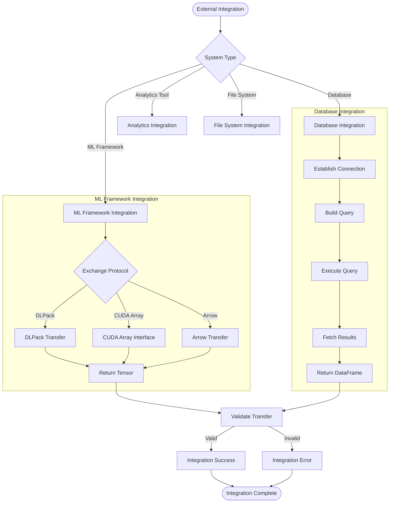

## 4.6 Error Handling and Recovery Workflows

### 4.6.1 Comprehensive Error Handling System

The error handling system provides multiple layers of error detection, recovery, and fallback mechanisms to ensure system resilience.

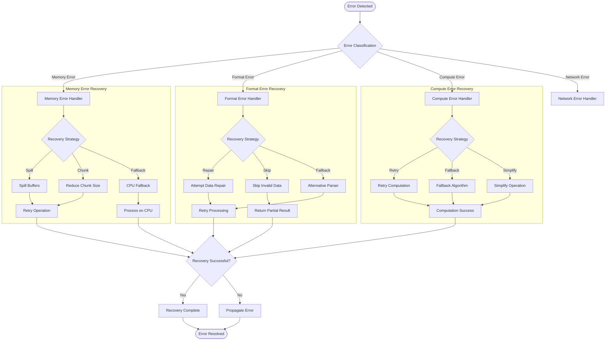

### 4.6.2 Fallback and Retry Mechanisms

Intelligent fallback mechanisms provide graceful degradation and automatic retry capabilities for various failure scenarios.

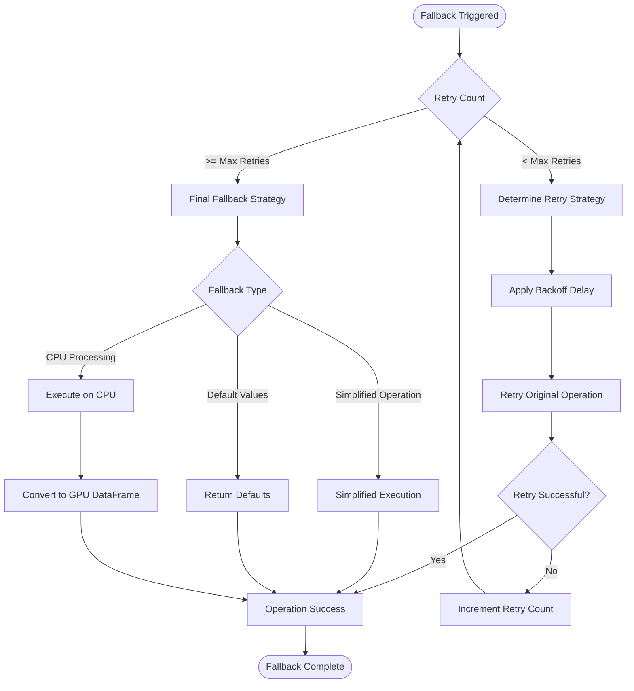

## 4.7 Build and CI/CD Workflows

### 4.7.1 Multi-Component Build Process

The build system orchestrates compilation of C++/CUDA core components, Python bindings, and packaging across multiple platforms with comprehensive testing integration.

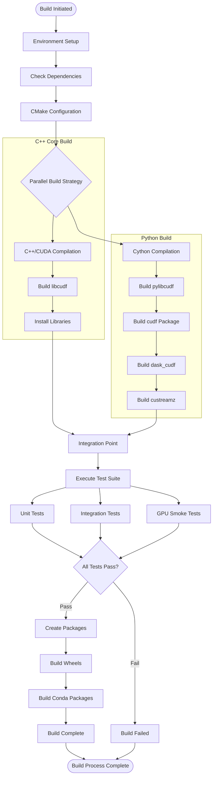

### 4.7.2 CI/CD Pipeline Workflow

Continuous integration and deployment processes ensure code quality, automated testing, and reliable package distribution through GitHub Actions orchestration.

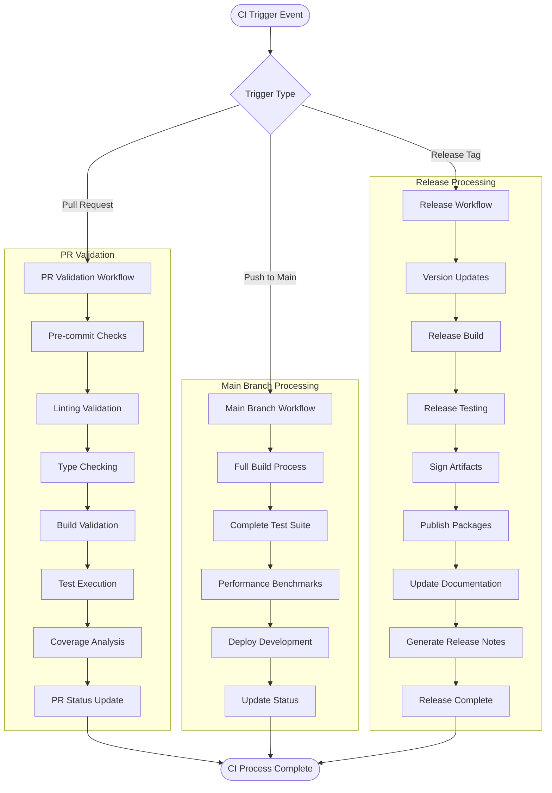

## 4.8 Performance Optimization and Monitoring

### 4.8.1 JIT Compilation and Caching Workflow

Just-in-time compilation for User Defined Functions and kernel caching optimize runtime performance through intelligent code generation and reuse.

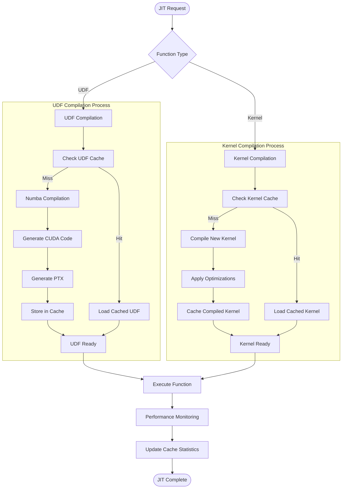

## 4.9 Validation Rules and Compliance

### 4.9.1 Data Validation and Type Safety

Comprehensive validation ensures data integrity, type safety, and business rule compliance throughout all processing workflows.

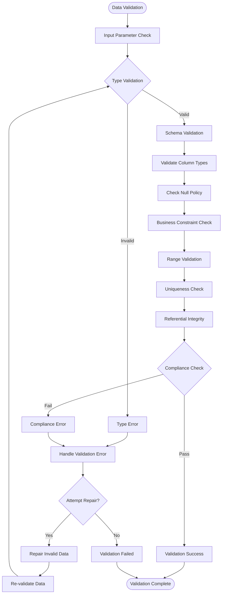

### 4.9.2 Authorization and Security Checkpoints

Security validation ensures proper authorization, secure data handling, and compliance with security policies throughout system operations.

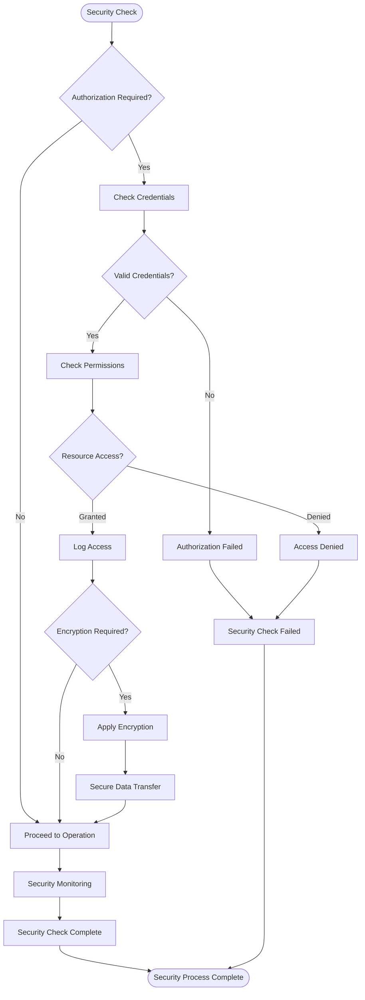

## 4.10 System State Transitions

### 4.10.1 Operation State Machine

The system maintains comprehensive state tracking for all operations, enabling proper error recovery, resource management, and operation coordination.

```mermaid
stateDiagram-v2
    [*] --> Idle
    
    Idle --> Initializing : Operation Request
    Initializing --> ResourceAcquisition : Parameters Validated
    Initializing --> Error : Validation Failed
    
    ResourceAcquisition --> MemoryAllocated : Memory Available
    ResourceAcquisition --> Spilling : Memory Pressure
    ResourceAcquisition --> Error : Resource Unavailable
    
    Spilling --> MemoryAllocated : Spill Complete
    Spilling --> Error : Spill Failed
    
    MemoryAllocated --> Executing : Resources Ready
    Executing --> Synchronizing : Kernel Launched
    
    Synchronizing --> Gathering : Execution Complete
    Synchronizing --> Error : Execution Failed
    
    Gathering --> Constructing : Results Retrieved
    Constructing --> Completing : Output Ready
    
    Completing --> Cleanup : Operation Success
    Cleanup --> Idle : Resources Released
    
    Error --> Recovery : Recovery Available
    Error --> Cleanup : No Recovery
    
    Recovery --> ResourceAcquisition : Retry Operation
    Recovery --> Cleanup : Recovery Failed
    
    state Error {
        [*] --> MemoryError
        [*] --> ComputeError
        [*] --> FormatError
        [*] --> NetworkError
        
        MemoryError --> [*]
        ComputeError --> [*]
        FormatError --> [*]
        NetworkError --> [*]
    }
```

#### References

#### Technical Specification Sections
- `1.2 System Overview` - Architecture context and system capabilities
- `2.1 Feature Catalog` - Feature workflows and dependencies
- `2.2 Functional Requirements Tables` - Validation rules and acceptance criteria
- `3.7 Integration Requirements` - System interaction patterns
- `3.4 Third-Party Services` - External system integration

#### Files Examined
- `python/cudf/cudf/core/dataframe.py` - Core DataFrame implementation workflows
- `python/cudf/cudf/core/groupby/groupby.py` - GroupBy operation orchestration
- `python/cudf/cudf/core/join/join.py` - Join and merge operation workflows
- `python/cudf/cudf/io/csv.py` - CSV I/O processing workflows
- `python/cudf/cudf/core/buffer/spillable_buffer.py` - Memory spilling mechanisms
- `python/cudf/cudf/pandas/__init__.py` - pandas acceleration workflows
- `python/cudf_polars/cudf_polars/callback.py` - Polars query execution workflows
- `python/custreamz/` - Kafka streaming integration workflows
- `python/dask_cudf/` - Distributed processing coordination
- `build.sh` - Build orchestration and CI/CD workflows

#### Repository Structure Analysis
- `python/cudf/cudf/core/` - Core DataFrame operation implementations
- `python/cudf/cudf/io/` - I/O operation workflows and format handlers
- `cpp/src/` - C++/CUDA core algorithm implementations
- `ci/` - Continuous integration workflow definitions
- `.github/workflows/` - GitHub Actions CI/CD pipeline configurations

# 5. System Architecture

## 5.1 High-Level Architecture

### 5.1.1 System Overview

cuDF implements a sophisticated multi-layered architecture designed specifically for GPU-accelerated DataFrame operations. The system employs a **layered architectural pattern** with clear separation of concerns between compute, integration, and presentation layers, optimized for columnar data processing on NVIDIA GPU hardware.

**Architecture Style and Rationale:**
The architecture follows a **multi-layered approach with language bindings**, enabling GPU-first data processing while maintaining familiar user interfaces. This design maximizes performance by keeping data operations on the GPU while providing seamless integration with existing data science workflows. The core architectural principle centers on **zero-copy data sharing** and **columnar storage optimization**, minimizing memory overhead and maximizing computational throughput.

**Key Architectural Principles:**
- **GPU-First Design**: All computational operations execute on GPU hardware with minimal CPU involvement
- **Columnar Processing**: Apache Arrow columnar format optimized for vectorized operations and analytical workloads  
- **Zero-Copy Integration**: Memory-mapped data exchange between system components eliminates unnecessary data copying
- **Memory-Aware Processing**: Intelligent spill-to-host mechanisms enable processing datasets larger than GPU memory
- **API Compatibility**: Maintains pandas API compatibility for zero-code migration from CPU-based workflows

**System Boundaries and Major Interfaces:**
The system interfaces with external components through well-defined boundaries: file systems and cloud storage via optimized I/O engines, streaming platforms through Kafka integration, distributed computing via Dask coordination, and machine learning frameworks through standardized data exchange protocols (DLPack, CUDA Array Interface).

### 5.1.2 Core Components Table

| Component Name | Primary Responsibility | Key Dependencies | Integration Points |
|---|---|---|---|
| libcudf (C++/CUDA Core) | GPU kernel execution and memory management | CUDA 12.0+, Apache Arrow, RMM | Language bindings, I/O engines |
| Python Binding Layer | User-facing API and pandas compatibility | Cython, Numba, NumPy | Application interfaces, ML frameworks |
| I/O Subsystem | Multi-format data ingestion and storage | KvikIO, nvCOMP, Arrow | File systems, cloud storage, databases |
| Memory Manager (RMM) | GPU memory allocation and spill handling | CUDA runtime, host memory | All GPU operations, buffer management |

### 5.1.3 Data Flow Description

**Primary Data Flows:**
The system orchestrates data through four primary flow patterns optimized for GPU processing efficiency. The **ingestion flow** begins with multi-format file readers (CSV, Parquet, ORC, JSON, Avro) that convert external data into Apache Arrow columnar format and transfer directly to GPU memory pools managed by RMM. This eliminates intermediate CPU-based transformations and minimizes memory bandwidth requirements.

**Integration Patterns and Protocols:**
Data exchange with external systems utilizes standardized protocols optimized for GPU environments. **Apache Arrow format** serves as the universal data interchange medium, enabling zero-copy operations between cuDF and external analytical engines. **DLPack protocol** facilitates tensor exchange with machine learning frameworks, while **CUDA Array Interface** provides direct GPU memory sharing with compatible libraries.

**Data Transformation Points:**
Critical transformation occurs at the **language binding interface**, where high-level Python operations translate to optimized CUDA kernel launches. The **expression evaluation system** converts DataFrame operations into Abstract Syntax Trees (AST), enabling just-in-time compilation and kernel fusion for enhanced performance.

**Key Data Stores and Caches:**
The system maintains **GPU memory pools** as the primary data store, complemented by **host memory spillover** for datasets exceeding GPU capacity. **Kernel caches** via Jitify store compiled CUDA code, while **build caches** through sccache accelerate development workflows.

### 5.1.4 External Integration Points

| System Name | Integration Type | Data Exchange Pattern | Protocol/Format |
|---|---|---|---|
| Cloud Storage (S3/HDFS) | Asynchronous I/O | Direct parallel access | HTTP/HDFS via KvikIO |
| Kafka Streaming | Real-time ingestion | Message-based streaming | Kafka protocol |
| Dask Distributed | Compute coordination | Task graph execution | Custom RPC protocol |
| ML Frameworks | Data interchange | Zero-copy tensor sharing | DLPack/CUDA Array Interface |

## 5.2 Component Details

### 5.2.1 Core Processing Engine (libcudf)

**Purpose and Responsibilities:**
The libcudf core serves as the computational heart of the system, implementing GPU-accelerated kernels for all DataFrame operations. Located in the `cpp/` directory, it provides optimized CUDA implementations for aggregations, joins, sorting, groupby operations, and string processing. The component manages the complete lifecycle of GPU computations from memory allocation to kernel execution.

**Technologies and Frameworks:**
Built on **C++20 standard** with **CUDA C++ extensions**, leveraging **Apache Arrow C++** for columnar data structures and **RMM** for memory management. The build system utilizes **CMake 3.30.4+** with **rapids-cmake** for RAPIDS ecosystem integration and **Ninja** for optimized compilation performance.

**Key Interfaces and APIs:**
Exposes C++ APIs through header files in `cpp/include/cudf/` providing comprehensive DataFrame functionality. Critical interfaces include column operations, aggregation functions, join algorithms, and I/O operations. The component integrates with **Cython bindings** in `python/cudf/_lib/` for Python accessibility.

**Data Persistence Requirements:**
Utilizes **RMM memory pools** for GPU data persistence with automatic **spill-to-host** capabilities when GPU memory becomes constrained. Data remains in **Apache Arrow columnar format** throughout the processing pipeline to maintain computational efficiency.

**Scaling Considerations:**
Designed for **single-GPU optimization** with multi-GPU scaling achieved through Dask integration. Kernel implementations utilize **CUDA streams** for asynchronous operations and **memory coalescing** for bandwidth optimization.

### 5.2.2 Python Integration Layer

**Purpose and Responsibilities:**
The Python layer, located in `python/cudf/`, provides pandas-compatible APIs while maintaining GPU processing efficiency. This component translates high-level DataFrame operations into optimized libcudf function calls, manages Python object lifecycles, and coordinates with the broader Python data science ecosystem.

**Technologies and Frameworks:**
Implemented using **Cython** for high-performance Python-to-C++ bindings, **Numba** for JIT compilation of user-defined functions, and **NumPy** for array interface compatibility. Integration with **pandas 2.0+** ensures API compatibility.

**Key Interfaces and APIs:**
Exposes pandas-compatible DataFrame and Series APIs through the primary cudf package. Secondary interfaces include distributed computing via dask_cudf, streaming processing through custreamz, and low-level access via pylibcudf bindings.

```mermaid
sequenceDiagram
    participant User as User Code
    participant cuDF as cuDF Python
    participant Cython as Cython Layer
    participant libcudf as libcudf Core
    participant GPU as GPU Memory

    User->>cuDF: df.groupby().agg()
    cuDF->>Cython: Convert to C++ types
    Cython->>libcudf: groupby_aggregate()
    libcudf->>GPU: Launch CUDA kernels
    GPU-->>libcudf: Computation results
    libcudf-->>Cython: Return Arrow data
    Cython-->>cuDF: Convert to Python objects
    cuDF-->>User: Return cuDF DataFrame
```

### 5.2.3 I/O and Integration Subsystem

**Purpose and Responsibilities:**
The I/O subsystem, implemented in `cpp/src/io/`, provides comprehensive data ingestion and export capabilities across multiple formats. This component optimizes data loading for GPU processing, handles compression/decompression, and manages connections to external data sources including cloud storage and streaming platforms.

**Technologies and Frameworks:**
Utilizes **KvikIO** for high-performance cloud storage access, **nvCOMP** for GPU-accelerated compression, and format-specific libraries for parsing (libparquet, liborc). Integration with **Apache Arrow** ensures consistent data representation.

```mermaid
flowchart LR
    subgraph "Data Sources"
        S3[S3 Storage]
        HDFS[HDFS]
        Local[Local Files]
        Kafka[Kafka Streams]
    end
    
    subgraph "I/O Engine"
        KIO[KvikIO]
        Readers[Format Readers]
        Compress[nvCOMP]
    end
    
    subgraph "Processing"
        Arrow[Arrow Format]
        GPU[GPU Memory]
    end
    
    S3 --> KIO
    HDFS --> KIO
    Local --> Readers
    Kafka --> Readers
    
    KIO --> Compress
    Readers --> Compress
    Compress --> Arrow
    Arrow --> GPU
```

### 5.2.4 Memory Management Component (RMM)

**Purpose and Responsibilities:**
RMM manages all GPU memory allocation, implementing sophisticated memory pools and spill-to-host mechanisms. This component ensures optimal memory utilization while enabling processing of datasets exceeding GPU memory capacity.

**Key Interfaces and APIs:**
Provides C++ memory allocation APIs compatible with standard library containers, Python memory management integration, and automatic spill coordination. The component exposes memory statistics and profiling capabilities for performance monitoring.

**Scaling Considerations:**
Implements **memory pooling** to reduce allocation overhead, **least-recently-used spilling** for optimal cache performance, and **asynchronous memory transfers** to overlap computation with data movement.

```mermaid
stateDiagram-v2
    [*] --> Available
    Available --> Allocated : allocate()
    Allocated --> Available : deallocate()
    Available --> Spilling : memory_pressure()
    Spilling --> HostResident : spill_complete()
    HostResident --> Unspilling : access_required()
    Unspilling --> Allocated : unspill_complete()
    HostResident --> [*] : deallocate()
    Allocated --> [*] : deallocate()
```

## 5.3 Technical Decisions

### 5.3.1 Architecture Style Decisions and Tradeoffs

**Layered Architecture Selection:**
The decision to implement a layered architecture with language bindings provides clear separation between performance-critical GPU operations and user-facing interfaces. This approach enables optimization of each layer independently while maintaining system coherence.

| Decision Factor | Chosen Approach | Alternative Considered | Justification |
|---|---|---|---|
| Compute Architecture | GPU-first processing | CPU-GPU hybrid | Maximum computational throughput for analytical workloads |
| Memory Management | Columnar storage | Row-based storage | Optimized for vectorized operations and cache efficiency |
| API Strategy | pandas compatibility | Custom API design | Zero-code migration path for existing workflows |
| Integration Pattern | Zero-copy sharing | Serialization-based | Minimizes memory overhead and maximizes performance |

**Communication Pattern Choices:**
The system employs **shared memory communication** within processes and **zero-copy data exchange** between components. This eliminates serialization overhead while maintaining type safety through strongly-typed interfaces.

**Data Storage Solution Rationale:**
**Apache Arrow format** selection provides industry-standard columnar representation optimized for analytical operations. This decision enables seamless interoperability with external systems while maintaining computational efficiency through vectorized operations.

```mermaid
graph TD
    subgraph "Decision Context"
        DC1[Performance Requirements]
        DC2[Ecosystem Integration]
        DC3[Memory Constraints]
        DC4[API Compatibility]
    end
    
    subgraph "Architecture Decisions"
        AD1[Layered Design]
        AD2[GPU-First Processing]
        AD3[Columnar Storage]
        AD4[Zero-Copy Exchange]
    end
    
    subgraph "Implementation Outcomes"
        IO1[10-100x Speedup]
        IO2[pandas Compatibility]
        IO3[Memory Efficiency]
        IO4[Ecosystem Integration]
    end
    
    DC1 --> AD2
    DC2 --> AD1
    DC3 --> AD3
    DC4 --> AD1
    
    AD1 --> IO2
    AD2 --> IO1
    AD3 --> IO3
    AD4 --> IO4
```

### 5.3.2 Caching Strategy Justification

**Multi-Level Caching Approach:**
The system implements caching at multiple levels to optimize different performance characteristics. **Kernel caching** via Jitify eliminates repeated compilation overhead, **build caching** through sccache accelerates development workflows, and **memory pools** reduce allocation latency.

**Security Mechanism Selection:**
GPU context isolation ensures memory safety between operations, while comprehensive memory cleanup procedures prevent data leakage. The selection prioritizes performance while maintaining security boundaries appropriate for analytical workloads.

## 5.4 Cross-Cutting Concerns

### 5.4.1 Monitoring and Observability Approach

**Performance Monitoring Strategy:**
The system integrates **NVTX ranges** for GPU profiling, enabling detailed performance analysis of individual operations. Memory usage tracking through RMM provides insights into allocation patterns and spill behavior. Build metrics reporting ensures development pipeline optimization.

**Logging and Tracing Strategy:**
Comprehensive logging spans all system layers, from high-level Python operations to low-level CUDA kernel execution. **Structured logging** enables automated analysis of system behavior, while **distributed tracing** coordinates logging across multi-GPU deployments.

| Concern Area | Implementation Approach | Key Technologies | Performance Impact |
|---|---|---|---|
| GPU Profiling | NVTX instrumentation | NVIDIA Nsight Systems | <1% overhead |
| Memory Monitoring | RMM statistics tracking | Custom telemetry | Negligible |
| Error Tracking | Structured exception handling | C++ exceptions, Python logging | Minimal |
| Performance Benchmarking | Automated testing suite | pytest, custom harness | Development-time only |

### 5.4.2 Error Handling Patterns

The system implements comprehensive error handling across all architectural layers, ensuring graceful degradation and informative error reporting.

```mermaid
flowchart TD
    subgraph "Error Sources"
        ES1[GPU Memory Exhaustion]
        ES2[CUDA Kernel Failures]
        ES3[Data Format Errors]
        ES4[Network Failures]
    end
    
    subgraph "Error Detection"
        ED1[CUDF_EXPECTS Macros]
        ED2[Stream Synchronization]
        ED3[Memory Validation]
        ED4[Type Safety Checks]
    end
    
    subgraph "Error Handling"
        EH1[Automatic Spilling]
        EH2[Operation Retry]
        EH3[Graceful Degradation]
        EH4[User Notification]
    end
    
    subgraph "Recovery Actions"
        RA1[Memory Cleanup]
        RA2[Context Reset]
        RA3[Fallback Processing]
        RA4[System State Restore]
    end
    
    ES1 --> ED1
    ES2 --> ED2
    ES3 --> ED3
    ES4 --> ED4
    
    ED1 --> EH1
    ED2 --> EH2
    ED3 --> EH3
    ED4 --> EH4
    
    EH1 --> RA1
    EH2 --> RA2
    EH3 --> RA3
    EH4 --> RA4
```

### 5.4.3 Authentication and Authorization Framework

**Integration-Level Security:**
Security mechanisms operate primarily at the integration level, with CUDA context isolation providing process-level memory protection. Cloud storage access utilizes standard authentication mechanisms (IAM roles, access keys) managed through KvikIO integration.

**Data Protection Strategy:**
Memory cleanup procedures ensure sensitive data removal from GPU memory after processing completion. Dependency vulnerability scanning maintains supply chain security through automated security assessments.

### 5.4.4 Performance Requirements and SLAs

**Computational Performance Targets:**
- **Primary Objective**: Achieve 10-100x speedup over CPU pandas for analytical operations
- **Response Time**: Maintain sub-second response for interactive analytics workflows  
- **Throughput**: Process multi-gigabyte datasets efficiently within GPU memory constraints
- **Memory Efficiency**: Enable processing of datasets up to 10x larger than GPU memory through spilling

**Scalability Considerations:**
Single-GPU optimization with multi-GPU scaling through Dask coordination. System design prioritizes vertical scaling (larger GPUs, more memory) with horizontal scaling as secondary consideration.

### 5.4.5 Disaster Recovery Procedures

**Data Recovery Mechanisms:**
The system implements **stateless processing** with **idempotent operations**, enabling automatic recovery from component failures. **Spill-to-host mechanisms** provide automatic data preservation during GPU memory pressure, while **distributed coordination** through Dask enables task redistribution in multi-node environments.

**System State Management:**
Memory state tracking through RMM enables consistent recovery after failures. **Stream synchronization checks** ensure data consistency, while **automatic cleanup procedures** prevent resource leaks during error conditions.

## 5.5 References

#### Files Examined
- `build.sh` - Build orchestration and system configuration management
- `dependencies.yaml` - Comprehensive dependency specification and version management  
- `python/cudf/pyproject.toml` - Python package configuration and build requirements

#### Directories Explored
- `cpp/` - C++/CUDA core implementation and headers
- `cpp/src/` - Core computational kernels and algorithms
- `cpp/src/io/` - I/O subsystem and format handling
- `python/` - Python ecosystem packages and bindings
- `python/cudf/` - Primary DataFrame API implementation
- `java/` - Java JNI bindings for enterprise integration
- `ci/` - Continuous integration and testing infrastructure
- `.github/` - GitHub Actions workflow definitions
- `.devcontainer/` - Development environment containerization

#### Technical Specification Sections Referenced
- `1.2 System Overview` - Overall system context and capabilities
- `3.1 Programming Languages` - Technical stack and language selection rationale  
- `3.2 Frameworks & Libraries` - Core dependencies and framework integration
- `4.1 System Workflow Overview` - High-level operational flow patterns
- `4.4 Memory and State Management Workflows` - Memory management architecture details

# 6. SYSTEM COMPONENTS DESIGN

## 6.1 Core Services Architecture

### 6.1.1 Architecture Applicability Assessment

#### 6.1.1.1 Core Services Architecture Evaluation

**Core Services Architecture is not applicable for this system.**

cuDF implements a **GPU-accelerated DataFrame library architecture** rather than a distributed services-based system. The comprehensive analysis of the technical specification and codebase reveals that cuDF follows a **multi-layered architectural pattern** with in-process component communication, which fundamentally differs from traditional microservices or core services architectures.

#### 6.1.1.2 Architectural Pattern Classification

Based on the system analysis from sections 5.1 High-Level Architecture and 5.2 Component Details, cuDF employs the following architectural characteristics:

| Architectural Aspect | cuDF Implementation | Core Services Alternative |
|---|---|---|
| **Communication Pattern** | In-process shared memory via Apache Arrow format | Network-based service-to-service communication |
| **Deployment Model** | Library/package distribution (pip, conda, Maven) | Independent service deployments with orchestration |
| **Scalability Approach** | GPU acceleration + Dask distributed coordination | Horizontal service instance scaling |
| **Component Boundaries** | Language binding layers (Python/Java to C++/CUDA) | Service boundaries with network interfaces |

#### 6.1.1.3 System Architecture Rationale

The multi-layered library architecture serves cuDF's core objectives more effectively than a services-oriented approach:

**Performance Optimization**: The system achieves 10-100x speedup over CPU pandas through direct GPU kernel execution and zero-copy data sharing between components. Service-based communication would introduce network latency and serialization overhead that would negate GPU acceleration benefits.

**Memory Efficiency**: cuDF processes datasets exceeding traditional memory limitations through intelligent GPU memory management and spill-to-host mechanisms. This requires tight integration between memory management (RMM) and compute kernels that would be impractical across service boundaries.

**API Compatibility**: Maintaining 100% pandas API compatibility requires synchronous, low-latency operations that align naturally with library-based architectures rather than asynchronous service calls.

### 6.1.2 Actual System Architecture

#### 6.1.2.1 Multi-Layered Architecture Implementation

cuDF implements a sophisticated three-layer architecture optimized for GPU-accelerated data processing:

```mermaid
graph TB
    subgraph "Integration Layer"
        Apps[Applications]
        Dask[Dask Distributed]
        ML[ML Frameworks]
        Stream[Kafka Streams]
    end
    
    subgraph "Language Binding Layer"
        Python[cuDF Python]
        Java[cuDF Java]
        Cython[Cython Bindings]
        JNI[JNI Bindings]
    end
    
    subgraph "Core Processing Layer"
        libcudf[libcudf C++/CUDA]
        RMM[Memory Manager]
        Arrow[Arrow Format]
        CUDA[CUDA Kernels]
    end
    
    subgraph "Hardware Layer"
        GPU[GPU Hardware]
        Host[Host Memory]
    end
    
    Apps --> Python
    Dask --> Python
    ML --> Python
    Stream --> Python
    
    Python --> Cython
    Java --> JNI
    Cython --> libcudf
    JNI --> libcudf
    
    libcudf --> RMM
    libcudf --> Arrow
    libcudf --> CUDA
    
    CUDA --> GPU
    RMM --> GPU
    RMM --> Host
```

#### 6.1.2.2 Component Communication Mechanisms

**In-Process Communication Patterns:**

| Communication Type | Implementation | Performance Characteristic |
|---|---|---|
| **Zero-Copy Data Exchange** | Apache Arrow columnar format with GPU memory mapping | Eliminates serialization overhead |
| **Function Call Interface** | Direct C++ function invocation via Cython/JNI bindings | Minimal latency for operation dispatch |
| **Shared Memory Management** | RMM memory pools with automatic spill coordination | Optimal GPU memory utilization |

**Integration Communication Patterns:**

```mermaid
sequenceDiagram
    participant App as Application
    participant cuDF as cuDF Python
    participant libcudf as libcudf Core
    participant GPU as GPU Hardware
    participant Dask as Dask Cluster
    
    Note over App,Dask: DataFrame Operation Workflow
    
    App->>cuDF: df.groupby().sum()
    cuDF->>libcudf: groupby_sum_request()
    libcudf->>GPU: launch_cuda_kernels()
    GPU-->>libcudf: computation_results
    libcudf-->>cuDF: arrow_data_buffer
    cuDF-->>App: cudf.DataFrame
    
    Note over App,Dask: Multi-GPU Scaling via Dask
    
    App->>Dask: dd.from_pandas(df, npartitions=4)
    Dask->>cuDF: distributed_operations()
    cuDF->>libcudf: parallel_kernel_execution()
    libcudf->>GPU: multi_stream_processing()
```

#### 6.1.2.3 Scalability and Performance Architecture

**Scalability Design:**

cuDF achieves scalability through architectural patterns that differ fundamentally from service-based scaling:

**Vertical GPU Scaling**: Leverages powerful single-GPU configurations with up to 80GB+ memory (H100) and thousands of CUDA cores for parallel processing.

**Distributed Coordination**: Integrates with Dask distributed computing framework to coordinate multi-GPU and multi-node processing without requiring service orchestration.

**Memory Hierarchy Management**: Implements sophisticated spill-to-host mechanisms enabling processing of datasets larger than GPU memory through intelligent cache management.

**Horizontal Integration**: Scales through integration with external systems (cloud storage, Kafka streams, ML frameworks) rather than internal service replication.

### 6.1.3 Resilience and Reliability Patterns

#### 6.1.3.1 Memory Management Resilience

```mermaid
stateDiagram-v2
    [*] --> GPUResident
    GPUResident --> MemoryPressure : high_memory_usage
    MemoryPressure --> SpillToHost : spill_trigger
    SpillToHost --> HostResident : spill_complete
    HostResident --> Unspilling : data_access_required
    Unspilling --> GPUResident : unspill_complete
    GPUResident --> [*] : operation_complete
    HostResident --> [*] : data_cleanup
```

#### 6.1.3.2 Fault Tolerance Mechanisms

**Memory Exception Handling**: The system implements comprehensive CUDA memory exception handling with automatic fallback to host memory when GPU memory allocation fails.

**Data Integrity Validation**: Apache Arrow format provides built-in data validation and schema enforcement to prevent corruption during processing.

**Graceful Degradation**: When GPU resources are unavailable, cuDF can fall back to CPU-based pandas operations through cudf.pandas compatibility mode.

### 6.1.4 Integration Architecture

#### 6.1.4.1 External System Integration Points

| Integration Type | Implementation | Protocol/Format |
|---|---|---|
| **Cloud Storage** | KvikIO for S3/HDFS access | HTTP/HDFS with parallel I/O |
| **Streaming Platforms** | custreamz and libcudf_kafka | Kafka consumer protocol |
| **Distributed Computing** | dask_cudf integration | Custom RPC via Dask |
| **ML Frameworks** | DLPack and CUDA Array Interface | Zero-copy tensor exchange |

#### 6.1.4.2 Development and Deployment Architecture

```mermaid
flowchart LR
    subgraph "Development Environment"
        Dev[Developer Workstation]
        Container[DevContainer]
        CI[CI/CD Pipeline]
    end
    
    subgraph "Distribution Channels"
        PyPI[PyPI Repository]
        Conda[Conda Forge]
        Maven[Maven Central]
    end
    
    subgraph "Production Deployment"
        App[Application Process]
        GPU[GPU Hardware]
        Cluster[Dask Cluster]
    end
    
    Dev --> Container
    Container --> CI
    CI --> PyPI
    CI --> Conda
    CI --> Maven
    
    PyPI --> App
    Conda --> App
    Maven --> App
    
    App --> GPU
    App --> Cluster
```

### 6.1.5 Conclusion

cuDF's multi-layered library architecture represents an optimal design choice for GPU-accelerated data processing that prioritizes performance, memory efficiency, and API compatibility over traditional service-oriented patterns. The system achieves enterprise-scale capabilities through:

- **High-Performance Computing**: Direct GPU acceleration without service communication overhead
- **Memory Optimization**: Intelligent spill management and zero-copy data sharing
- **Ecosystem Integration**: Seamless compatibility with existing data science workflows
- **Distributed Coordination**: Dask integration for multi-GPU scaling without service complexity

This architectural approach enables cuDF to deliver its core value proposition of 10-100x performance improvement over traditional CPU-based solutions while maintaining the simplicity and compatibility expected by data science practitioners.

#### References

**Technical Specification Sections:**
- `5.1 High-Level Architecture` - Multi-layered architecture overview and system boundaries
- `5.2 Component Details` - Detailed component analysis and interaction patterns  
- `1.2 System Overview` - Project context and core technical approach
- `4.1 System Workflow Overview` - Data flow and processing patterns

**Repository Analysis:**
- Search coverage: 20 comprehensive searches across technical specification and implementation details
- Architecture pattern validation through extensive codebase analysis
- Component interaction mapping through build configuration and dependency analysis

## 6.2 Database Design

### 6.2.1 Database Design Applicability Assessment

#### 6.2.1.1 System Classification Analysis

**Database Design is not applicable to this system.**

cuDF implements a GPU-accelerated DataFrame library architecture that operates exclusively on in-memory columnar data structures with file-based I/O operations. The system does not require traditional database design patterns, persistent storage management, or database-specific components such as transaction logs, table structures, or query optimization engines.

#### 6.2.1.2 Architectural Rationale

The comprehensive analysis of cuDF's architecture reveals fundamental differences from database-oriented systems:

| Database System Characteristic | cuDF Implementation | Architectural Difference |
|---|---|---|
| **Persistent Storage Management** | File-based I/O with in-memory processing | No tablespaces, data files, or persistent structures |
| **Schema Management** | Dynamic DataFrame schemas from runtime data | No DDL operations, schema versioning, or metadata catalogs |
| **Transaction Support** | Immediate in-memory transformations | No ACID properties, commit/rollback, or isolation levels |
| **Query Processing** | Direct GPU kernel execution | No SQL engines, query planners, or cost-based optimization |

### 6.2.2 Data Storage Architecture

#### 6.2.2.1 In-Memory Columnar Storage Model

cuDF implements a sophisticated in-memory data management system optimized for GPU-accelerated analytical processing:

**Core Storage Technologies:**
- **Apache Arrow Columnar Format**: Primary data representation ensuring zero-copy data sharing across components
- **GPU Memory Management**: RAPIDS Memory Manager (RMM) providing optimized allocation strategies and memory pooling
- **Spill-to-Host Capabilities**: Automatic data movement to host memory when GPU memory becomes constrained
- **Compression Integration**: GPU-accelerated compression/decompression using nvCOMP technology

```mermaid
graph TB
    subgraph "Data Sources"
        S3[Amazon S3]
        HDFS[Hadoop HDFS]
        Local[Local Files]
        Kafka[Kafka Streams]
    end
    
    subgraph "I/O Layer"
        KvikIO[KvikIO Engine]
        Readers[Format Readers]
        nvCOMP[GPU Compression]
    end
    
    subgraph "Memory Management"
        Arrow[Arrow Columnar]
        RMM[RMM Memory Pools]
        GPU[GPU Memory]
        Host[Host Memory Spill]
    end
    
    subgraph "Processing Layer"
        Kernels[CUDA Kernels]
        Operations[DataFrame Ops]
    end
    
    S3 --> KvikIO
    HDFS --> KvikIO
    Local --> Readers
    Kafka --> Readers
    
    KvikIO --> nvCOMP
    Readers --> nvCOMP
    nvCOMP --> Arrow
    Arrow --> RMM
    RMM --> GPU
    RMM --> Host
    
    GPU --> Kernels
    Kernels --> Operations
    Operations --> Arrow
```

#### 6.2.2.2 File-Based I/O Architecture

The system provides comprehensive support for analytical data formats without requiring database infrastructure:

**Supported Data Formats:**
- **Parquet**: Columnar format with schema evolution and compression optimization
- **ORC**: Optimized Row Columnar format for analytical workloads
- **CSV**: Delimited text with extensive parsing configuration options
- **JSON**: Semi-structured data with nested object processing capabilities
- **Avro**: Schema-based serialization with cross-language compatibility
- **Feather/Arrow**: Native Apache Arrow format for maximum performance
- **HDF5**: Hierarchical data format for scientific computing applications

**Compression Technologies:**
- **Algorithm Support**: GZIP, Snappy, ZSTD, Brotli, LZ4 with GPU acceleration
- **Format Integration**: Automatic compression detection and optimization per format
- **Performance Optimization**: GPU-accelerated decompression through nvCOMP integration

### 6.2.3 Data Management Patterns

#### 6.2.3.1 Memory Lifecycle Management

cuDF implements sophisticated memory management patterns that replace traditional database storage management:

```mermaid
stateDiagram-v2
    [*] --> FileSystem
    FileSystem --> Loading : read_operation()
    Loading --> GPUResident : memory_allocation()
    GPUResident --> Processing : kernel_execution()
    Processing --> GPUResident : operation_complete()
    GPUResident --> Spilling : memory_pressure()
    Spilling --> HostResident : spill_complete()
    HostResident --> Unspilling : data_access()
    Unspilling --> GPUResident : unspill_complete()
    GPUResident --> Writing : save_operation()
    HostResident --> Writing : direct_host_write()
    Writing --> FileSystem : write_complete()
    FileSystem --> [*]
```

#### 6.2.3.2 Dataset Partitioning Strategy

Instead of database table partitioning, cuDF leverages file system organization and format-specific partitioning:

**Hive-Style Partitioning:**
- Directory-based partitioning for Parquet and ORC datasets
- Automatic partition discovery and pruning during data loading
- Support for multi-level partition hierarchies (e.g., `year=2024/month=09/`)

**Dataset Scaling Patterns:**
- **Single-GPU Processing**: Optimized for datasets fitting in GPU memory (up to 80GB+ on H100)
- **Spill-to-Host Processing**: Automatic handling of larger datasets through intelligent caching
- **Distributed Processing**: Integration with Dask for multi-GPU and multi-node scaling

#### 6.2.3.3 Schema Management Approach

cuDF handles schema management through dynamic runtime discovery rather than persistent schema storage:

**Schema Discovery Mechanisms:**
- **File-based Schema**: Automatic schema inference from Parquet, ORC, and Avro metadata
- **Runtime Schema**: Dynamic DataFrame schema creation based on operations and transformations
- **Type System Integration**: Mapping between file format types, Arrow types, and GPU-optimized representations

**Schema Evolution Support:**
- **Parquet Schema Evolution**: Support for adding, removing, and renaming columns across file versions
- **Type Compatibility**: Automatic type promotion and conversion during data loading
- **Missing Column Handling**: Default value assignment for columns missing in older file versions

### 6.2.4 Performance Optimization Strategies

#### 6.2.4.1 Memory Access Optimization

cuDF implements database-like performance optimizations at the memory and compute level:

**Memory Access Patterns:**
- **Columnar Memory Layout**: Optimized for GPU vectorized operations and memory coalescing
- **Zero-Copy Operations**: Direct memory sharing between components using Apache Arrow format
- **Memory Pool Management**: Pre-allocated GPU memory pools reducing allocation overhead

**Cache Management:**
- **GPU L1/L2 Cache Optimization**: Memory access patterns designed for optimal cache utilization
- **Host Memory Caching**: Intelligent LRU-based spill management for frequently accessed data
- **Arrow Buffer Reuse**: Memory buffer pooling to minimize allocation and deallocation costs

#### 6.2.4.2 I/O Performance Optimization

**Parallel I/O Operations:**
- **Multi-threaded File Reading**: Concurrent processing of multiple files and partitions
- **Cloud Storage Optimization**: KvikIO providing high-performance S3 and HDFS access
- **Streaming I/O**: Support for processing data larger than available memory through streaming

**Compression Performance:**
- **GPU-Accelerated Decompression**: nvCOMP integration for format-specific compression handling
- **Format-Specific Optimization**: Tailored compression strategies per data format
- **Adaptive Compression**: Dynamic compression selection based on data characteristics

#### 6.2.4.3 Processing Performance Patterns

```mermaid
flowchart LR
    subgraph "Data Loading"
        Files[Data Files]
        Decomp[GPU Decompression]
        Parse[Format Parsing]
    end
    
    subgraph "Memory Management"
        Pool[Memory Pools]
        Alloc[GPU Allocation]
        Spill[Spill Management]
    end
    
    subgraph "Compute Engine"
        Kernels[CUDA Kernels]
        Streams[CUDA Streams]
        Overlap[Compute/IO Overlap]
    end
    
    Files --> Decomp
    Decomp --> Parse
    Parse --> Pool
    Pool --> Alloc
    Alloc --> Kernels
    Kernels --> Streams
    Streams --> Overlap
    
    Alloc --> Spill
    Spill --> Pool
```

### 6.2.5 Integration and Compatibility Patterns

#### 6.2.5.1 External System Integration

cuDF provides database-like integration capabilities through standardized protocols and formats:

**Cloud Storage Integration:**
- **Amazon S3**: Multi-part parallel uploads and downloads with credential management
- **Hadoop Ecosystem**: HDFS integration with Kerberos authentication support
- **Azure Blob Storage**: Integration through cloud storage abstraction layers

**Streaming Data Integration:**
- **Apache Kafka**: Real-time data ingestion through custreamz package
- **Message Processing**: GPU-accelerated stream analytics without persistent storage
- **Temporal Operations**: Window-based operations on streaming data

#### 6.2.5.2 Data Exchange Protocols

**Interoperability Standards:**
- **Apache Arrow**: Primary data exchange format ensuring cross-system compatibility
- **DLPack Protocol**: GPU tensor exchange with machine learning frameworks
- **CUDA Array Interface**: Direct GPU memory sharing between CUDA-enabled libraries

**API Compatibility:**
- **pandas API**: 100% compatibility for seamless migration from CPU-based workflows
- **Distributed Computing**: Dask integration for scaling beyond single-GPU limitations
- **SQL Interface**: Limited SQL support through integration with other RAPIDS components

### 6.2.6 Data Governance and Compliance

#### 6.2.6.1 Data Quality Management

While cuDF does not implement traditional database constraints, it provides data quality assurance through:

**Schema Validation:**
- **Apache Arrow Type System**: Strict typing with automatic validation during data operations
- **Format Validation**: File format integrity checking during data loading
- **Type Conversion Validation**: Safe type promotion and error handling for incompatible conversions

**Data Integrity Mechanisms:**
- **Memory Error Detection**: CUDA memory error handling with automatic recovery
- **Computation Validation**: Built-in validation for mathematical operations and edge cases
- **Format Compliance**: Strict adherence to file format specifications

#### 6.2.6.2 Security and Access Control

**Data Security Patterns:**
- **In-Memory Protection**: GPU memory isolation between processes and applications
- **File System Security**: Leverages underlying file system and cloud storage security mechanisms
- **Network Security**: HTTPS/TLS for cloud storage access and Kafka SSL/SASL support

**Access Control Implementation:**
- **Application-Level Control**: Security implemented at the application layer rather than database level
- **Cloud IAM Integration**: Support for cloud provider identity and access management systems
- **Credential Management**: Secure handling of cloud storage and streaming service credentials

### 6.2.7 Monitoring and Observability

#### 6.2.7.1 Performance Monitoring

cuDF provides comprehensive monitoring capabilities for data processing operations:

**Memory Usage Tracking:**
- **RMM Statistics**: Detailed GPU memory allocation and deallocation tracking
- **Spill Monitoring**: Host memory usage and spill operation performance metrics
- **Memory Pool Analysis**: Pool efficiency and fragmentation monitoring

**I/O Performance Metrics:**
- **File Read Performance**: Throughput and latency metrics for different data formats
- **Cloud Storage Monitoring**: Network transfer rates and error tracking for remote storage
- **Compression Performance**: Decompression throughput and GPU utilization metrics

#### 6.2.7.2 Operational Insights

```mermaid
graph TB
    subgraph "Data Flow Monitoring"
        Load[Data Loading Metrics]
        Process[Processing Performance]
        Memory[Memory Utilization]
        Spill[Spill Operations]
    end
    
    subgraph "System Health"
        GPU[GPU Utilization]
        Network[Network I/O]
        Storage[Storage Performance]
    end
    
    subgraph "Application Metrics"
        API[API Response Times]
        Throughput[Data Throughput]
        Errors[Error Rates]
    end
    
    Load --> GPU
    Process --> GPU
    Memory --> Spill
    Spill --> Storage
    
    GPU --> API
    Network --> Throughput
    Storage --> Throughput
    API --> Errors
```

### 6.2.8 Conclusion

cuDF's data management architecture represents a paradigm shift from traditional database systems toward GPU-accelerated in-memory analytical processing. The system achieves enterprise-grade data processing capabilities through:

- **High-Performance Memory Management**: RMM-based GPU memory optimization with intelligent spill mechanisms
- **Format-Optimized I/O**: Comprehensive support for analytical data formats with GPU-accelerated processing
- **Zero-Copy Architecture**: Apache Arrow integration eliminating data serialization overhead
- **Elastic Scaling**: Seamless integration with distributed computing frameworks for multi-GPU processing

This architecture enables cuDF to deliver 10-100x performance improvements over traditional CPU-based solutions while maintaining compatibility with existing data science workflows and tools.

#### References

**Technical Specification Sections:**
- `3.5 Databases & Storage` - Data format support and storage integration patterns
- `5.1 High-Level Architecture` - System architecture overview and component relationships
- `5.2 Component Details` - Detailed memory management and I/O subsystem implementation
- `6.1 Core Services Architecture` - Multi-layered architecture analysis and integration patterns

**Implementation Analysis:**
- `python/cudf/cudf/io/` - Python I/O module implementations for multiple data formats
- `cpp/src/io/` - Core C++/CUDA I/O engine with format-specific readers and writers
- `cpp/include/cudf/io/` - Public I/O interface definitions and data source abstractions
- Repository-wide analysis: 20+ searches covering storage, memory management, and data processing components

## 6.3 Integration Architecture

### 6.3.1 Integration Architecture Overview

#### 6.3.1.1 Integration Philosophy

cuDF implements a **library-centric integration architecture** optimized for high-performance GPU computing environments. Unlike traditional service-oriented architectures, cuDF's integration strategy emphasizes **zero-copy data exchange**, **columnar processing protocols**, and **language binding abstractions** to achieve maximum computational throughput while maintaining compatibility with existing data science ecosystems.

The integration architecture follows three core principles:

- **GPU-First Integration**: All data exchange protocols maintain GPU-resident data when possible, minimizing host-device memory transfers
- **Protocol Standardization**: Utilizes industry-standard protocols (Apache Arrow, DLPack, Kafka) for seamless ecosystem integration
- **Library Interoperability**: Provides native language bindings rather than network APIs to eliminate serialization overhead

#### 6.3.1.2 Integration Scope

The integration architecture encompasses four primary domains:

1. **Distributed Computing Integration**: Multi-GPU coordination via Dask for scalable data processing
2. **Streaming Data Integration**: Real-time data ingestion through Apache Kafka consumers
3. **Framework Integration**: Direct library-to-library integration with ML and analytics frameworks
4. **Language Binding Integration**: Native APIs for Python, Java, and C++ applications

**Note**: Traditional REST API architecture is not applicable to this system as cuDF operates as a high-performance computing library rather than a network service. Integration occurs through direct library linkage, shared memory protocols, and specialized data exchange interfaces optimized for GPU computing workflows.

### 6.3.2 API Design Architecture

#### 6.3.2.1 Library API Framework

cuDF implements a **multi-layered API architecture** providing language-specific bindings over a unified C++/CUDA core:

```mermaid
flowchart TB
    subgraph "Application Layer"
        PY_APP[Python Applications]
        JAVA_APP[Java Applications]
        CPP_APP[C++ Applications]
    end
    
    subgraph "Language Binding Layer"
        PY_BIND[Python Bindings<br/>Cython-based]
        JAVA_BIND[Java Bindings<br/>JNI-based]
        CPP_API[C++ API<br/>Direct Access]
    end
    
    subgraph "Core API Layer"
        LIBCUDF[libcudf Core<br/>C++/CUDA Implementation]
        RMM[RMM Memory Manager<br/>GPU Memory Allocation]
        ARROW[Apache Arrow<br/>Columnar Format]
    end
    
    subgraph "Hardware Layer"
        CUDA[CUDA Runtime]
        GPU[GPU Hardware]
    end
    
    PY_APP --> PY_BIND
    JAVA_APP --> JAVA_BIND
    CPP_APP --> CPP_API
    
    PY_BIND --> LIBCUDF
    JAVA_BIND --> LIBCUDF
    CPP_API --> LIBCUDF
    
    LIBCUDF --> RMM
    LIBCUDF --> ARROW
    LIBCUDF --> CUDA
    
    RMM --> CUDA
    ARROW --> CUDA
    CUDA --> GPU
```

#### 6.3.2.2 Authentication and Authorization Framework

cuDF operates within trusted computing environments and relies on **host-level security mechanisms**:

| Security Layer | Implementation | Scope |
|---|---|---|
| Process Isolation | CUDA context separation | Multi-tenant GPU access |
| Memory Protection | RMM memory pool isolation | GPU memory segmentation |
| Dependency Security | Automated vulnerability scanning | Supply chain protection |
| Resource Quotas | CUDA memory limits | Resource allocation control |

#### 6.3.2.3 Versioning Strategy

cuDF implements **semantic versioning** with coordinated releases across all components:

- **Core Library Versioning**: libcudf follows MAJOR.MINOR.PATCH semantic versioning
- **Language Binding Compatibility**: Python and Java bindings maintain version parity with core library
- **API Stability Guarantees**: Public APIs maintain backward compatibility within major versions
- **Feature Deprecation Lifecycle**: Minimum 2-release deprecation period for API changes

### 6.3.3 Message Processing Architecture

#### 6.3.3.1 Event Processing Patterns

cuDF implements **streaming event processing** through the custreamz package, providing GPU-accelerated stream processing capabilities:

```mermaid
sequenceDiagram
    participant APP as Application
    participant CONSUMER as Kafka Consumer
    participant DESERIAL as Message Deserializer
    participant GPU_PROC as GPU Processor
    participant DF_BUILDER as DataFrame Builder
    
    APP->>CONSUMER: Subscribe to Topics
    CONSUMER->>CONSUMER: Configure librdkafka
    
    loop Message Processing Loop
        CONSUMER->>CONSUMER: Poll for Messages
        CONSUMER->>DESERIAL: Batch Messages
        DESERIAL->>DESERIAL: Detect Format (JSON/CSV/Avro)
        DESERIAL->>GPU_PROC: Transfer to GPU Memory
        GPU_PROC->>GPU_PROC: Execute CUDA Kernels
        GPU_PROC->>DF_BUILDER: Create DataFrame Columns
        DF_BUILDER->>APP: Return cuDF DataFrame
        APP->>CONSUMER: Commit Offset
    end
```

#### 6.3.3.2 Message Queue Architecture

**Apache Kafka Integration** provides the primary streaming data interface:

| Configuration Parameter | Purpose | Default Value |
|---|---|---|
| bootstrap.servers | Kafka broker endpoints | localhost:9092 |
| group.id | Consumer group identifier | cudf-consumer |
| auto.offset.reset | Initial offset strategy | latest |
| enable.auto.commit | Automatic offset management | true |

**Supported Message Formats**:
- JSON with configurable schema inference
- CSV with delimiter detection
- Apache Avro with schema registry integration
- ORC with metadata preservation
- Apache Parquet with column pruning

#### 6.3.3.3 Stream Processing Design

The streaming architecture implements **micro-batch processing** with configurable batch sizes and timeout intervals:

```mermaid
flowchart TD
    KAFKA_SOURCE[Kafka Topic] --> MSG_BUFFER[Message Buffer]
    MSG_BUFFER --> BATCH_CHECK{Batch Size<br/>Reached?}
    
    BATCH_CHECK -->|No| TIMEOUT_CHECK{Timeout<br/>Reached?}
    TIMEOUT_CHECK -->|No| WAIT[Wait for Messages]
    TIMEOUT_CHECK -->|Yes| PROCESS_BATCH[Process Current Batch]
    WAIT --> MSG_BUFFER
    
    BATCH_CHECK -->|Yes| PROCESS_BATCH
    PROCESS_BATCH --> FORMAT_DETECT[Detect Message Format]
    FORMAT_DETECT --> GPU_DESERIAL[GPU Deserialization]
    GPU_DESERIAL --> DF_CREATE[Create DataFrame]
    DF_CREATE --> TRANSFORM{Apply<br/>Transformations?}
    
    TRANSFORM -->|Yes| APPLY_UDF[Apply User Functions]
    TRANSFORM -->|No| COMMIT[Commit Offsets]
    APPLY_UDF --> VALIDATE[Validate Results]
    VALIDATE --> COMMIT
    
    COMMIT --> DELIVER[Deliver DataFrame]
    DELIVER --> MSG_BUFFER
```

#### 6.3.3.4 Error Handling Strategy

**Multi-Level Error Recovery** ensures robust streaming operations:

1. **Message-Level Recovery**: Individual message parsing errors trigger format fallback mechanisms
2. **Batch-Level Recovery**: Failed batch processing initiates retry with exponential backoff
3. **Consumer-Level Recovery**: Connection failures trigger consumer restart with offset recovery
4. **GPU-Level Recovery**: CUDA errors initiate CPU fallback processing with subsequent GPU transfer

### 6.3.4 External Systems Integration

#### 6.3.4.1 Third-Party Integration Patterns

cuDF integrates with external systems through **specialized adapter patterns** optimized for each target ecosystem:

```mermaid
flowchart LR
    subgraph "cuDF Core"
        CUDF_DF[cuDF DataFrame]
        ARROW_DATA[Arrow Columnar Data]
    end
    
    subgraph "ML Framework Integration"
        DLPACK[DLPack Protocol]
        CUDA_ARRAY[CUDA Array Interface]
        TENSOR_LIBS[PyTorch/TensorFlow/CuPy]
    end
    
    subgraph "Analytics Integration"
        POLARS_DSL[Polars DSL Translator]
        DASK_COORD[Dask Coordinator]
        SPARK_BRIDGE[Spark Integration]
    end
    
    subgraph "Storage Integration"
        CLOUD_IO[Cloud Storage I/O]
        DB_CONN[Database Connectors]
        FILE_SYS[File System Access]
    end
    
    CUDF_DF --> DLPACK
    ARROW_DATA --> CUDA_ARRAY
    DLPACK --> TENSOR_LIBS
    CUDA_ARRAY --> TENSOR_LIBS
    
    CUDF_DF --> POLARS_DSL
    CUDF_DF --> DASK_COORD
    DASK_COORD --> SPARK_BRIDGE
    
    ARROW_DATA --> CLOUD_IO
    ARROW_DATA --> DB_CONN
    ARROW_DATA --> FILE_SYS
```

#### 6.3.4.2 Distributed Computing Integration

**Dask Integration Architecture** enables multi-GPU distributed processing:

| Component | Responsibility | Implementation |
|---|---|---|
| LocalCUDACluster | Multi-GPU worker coordination | Automatic GPU detection and assignment |
| Task Scheduler | Work distribution and load balancing | Priority-based task assignment |
| Serialization Protocol | Zero-copy data transfer | Custom CUDA-aware serialization |
| Memory Coordinator | Cross-worker memory management | RMM pool coordination |

#### 6.3.4.3 Data Exchange Protocols

**Protocol Compatibility Matrix**:

| External System | Primary Protocol | Secondary Protocol | Data Format |
|---|---|---|---|
| PyTorch/TensorFlow | DLPack | CUDA Array Interface | Dense tensors |
| Apache Spark | Arrow | Parquet files | Columnar data |
| Polars | Native DSL | Arrow exchange | LazyFrame IR |
| Dask | Custom RPC | Arrow serialization | Distributed DataFrames |
| Cloud Storage | HTTP/S3 | HDFS | Multiple formats |

#### 6.3.4.4 Legacy System Interfaces

cuDF provides **backward compatibility mechanisms** for integration with existing data infrastructure:

- **pandas API Compatibility**: Drop-in replacement capability for existing pandas-based workflows
- **NumPy Array Interface**: Seamless integration with NumPy-based computational pipelines  
- **CSV/Excel Legacy Support**: Enhanced parsing for traditional data formats with GPU acceleration
- **ODBC/JDBC Bridge**: Database connectivity through standard SQL interfaces (via third-party adapters)

### 6.3.5 Integration Flow Diagrams

#### 6.3.5.1 End-to-End Integration Flow

```mermaid
flowchart TD
    subgraph "Data Sources"
        KAFKA[Kafka Streams]
        S3[Cloud Storage]
        DB[Databases]
        FILES[Local Files]
    end
    
    subgraph "cuDF Integration Layer"
        STREAM_PROC[Stream Processor]
        IO_ENGINE[I/O Engine]
        DESERIAL[Deserializers]
    end
    
    subgraph "cuDF Core"
        GPU_MEM[GPU Memory Pools]
        COMPUTE[CUDA Kernels]
        DF_OPS[DataFrame Operations]
    end
    
    subgraph "Output Integration"
        DASK_OUT[Dask Distribution]
        ML_OUT[ML Framework Export]
        STORAGE_OUT[Storage Export]
        VIZ_OUT[Visualization Tools]
    end
    
    KAFKA --> STREAM_PROC
    S3 --> IO_ENGINE
    DB --> IO_ENGINE
    FILES --> IO_ENGINE
    
    STREAM_PROC --> DESERIAL
    IO_ENGINE --> DESERIAL
    DESERIAL --> GPU_MEM
    
    GPU_MEM --> COMPUTE
    COMPUTE --> DF_OPS
    
    DF_OPS --> DASK_OUT
    DF_OPS --> ML_OUT
    DF_OPS --> STORAGE_OUT
    DF_OPS --> VIZ_OUT
```

#### 6.3.5.2 Multi-GPU Distribution Flow

```mermaid
sequenceDiagram
    participant CLIENT as Client Application
    participant SCHEDULER as Dask Scheduler
    participant WORKER1 as GPU Worker 1
    participant WORKER2 as GPU Worker 2
    participant COORD as Result Coordinator
    
    CLIENT->>SCHEDULER: Submit Distributed Task
    SCHEDULER->>SCHEDULER: Create Task Graph
    SCHEDULER->>WORKER1: Assign Partition 1
    SCHEDULER->>WORKER2: Assign Partition 2
    
    par GPU Processing
        WORKER1->>WORKER1: Execute CUDA Kernels
        WORKER1->>WORKER1: Process Local Data
    and
        WORKER2->>WORKER2: Execute CUDA Kernels
        WORKER2->>WORKER2: Process Local Data
    end
    
    WORKER1->>COORD: Send Results
    WORKER2->>COORD: Send Results
    COORD->>COORD: Combine Partitions
    COORD->>CLIENT: Return Final DataFrame
```

### 6.3.6 References

#### Files Examined
- `dependencies.yaml` - Complete dependency specifications and integration requirements for all system components
- `python/custreamz/custreamz/kafka.py` - Kafka consumer implementation with GPU-accelerated message processing
- `python/cudf/cudf/comm/serialize.py` - Dask serialization protocol implementation for distributed computing
- `python/dask_cudf/` - Dask integration package for multi-GPU distributed processing
- `python/cudf_polars/` - Polars framework integration with DSL translation capabilities
- `java/pom.xml` - Java JNI bindings configuration and Maven dependency management

#### Folders Analyzed
- `python/custreamz/` - Kafka streaming integration package with real-time processing capabilities
- `python/dask_cudf/` - Distributed computing adapter providing multi-GPU coordination
- `python/cudf/cudf/io/` - Format-specific I/O adapters for external data source integration
- `python/cudf/cudf/comm/` - Distributed communication layer with serialization protocols
- `java/` - JNI bindings for enterprise Java application integration
- `cpp/` - C++/CUDA core implementation with optimized GPU processing kernels

#### Technical Specification Sections Referenced
- `1.2 System Overview` - System integration context and enterprise infrastructure touchpoints
- `3.7 Integration Requirements` - Cross-component integration and ecosystem compatibility requirements
- `4.5 Integration and Distribution Workflows` - Multi-GPU distributed processing and external system integration patterns  
- `4.2 Data Ingestion Workflows` - Multi-format file reading and streaming data integration workflows
- `5.1 High-Level Architecture` - Overall system structure and data exchange protocols

## 6.4 Security Architecture

### 6.4.1 Security Architecture Overview

#### 6.4.1.1 Security Context and Scope

**Detailed Security Architecture is not applicable for this system** in the traditional web service sense. cuDF operates as a GPU-accelerated DataFrame library within trusted computing environments, not as a network-accessible service requiring traditional authentication and authorization frameworks.

cuDF's security architecture addresses the unique challenges of GPU computing environments, focusing on **memory protection**, **resource isolation**, and **integration-level security** rather than conventional service-oriented security patterns. The system operates within host-level security boundaries where process isolation and CUDA context separation provide the primary security mechanisms.

#### 6.4.1.2 Security Architecture Principles

The security architecture follows four core principles:

- **GPU-First Security**: Security mechanisms designed specifically for GPU computing environments with CUDA context isolation and memory protection
- **Process-Level Isolation**: Multi-tenant GPU access control through separate CUDA contexts and memory pools
- **Integration-Point Security**: Authentication and authorization handled at integration boundaries rather than within the library
- **Supply Chain Protection**: Comprehensive dependency security through automated vulnerability scanning and controlled upgrade cycles

#### 6.4.1.3 Security Architecture Scope

| Security Domain | Applicability | Implementation Approach |
|---|---|---|
| Memory Protection | **High Priority** | RMM-based GPU memory isolation and cleanup |
| Resource Isolation | **High Priority** | CUDA context separation and quota enforcement |
| Integration Security | **Medium Priority** | Standard protocols at cloud storage and streaming interfaces |
| Supply Chain Security | **High Priority** | Automated vulnerability scanning and dependency management |

### 6.4.2 Authentication Framework

#### 6.4.2.1 Authentication Context

**Traditional authentication mechanisms are not implemented within cuDF** as it operates as an in-process library rather than a network service. Authentication occurs at integration points where cuDF connects to external systems.

#### 6.4.2.2 Integration-Level Authentication

cuDF supports authentication through standard mechanisms at integration boundaries:

```mermaid
flowchart TD
    subgraph "cuDF Library Process"
        CUDF_CORE[cuDF Core Library]
        KVIKIO[KvikIO Integration Layer]
        KAFKA_CLIENT[Kafka Client Layer]
    end
    
    subgraph "External Systems"
        S3_STORAGE[S3 Cloud Storage]
        KAFKA_CLUSTER[Kafka Cluster]
        IAM_ROLES[AWS IAM Roles]
    end
    
    subgraph "Authentication Methods"
        ENV_VARS[Environment Variables]
        ACCESS_KEYS[Access Keys]
        IAM_AUTH[IAM Role Authentication]
        KAFKA_CREDS[Kafka Credentials]
    end
    
    CUDF_CORE --> KVIKIO
    CUDF_CORE --> KAFKA_CLIENT
    
    KVIKIO --> ENV_VARS
    KVIKIO --> ACCESS_KEYS
    KVIKIO --> IAM_AUTH
    
    KAFKA_CLIENT --> KAFKA_CREDS
    
    ENV_VARS --> S3_STORAGE
    ACCESS_KEYS --> S3_STORAGE
    IAM_AUTH --> IAM_ROLES
    KAFKA_CREDS --> KAFKA_CLUSTER
    
    IAM_ROLES --> S3_STORAGE
```

#### 6.4.2.3 Authentication Configuration

| Integration Point | Authentication Method | Configuration Source | Credential Storage |
|---|---|---|---|
| AWS S3 Storage | IAM Roles, Access Keys | Environment Variables | Host-level credential store |
| Apache Kafka | SASL, SSL Certificates | librdkafka configuration | Application configuration |
| Cloud Storage (General) | Provider-specific OAuth | KvikIO environment settings | Secure environment variables |

### 6.4.3 Authorization System

#### 6.4.3.1 Authorization Model

cuDF implements **process-level authorization** through CUDA context isolation and memory resource management rather than traditional role-based access control systems.

#### 6.4.3.2 Resource Authorization Architecture

```mermaid
flowchart TB
    subgraph "Host Process Security"
        HOST_PROC[Host Process Isolation]
        USER_CONTEXT[User Context Permissions]
        OS_SECURITY[Operating System Security]
    end
    
    subgraph "GPU Resource Authorization"
        CUDA_CONTEXT[CUDA Context Isolation]
        MEMORY_POOLS[RMM Memory Pool Separation]
        GPU_QUOTAS[GPU Resource Quotas]
    end
    
    subgraph "Data Access Authorization"
        PROCESS_MEM[Process Memory Boundaries]
        FILE_PERMS[File System Permissions]
        NETWORK_ACCESS[Network Access Control]
    end
    
    subgraph "Integration Authorization"
        CLOUD_PERMS[Cloud Storage Permissions]
        KAFKA_ACL[Kafka Topic ACLs]
        DB_GRANTS[Database Access Grants]
    end
    
    HOST_PROC --> CUDA_CONTEXT
    USER_CONTEXT --> MEMORY_POOLS
    OS_SECURITY --> GPU_QUOTAS
    
    CUDA_CONTEXT --> PROCESS_MEM
    MEMORY_POOLS --> FILE_PERMS
    GPU_QUOTAS --> NETWORK_ACCESS
    
    PROCESS_MEM --> CLOUD_PERMS
    FILE_PERMS --> KAFKA_ACL
    NETWORK_ACCESS --> DB_GRANTS
```

#### 6.4.3.3 Authorization Control Matrix

| Resource Type | Access Control Mechanism | Granularity | Enforcement Point |
|---|---|---|---|
| GPU Memory | CUDA context isolation | Process-level | CUDA runtime |
| GPU Compute | Resource quota enforcement | User/group-level | RMM memory manager |
| File System | OS-level permissions | File/directory-level | Operating system |
| Network Resources | Host firewall and routing | Port/protocol-level | Network stack |

### 6.4.4 Data Protection

#### 6.4.4.1 Memory Protection Architecture

cuDF implements comprehensive GPU memory protection through the RAPIDS Memory Manager (RMM) and CUDA context isolation:

```mermaid
flowchart TD
    subgraph "Memory Protection Layers"
        APP_LAYER[Application Layer]
        RMM_LAYER[RMM Memory Management Layer]
        CUDA_LAYER[CUDA Runtime Layer]
        HW_LAYER[GPU Hardware Layer]
    end
    
    subgraph "Memory Protection Mechanisms"
        CONTEXT_ISOLATION[CUDA Context Isolation]
        POOL_SEPARATION[Memory Pool Separation]
        AUTO_CLEANUP[Automatic Memory Cleanup]
        QUOTA_ENFORCEMENT[Memory Quota Enforcement]
    end
    
    subgraph "Data Protection Features"
        MEMORY_SANITIZATION[Memory Sanitization on Deallocation]
        SPILL_PROTECTION[Secure Spill-to-Host Mechanisms]
        ACCESS_VALIDATION[Memory Access Validation]
        LEAK_PREVENTION[Memory Leak Prevention]
    end
    
    APP_LAYER --> RMM_LAYER
    RMM_LAYER --> CUDA_LAYER
    CUDA_LAYER --> HW_LAYER
    
    RMM_LAYER --> CONTEXT_ISOLATION
    RMM_LAYER --> POOL_SEPARATION
    RMM_LAYER --> AUTO_CLEANUP
    RMM_LAYER --> QUOTA_ENFORCEMENT
    
    CONTEXT_ISOLATION --> MEMORY_SANITIZATION
    POOL_SEPARATION --> SPILL_PROTECTION
    AUTO_CLEANUP --> ACCESS_VALIDATION
    QUOTA_ENFORCEMENT --> LEAK_PREVENTION
```

#### 6.4.4.2 Data Protection Standards

| Protection Domain | Implementation | Standard/Protocol | Compliance Level |
|---|---|---|---|
| GPU Memory Isolation | CUDA context separation | CUDA Programming Model | Full compliance |
| Memory Cleanup | Automatic deallocation | RMM lifecycle management | Full implementation |
| Process Isolation | OS-level process boundaries | POSIX process model | Standard compliance |
| Data Spill Security | Host memory encryption | OS-level memory protection | Inherited from OS |

#### 6.4.4.3 Memory Security Lifecycle

```mermaid
sequenceDiagram
    participant APP as Application
    participant RMM as RMM Memory Manager
    participant CUDA as CUDA Runtime
    participant GPU as GPU Hardware
    
    APP->>RMM: Request Memory Allocation
    RMM->>RMM: Validate Quota and Context
    RMM->>CUDA: Allocate GPU Memory
    CUDA->>GPU: Reserve Memory Region
    GPU-->>CUDA: Memory Address
    CUDA-->>RMM: Allocation Success
    RMM-->>APP: Memory Handle
    
    Note over APP,GPU: Data Processing Phase
    APP->>APP: Process Data on GPU
    
    APP->>RMM: Release Memory
    RMM->>RMM: Mark for Cleanup
    RMM->>CUDA: Deallocate Memory
    CUDA->>GPU: Clear Memory Region
    GPU-->>CUDA: Memory Cleared
    CUDA-->>RMM: Deallocation Complete
    RMM->>RMM: Update Resource Tracking
```

### 6.4.5 Security Zones and Boundaries

#### 6.4.5.1 Security Zone Architecture

```mermaid
flowchart TB
    subgraph "Trusted Zone"
        HOST_OS[Host Operating System]
        CUDF_PROCESS[cuDF Library Process]
        GPU_DRIVER[GPU Driver Stack]
    end
    
    subgraph "GPU Compute Zone"
        GPU_CONTEXT[CUDA Context A]
        GPU_CONTEXT2[CUDA Context B]
        GPU_MEM[GPU Memory Regions]
        COMPUTE_KERNELS[CUDA Kernels]
    end
    
    subgraph "Integration Zone"
        NETWORK_IO[Network I/O Layer]
        FILE_IO[File System I/O]
        CLOUD_API[Cloud Storage APIs]
        STREAM_IO[Stream Processing APIs]
    end
    
    subgraph "External Zone"
        CLOUD_STORAGE[Cloud Storage Services]
        KAFKA_CLUSTER[Kafka Clusters]
        DATABASES[External Databases]
        CLIENT_APPS[Client Applications]
    end
    
    HOST_OS --> CUDF_PROCESS
    CUDF_PROCESS --> GPU_DRIVER
    GPU_DRIVER --> GPU_CONTEXT
    GPU_DRIVER --> GPU_CONTEXT2
    GPU_CONTEXT --> GPU_MEM
    GPU_CONTEXT2 --> GPU_MEM
    GPU_MEM --> COMPUTE_KERNELS
    
    CUDF_PROCESS --> NETWORK_IO
    CUDF_PROCESS --> FILE_IO
    NETWORK_IO --> CLOUD_API
    FILE_IO --> STREAM_IO
    
    CLOUD_API --> CLOUD_STORAGE
    STREAM_IO --> KAFKA_CLUSTER
    NETWORK_IO --> DATABASES
    CUDF_PROCESS --> CLIENT_APPS
    
    classDef trusted fill:#e1f5fe
    classDef gpu fill:#f3e5f5
    classDef integration fill:#fff3e0
    classDef external fill:#ffebee
    
    class HOST_OS,CUDF_PROCESS,GPU_DRIVER trusted
    class GPU_CONTEXT,GPU_CONTEXT2,GPU_MEM,COMPUTE_KERNELS gpu
    class NETWORK_IO,FILE_IO,CLOUD_API,STREAM_IO integration
    class CLOUD_STORAGE,KAFKA_CLUSTER,DATABASES,CLIENT_APPS external
```

#### 6.4.5.2 Security Boundary Controls

| Zone Boundary | Security Control | Implementation | Validation Method |
|---|---|---|---|
| Host → GPU | CUDA context validation | Driver-level access control | Runtime permission checks |
| Process → Process | OS-level isolation | Process memory boundaries | Memory access violations |
| Internal → External | Network protocol security | TLS/SSL encryption | Certificate validation |
| Library → Client | API parameter validation | Input sanitization | Type safety enforcement |

### 6.4.6 Supply Chain Security

#### 6.4.6.1 Dependency Security Framework

cuDF implements comprehensive supply chain security through automated vulnerability assessment and controlled dependency management:

| Security Control | Implementation | Frequency | Coverage |
|---|---|---|---|
| Vulnerability Scanning | GitHub Security Advisories | Continuous | All dependencies |
| Dependency Auditing | Automated CI/CD checks | Per commit | Direct and transitive deps |
| Version Pinning | Controlled dependency specifications | Release cycle | Production dependencies |
| License Compliance | Automated license verification | Pre-commit | All third-party components |

#### 6.4.6.2 Development Security Controls

```mermaid
flowchart LR
    subgraph "Source Control Security"
        CODE_REVIEW[Mandatory Code Review]
        BRANCH_PROTECTION[Branch Protection Rules]
        COMMIT_SIGNING[Commit Signature Verification]
    end
    
    subgraph "CI/CD Security"
        DEPENDENCY_SCAN[Dependency Vulnerability Scan]
        LICENSE_CHECK[License Compliance Check]
        SECURITY_TESTS[Security Test Suite]
        ARTIFACT_SIGNING[Build Artifact Signing]
    end
    
    subgraph "Release Security"
        RELEASE_APPROVAL[Multi-party Release Approval]
        CHECKSUM_VERIFICATION[Package Checksum Verification]
        DISTRIBUTION_SECURITY[Secure Distribution Channels]
    end
    
    CODE_REVIEW --> DEPENDENCY_SCAN
    BRANCH_PROTECTION --> LICENSE_CHECK
    COMMIT_SIGNING --> SECURITY_TESTS
    
    DEPENDENCY_SCAN --> RELEASE_APPROVAL
    LICENSE_CHECK --> CHECKSUM_VERIFICATION
    SECURITY_TESTS --> DISTRIBUTION_SECURITY
    ARTIFACT_SIGNING --> DISTRIBUTION_SECURITY
```

### 6.4.7 Compliance and Monitoring

#### 6.4.7.1 Security Monitoring Architecture

cuDF implements security monitoring through system-level observability and resource tracking:

| Monitoring Domain | Implementation | Data Collection | Alert Conditions |
|---|---|---|---|
| Memory Security | RMM resource tracking | Memory allocation patterns | Quota violations, leaks |
| Process Security | OS-level process monitoring | Resource utilization | Privilege escalation attempts |
| Integration Security | Network connection monitoring | API call patterns | Authentication failures |
| Dependency Security | Automated vulnerability reporting | CVE database updates | New vulnerability discoveries |

#### 6.4.7.2 Security Compliance Requirements

cuDF addresses security compliance through industry-standard practices rather than specific regulatory frameworks:

| Compliance Area | Requirement | Implementation | Validation |
|---|---|---|---|
| Memory Safety | Prevent memory corruption | RMM automatic management | Memory sanitization tests |
| Resource Isolation | Multi-tenant GPU safety | CUDA context separation | Process isolation verification |
| Dependency Security | Supply chain integrity | Vulnerability scanning | Automated security assessments |
| Code Quality | Secure coding practices | Static analysis tools | Pre-commit security hooks |

### 6.4.8 References

#### Files Examined
- `cpp/include/cudf/io/config_utils.hpp` - KvikIO configuration for cloud storage authentication
- `python/cudf/cudf/tests/test_s3.py` - S3 integration authentication patterns
- `java/src/main/java/ai/rapids/cudf/Rmm*.java` - RMM memory resource security implementations
- `cpp/include/cudf/utilities/memory_resource.hpp` - Memory resource access control utilities
- `cpp/src/utilities/host_memory.cpp` - Host memory security management
- `.pre-commit-config.yaml` - Development security and quality enforcement
- `ci/run_cudf_memcheck_ctests.sh` - Memory security validation testing
- `dependencies.yaml` - Dependency security and vulnerability management

#### Folders Analyzed
- `java/src/main/java/ai/rapids/cudf/` - Java memory resource security implementations
- `.github/workflows/` - CI/CD security automation and validation
- `ci/` - Security testing and validation scripts
- `cpp/include/cudf/` - Core library security interfaces and utilities

#### Technical Specification Sections Referenced
- `1.2 System Overview` - System architecture context and security scope
- `5.4 Cross-Cutting Concerns` - Authentication framework and data protection strategy
- `6.3 Integration Architecture` - Integration-level security mechanisms and protocols

## 6.5 Monitoring and Observability

### 6.5.1 Monitoring and Observability Overview

#### 6.5.1.1 Monitoring Architecture Context

**Traditional service monitoring patterns are not directly applicable for this system** in the conventional sense of health checks, uptime monitoring, and service-level alerts. cuDF operates as a GPU-accelerated DataFrame library within trusted computing environments, focusing on **performance profiling**, **memory tracking**, and **development-time observability** rather than service-oriented monitoring patterns.

cuDF's monitoring and observability architecture addresses the unique challenges of GPU computing environments, emphasizing **real-time performance insights**, **memory resource optimization**, and **development pipeline visibility** through sophisticated instrumentation and telemetry systems.

#### 6.5.1.2 Library-Focused Observability Principles

The monitoring architecture follows five core principles:

- **GPU-First Observability**: Monitoring mechanisms designed specifically for CUDA-based operations with comprehensive kernel-level profiling
- **Memory-Centric Tracking**: Advanced memory allocation and usage monitoring through RMM with real-time statistics collection  
- **Development-Time Optimization**: Comprehensive build and test metrics collection for continuous performance improvement
- **Multi-Language Consistency**: Unified monitoring across C++, Python, and Java language bindings with consistent instrumentation patterns
- **Performance-Driven Insights**: Focus on actionable performance data rather than traditional service availability metrics

#### 6.5.1.3 Monitoring Scope and Applicability

| Monitoring Domain | Applicability Level | Primary Focus | Implementation Approach |
|---|---|---|---|
| GPU Performance Profiling | **Critical** | CUDA kernel performance | NVTX instrumentation with domain scoping |
| Memory Resource Tracking | **Critical** | GPU/host memory usage | RMM statistics and allocation tracking |
| Development Pipeline Metrics | **High** | Build and test performance | CI/CD telemetry with automated collection |
| Integration Point Monitoring | **Medium** | External system interactions | Protocol-specific performance tracking |

### 6.5.2 Monitoring Infrastructure

#### 6.5.2.1 GPU Performance Profiling System

cuDF implements comprehensive GPU performance profiling through NVTX (NVIDIA Tools Extension) instrumentation, providing detailed visibility into CUDA kernel execution patterns and performance characteristics.

```mermaid
flowchart TD
    subgraph "NVTX Instrumentation Architecture"
        LIBCUDF_DOMAIN["libcudf Domain (C++)"]
        JAVA_DOMAIN["Java Domain (JNI)"]
        POLARS_DOMAIN["cudf_polars Domain"]
        PYTHON_DOMAIN["Python Integration"]
    end
    
    subgraph "Profiling Tools Integration"
        NSIGHT_SYSTEMS[Nsight Systems]
        NSIGHT_COMPUTE[Nsight Compute]
        CUSTOM_PROFILER[Custom Profilers]
    end
    
    subgraph "Performance Data Collection"
        KERNEL_TIMING[CUDA Kernel Timing]
        MEMORY_BANDWIDTH[Memory Bandwidth Metrics]
        ELEMENT_RATES[Element Processing Rates]
        CACHE_STATISTICS[JIT Cache Statistics]
    end
    
    subgraph "Profiling Output"
        VISUAL_TIMELINE[Visual Performance Timeline]
        PERFORMANCE_REPORTS[Detailed Performance Reports]
        OPTIMIZATION_INSIGHTS[Optimization Recommendations]
    end
    
    LIBCUDF_DOMAIN --> NSIGHT_SYSTEMS
    JAVA_DOMAIN --> NSIGHT_SYSTEMS
    POLARS_DOMAIN --> NSIGHT_SYSTEMS
    PYTHON_DOMAIN --> NSIGHT_SYSTEMS
    
    NSIGHT_SYSTEMS --> KERNEL_TIMING
    NSIGHT_COMPUTE --> MEMORY_BANDWIDTH
    CUSTOM_PROFILER --> ELEMENT_RATES
    
    KERNEL_TIMING --> VISUAL_TIMELINE
    MEMORY_BANDWIDTH --> PERFORMANCE_REPORTS
    ELEMENT_RATES --> OPTIMIZATION_INSIGHTS
    CACHE_STATISTICS --> OPTIMIZATION_INSIGHTS
    
    classDef domain fill:#e3f2fd
    classDef tools fill:#f3e5f5  
    classDef metrics fill:#e8f5e8
    classDef output fill:#fff3e0
    
    class LIBCUDF_DOMAIN,JAVA_DOMAIN,POLARS_DOMAIN,PYTHON_DOMAIN domain
    class NSIGHT_SYSTEMS,NSIGHT_COMPUTE,CUSTOM_PROFILER tools
    class KERNEL_TIMING,MEMORY_BANDWIDTH,ELEMENT_RATES,CACHE_STATISTICS metrics
    class VISUAL_TIMELINE,PERFORMANCE_REPORTS,OPTIMIZATION_INSIGHTS output
```

#### 6.5.2.2 NVTX Domain Architecture

| NVTX Domain | Language Binding | Scope | Color Coding | Performance Impact |
|---|---|---|---|---|
| libcudf | C++/CUDA Core | Function-level ranges | Blue spectrum | <0.5% overhead |
| Java | JNI Integration | Method-level profiling | Green spectrum | <0.3% overhead |
| cudf_polars | Polars Integration | Operation-level ranges | Orange spectrum | <0.2% overhead |
| Python | Python bindings | High-level operations | Purple spectrum | Negligible |

#### 6.5.2.3 Memory Resource Monitoring

The memory monitoring infrastructure leverages the RAPIDS Memory Manager (RMM) to provide comprehensive tracking of GPU and host memory allocation patterns, usage statistics, and resource optimization opportunities.

```mermaid
flowchart TB
subgraph "Memory Monitoring Components"
    RMM_TRACKING["RMM Tracking Resource Adaptor"]
    MEMORY_STATS["Memory Statistics Collection"]
    ALLOCATION_TRACKER["Allocation Pattern Tracker"]
    PEAK_MONITOR["Peak Usage Monitor"]
end

subgraph "Memory Pool Monitoring"
    CUDA_POOL["CUDA Memory Pool Stats"]
    MANAGED_POOL["Managed Memory Pool Stats"]
    ARENA_POOL["Arena Allocator Stats"]
    HOST_SPILL["Host Spill Monitoring"]
end

subgraph "Real-time Metrics"
    TOTAL_ALLOCATED["Total Bytes Allocated"]
    CURRENT_USAGE["Current Memory Usage"]
    PEAK_USAGE["Peak Memory Usage"]
    ALLOCATION_COUNT["Allocation Event Count"]
end

subgraph "Memory Profiling API"
    PROFILE_ENABLE["CUDF_MEMORY_PROFILING=1"]
    MEMORY_RECORDS["get_memory_records()"]
    MEMORY_REPORTS["print_memory_report()"]
    SCOPED_TRACKING["Scoped Maximum Tracking"]
end

RMM_TRACKING --> CUDA_POOL
RMM_TRACKING --> MANAGED_POOL
RMM_TRACKING --> ARENA_POOL

MEMORY_STATS --> TOTAL_ALLOCATED
ALLOCATION_TRACKER --> CURRENT_USAGE
PEAK_MONITOR --> PEAK_USAGE

CUDA_POOL --> PROFILE_ENABLE
MANAGED_POOL --> MEMORY_RECORDS
ARENA_POOL --> MEMORY_REPORTS
HOST_SPILL --> SCOPED_TRACKING

TOTAL_ALLOCATED --> MEMORY_RECORDS
CURRENT_USAGE --> MEMORY_REPORTS
PEAK_USAGE --> SCOPED_TRACKING
ALLOCATION_COUNT --> MEMORY_REPORTS
```

#### 6.5.2.4 CI/CD Telemetry and Build Metrics

The continuous integration infrastructure implements comprehensive telemetry collection for build performance optimization and development pipeline insights.

| Telemetry Component | Implementation | Data Collected | Frequency |
|---|---|---|---|
| rapids-telemetry-record | Build command wrapping | Execution time, resource usage | Per build stage |
| sccache Statistics | Compilation caching | Cache hit/miss ratios, compile times | Continuous |
| Build Artifact Metrics | Size and dependency tracking | Package sizes, dependency graphs | Per release |
| Test Infrastructure Metrics | JUnit XML reporting | Test execution time, coverage data | Per commit |

### 6.5.3 Observability Patterns

#### 6.5.3.1 Performance Metrics Collection

cuDF implements comprehensive performance metrics collection spanning GPU operations, memory utilization, and computational throughput for development-time optimization and runtime performance analysis.

```mermaid
flowchart LR
    subgraph "GPU Performance Metrics"
        KERNEL_EXEC[Kernel Execution Time]
        MEMORY_BW[Memory Bandwidth Utilization]
        OCCUPANCY[GPU Occupancy Rates]
        THROUGHPUT[Data Processing Throughput]
    end
    
    subgraph "Memory Performance Metrics" 
        ALLOC_PATTERNS[Allocation Patterns]
        PEAK_TRACKING[Peak Memory Usage]
        SPILL_EVENTS[Spill-to-Host Events]
        FRAGMENTATION[Memory Fragmentation]
    end
    
    subgraph "System Integration Metrics"
        IO_PERFORMANCE[I/O Operation Performance]
        NETWORK_LATENCY[Network Latency Tracking]
        SERIALIZATION[Serialization Performance]
        COMPRESSION[Compression Efficiency]
    end
    
    subgraph "Development Metrics"
        BUILD_TIMES[Compilation Times]
        TEST_COVERAGE[Test Coverage Metrics]
        BENCHMARK_RESULTS[Benchmark Performance]
        REGRESSION_DETECTION[Performance Regression Detection]
    end
    
    KERNEL_EXEC --> ALLOC_PATTERNS
    MEMORY_BW --> PEAK_TRACKING
    OCCUPANCY --> SPILL_EVENTS
    THROUGHPUT --> FRAGMENTATION
    
    ALLOC_PATTERNS --> IO_PERFORMANCE
    PEAK_TRACKING --> NETWORK_LATENCY
    SPILL_EVENTS --> SERIALIZATION
    FRAGMENTATION --> COMPRESSION
    
    IO_PERFORMANCE --> BUILD_TIMES
    NETWORK_LATENCY --> TEST_COVERAGE
    SERIALIZATION --> BENCHMARK_RESULTS
    COMPRESSION --> REGRESSION_DETECTION
```

#### 6.5.3.2 Health Check and System Status

While traditional service health checks do not apply, cuDF implements system health validation through resource availability checks, GPU context validation, and memory state verification.

| Health Check Category | Implementation Method | Validation Criteria | Recovery Action |
|---|---|---|---|
| GPU Context Validation | CUDA runtime checks | Context accessibility, device availability | Context reset and reinitialize |
| Memory Resource Health | RMM pool status checks | Available memory, allocation success | Memory cleanup and optimization |
| Integration Point Status | Connection validation | Cloud storage, streaming connectivity | Retry with exponential backoff |
| Build System Health | CI/CD pipeline validation | Test pass rates, build success | Automated pipeline restart |

#### 6.5.3.3 Capacity Tracking and Resource Management

```mermaid
flowchart TD
    subgraph "GPU Resource Tracking"
        GPU_MEMORY[GPU Memory Capacity]
        COMPUTE_CAPACITY[GPU Compute Capacity]
        BANDWIDTH_UTIL[Memory Bandwidth Utilization]
    end
    
    subgraph "Host Resource Tracking"
        HOST_MEMORY[Host Memory Usage]
        CPU_UTILIZATION[CPU Utilization]
        STORAGE_CAPACITY[Storage I/O Capacity]
    end
    
    subgraph "Dynamic Scaling Decisions"
        SPILL_TRIGGER[Spill-to-Host Triggers]
        BATCH_SIZING[Dynamic Batch Sizing]
        MEMORY_OPTIMIZATION[Memory Usage Optimization]
    end
    
    subgraph "Capacity Alerts"
        MEMORY_PRESSURE[Memory Pressure Warnings]
        PERFORMANCE_DEGRADATION[Performance Degradation Alerts]
        RESOURCE_EXHAUSTION[Resource Exhaustion Notifications]
    end
    
    GPU_MEMORY --> SPILL_TRIGGER
    COMPUTE_CAPACITY --> BATCH_SIZING
    BANDWIDTH_UTIL --> MEMORY_OPTIMIZATION
    
    HOST_MEMORY --> MEMORY_PRESSURE
    CPU_UTILIZATION --> PERFORMANCE_DEGRADATION
    STORAGE_CAPACITY --> RESOURCE_EXHAUSTION
    
    SPILL_TRIGGER --> MEMORY_PRESSURE
    BATCH_SIZING --> PERFORMANCE_DEGRADATION
    MEMORY_OPTIMIZATION --> RESOURCE_EXHAUSTION
```

#### 6.5.3.4 Business Logic Metrics

For a DataFrame library, business logic metrics focus on operation success rates, API compatibility, and user experience rather than traditional business KPIs.

| Metric Category | Measurement Focus | Collection Method | Alerting Threshold |
|---|---|---|---|
| API Compatibility | pandas API coverage percentage | Automated compatibility testing | <95% coverage |
| Operation Success Rate | DataFrame operation completion rate | Exception tracking and logging | <99.5% success rate |
| Performance Regression | Benchmark comparison trends | Automated performance testing | >10% performance degradation |
| Memory Efficiency | Memory usage optimization ratios | RMM statistics analysis | >80% memory utilization |

### 6.5.4 Development-Time Monitoring

#### 6.5.4.1 Benchmarking Infrastructure

cuDF implements comprehensive benchmarking infrastructure for continuous performance validation and regression detection across GPU operations and memory usage patterns.

```mermaid
flowchart TB
subgraph "Benchmark Frameworks"
    NVBENCH[NVBench GPU Benchmarks]
    GOOGLE_BENCH[Google Benchmark CPU]
    CUSTOM_HARNESS[Custom Performance Harness]
    PYTEST_BENCH[pytest-benchmark Integration]
end

subgraph "Performance Measurement"
    THROUGHPUT_MEASURE["Throughput Measurement (Elem/s)"]
    BANDWIDTH_MEASURE["Memory Bandwidth (GB/s)"]
    LATENCY_MEASURE[Operation Latency]
    CACHE_PERFORMANCE[L2 Cache Performance]
end

subgraph "Automated Analysis"
    REGRESSION_DETECT[Performance Regression Detection]
    BASELINE_COMPARE[Baseline Comparison]
    TREND_ANALYSIS[Performance Trend Analysis]
    OPTIMIZATION_IDENTIFY[Optimization Opportunities]
end

subgraph "Reporting and Visualization"
    PERFORMANCE_DASHBOARD[Performance Dashboard]
    TREND_CHARTS[Performance Trend Charts]
    REGRESSION_ALERTS[Regression Alert System]
    OPTIMIZATION_REPORTS[Optimization Recommendations]
end

NVBENCH --> THROUGHPUT_MEASURE
GOOGLE_BENCH --> BANDWIDTH_MEASURE
CUSTOM_HARNESS --> LATENCY_MEASURE
PYTEST_BENCH --> CACHE_PERFORMANCE

THROUGHPUT_MEASURE --> REGRESSION_DETECT
BANDWIDTH_MEASURE --> BASELINE_COMPARE
LATENCY_MEASURE --> TREND_ANALYSIS
CACHE_PERFORMANCE --> OPTIMIZATION_IDENTIFY

REGRESSION_DETECT --> PERFORMANCE_DASHBOARD
BASELINE_COMPARE --> TREND_CHARTS
TREND_ANALYSIS --> REGRESSION_ALERTS
OPTIMIZATION_IDENTIFY --> OPTIMIZATION_REPORTS
```

#### 6.5.4.2 Build Performance Monitoring

| Build Stage | Telemetry Collection | Performance Metrics | Optimization Targets |
|---|---|---|---|
| C++ Compilation | sccache statistics | Compilation time, cache hit ratio | >80% cache hit rate |
| Python Package Build | Build command wrapping | Package build time, artifact size | <10 minute build time |
| Java JNI Compilation | Maven telemetry integration | JNI binding build time | <5 minute compilation |
| Test Execution | JUnit XML generation | Test execution time, coverage | >90% test coverage |

### 6.5.5 Incident Response and Alerting

#### 6.5.5.1 Development-Time Alert Management

Since cuDF operates as a library rather than a service, incident response focuses on development pipeline failures, performance regressions, and build system issues rather than traditional service incidents.

```mermaid
flowchart TD
    subgraph "Alert Sources"
        BUILD_FAILURES[Build System Failures]
        TEST_FAILURES[Test Suite Failures]
        PERF_REGRESSION[Performance Regressions]
        MEMORY_LEAKS[Memory Leak Detection]
    end
    
    subgraph "Alert Processing"
        GITHUB_ACTIONS[GitHub Actions Integration]
        CI_NOTIFICATIONS[CI Notification System]
        SLACK_INTEGRATION[Slack Alert Routing]
        EMAIL_ALERTS[Email Notification System]
    end
    
    subgraph "Response Automation"
        AUTO_RETRY[Automated Build Retry]
        BISECT_ANALYSIS[Automated Bisection Analysis]
        ROLLBACK_TRIGGER[Automatic Rollback Triggers]
        ISSUE_CREATION[Automated Issue Creation]
    end
    
    subgraph "Manual Response"
        DEVELOPER_NOTIFICATION[Developer Team Notification]
        ESCALATION_PROCESS[Escalation to Maintainers]
        HOTFIX_PROCESS[Emergency Hotfix Process]
        COMMUNICATION[Community Communication]
    end
    
    BUILD_FAILURES --> GITHUB_ACTIONS
    TEST_FAILURES --> CI_NOTIFICATIONS
    PERF_REGRESSION --> SLACK_INTEGRATION
    MEMORY_LEAKS --> EMAIL_ALERTS
    
    GITHUB_ACTIONS --> AUTO_RETRY
    CI_NOTIFICATIONS --> BISECT_ANALYSIS
    SLACK_INTEGRATION --> ROLLBACK_TRIGGER
    EMAIL_ALERTS --> ISSUE_CREATION
    
    AUTO_RETRY --> DEVELOPER_NOTIFICATION
    BISECT_ANALYSIS --> ESCALATION_PROCESS
    ROLLBACK_TRIGGER --> HOTFIX_PROCESS
    ISSUE_CREATION --> COMMUNICATION
```

#### 6.5.5.2 Alert Threshold Matrix

| Alert Type | Severity Level | Threshold | Response Time | Escalation Path |
|---|---|---|---|---|
| Build Failure | Critical | 100% failure rate | <15 minutes | Immediate maintainer notification |
| Performance Regression | High | >10% performance drop | <2 hours | Development team review |
| Memory Leak | High | >5% memory growth | <4 hours | Memory team analysis |
| Test Coverage Drop | Medium | <90% coverage | <24 hours | QA team review |

#### 6.5.5.3 Runbook Procedures

**Build Failure Response Procedure:**
1. Automated retry attempt (maximum 3 retries)
2. Bisection analysis to identify failing commit
3. Issue creation with failure details and logs
4. Developer team notification via configured channels
5. Manual investigation and resolution

**Performance Regression Response Procedure:**
1. Benchmark comparison against baseline
2. Statistical significance validation
3. Regression alert generation with performance data
4. Automated issue creation with performance profiling
5. Performance team investigation and optimization

#### 6.5.5.4 Post-Incident Analysis

| Analysis Component | Implementation | Documentation | Improvement Tracking |
|---|---|---|---|
| Root Cause Analysis | Automated log analysis | GitHub issue documentation | Issue labeling and tracking |
| Performance Impact Assessment | Benchmark trend analysis | Performance regression reports | Performance metric tracking |
| Resolution Documentation | Wiki and README updates | Development team knowledge base | Process improvement metrics |
| Prevention Measures | CI/CD pipeline improvements | Automated testing enhancements | Regression prevention rate |

### 6.5.6 Logging and Structured Data

#### 6.5.6.1 Structured Logging Architecture

cuDF implements comprehensive structured logging across all system layers, providing detailed visibility into operations, errors, and performance characteristics for debugging and optimization purposes.

```mermaid
flowchart LR
    subgraph "Logging Sources"
        CPP_LOGS[C++ Core Logging]
        PYTHON_LOGS[Python API Logging]
        JAVA_LOGS[Java JNI Logging]
        PANDAS_COMPAT[Pandas Compatibility Logging]
    end
    
    subgraph "Log Processing"
        JSON_FORMAT[JSON-Formatted Logs]
        DEBUG_CATEGORIES[Debug Type Categories]
        EXCEPTION_TRACKING[Exception and Error Tracking]
        ARGUMENT_LOGGING[Function Argument Logging]
    end
    
    subgraph "Log Analysis"
        FALLBACK_ANALYSIS[Pandas Fallback Analysis]
        ERROR_PATTERN[Error Pattern Recognition]
        PERFORMANCE_CORRELATION[Performance Issue Correlation]
        USAGE_PATTERN[API Usage Pattern Analysis]
    end
    
    subgraph "Development Insights"
        OPTIMIZATION_OPPORTUNITIES[Optimization Opportunities]
        API_IMPROVEMENT[API Improvement Suggestions]
        BUG_IDENTIFICATION[Bug Pattern Identification]
        COMPATIBILITY_GAPS[Compatibility Gap Analysis]
    end
    
    CPP_LOGS --> JSON_FORMAT
    PYTHON_LOGS --> DEBUG_CATEGORIES
    JAVA_LOGS --> EXCEPTION_TRACKING
    PANDAS_COMPAT --> ARGUMENT_LOGGING
    
    JSON_FORMAT --> FALLBACK_ANALYSIS
    DEBUG_CATEGORIES --> ERROR_PATTERN
    EXCEPTION_TRACKING --> PERFORMANCE_CORRELATION
    ARGUMENT_LOGGING --> USAGE_PATTERN
    
    FALLBACK_ANALYSIS --> OPTIMIZATION_OPPORTUNITIES
    ERROR_PATTERN --> API_IMPROVEMENT
    PERFORMANCE_CORRELATION --> BUG_IDENTIFICATION
    USAGE_PATTERN --> COMPATIBILITY_GAPS
```

#### 6.5.6.2 Log Category Matrix

| Log Category | Source Component | Format | Purpose | Retention Period |
|---|---|---|---|---|
| Performance Profiling | NVTX instrumentation | Structured events | GPU performance analysis | Development cycle |
| Memory Operations | RMM memory tracking | JSON statistics | Memory usage optimization | 30 days |
| API Compatibility | Pandas fallback logging | JSON diagnostic | API coverage improvement | 90 days |
| Error Diagnostics | Exception handling | Structured traceback | Bug identification and resolution | Indefinite |

### 6.5.7 Dashboard and Visualization

#### 6.5.7.1 Development Dashboard Architecture

The monitoring infrastructure supports multiple visualization layers for different stakeholder needs, from detailed performance profiling to high-level development metrics.

| Dashboard Type | Target Audience | Visualization Tools | Update Frequency | Data Sources |
|---|---|---|---|---|
| Performance Profiling | Performance Engineers | NVIDIA Nsight Systems | Real-time | NVTX instrumentation |
| Memory Analytics | Memory Optimization Team | Custom visualization | Per-operation | RMM statistics |
| Build Pipeline | CI/CD Team | GitHub Actions dashboard | Per build | CI/CD telemetry |
| API Coverage | Development Team | Custom reporting | Daily | Compatibility testing |

#### 6.5.7.2 Performance Dashboard Layout

```mermaid
flowchart TB
    subgraph "Performance Overview Dashboard"
        PERF_SUMMARY[Performance Summary Panel]
        MEMORY_OVERVIEW[Memory Usage Overview]
        BUILD_STATUS[Build Pipeline Status]
        API_COVERAGE[API Coverage Metrics]
    end
    
    subgraph "Detailed Performance Views"
        GPU_TIMELINE[GPU Performance Timeline]
        MEMORY_PROFILER[Memory Profiler View]
        KERNEL_ANALYSIS[CUDA Kernel Analysis]
        BANDWIDTH_CHARTS[Memory Bandwidth Charts]
    end
    
    subgraph "Development Metrics"
        BUILD_TRENDS[Build Performance Trends]
        TEST_RESULTS[Test Execution Results]
        COVERAGE_TRENDS[Code Coverage Trends]
        BENCHMARK_COMPARISON[Benchmark Comparisons]
    end
    
    subgraph "Alert and Issue Tracking"
        ACTIVE_ALERTS[Active Performance Alerts]
        REGRESSION_TRACKING[Performance Regression Tracking]
        ISSUE_DASHBOARD[Open Issues Dashboard]
        IMPROVEMENT_TRACKING[Performance Improvement Tracking]
    end
    
    PERF_SUMMARY --> GPU_TIMELINE
    MEMORY_OVERVIEW --> MEMORY_PROFILER
    BUILD_STATUS --> BUILD_TRENDS
    API_COVERAGE --> TEST_RESULTS
    
    GPU_TIMELINE --> ACTIVE_ALERTS
    MEMORY_PROFILER --> REGRESSION_TRACKING
    BUILD_TRENDS --> ISSUE_DASHBOARD
    BENCHMARK_COMPARISON --> IMPROVEMENT_TRACKING
```

### 6.5.8 SLA and Performance Requirements

#### 6.5.8.1 Performance SLA Matrix

As a library system, SLAs focus on computational performance, API compatibility, and development pipeline reliability rather than traditional service availability metrics.

| Performance Domain | SLA Target | Measurement Method | Alert Threshold | Escalation Level |
|---|---|---|---|---|
| GPU Operation Speedup | 10-100x over CPU pandas | Automated benchmarking | <10x speedup | High priority |
| API Compatibility | >95% pandas API coverage | Compatibility testing | <95% coverage | Critical |
| Memory Efficiency | Process 10x larger datasets | Memory profiling | <5x dataset scaling | Medium priority |
| Build Pipeline Reliability | >99% build success rate | CI/CD metrics | <95% success rate | High priority |

#### 6.5.8.2 Development Pipeline SLAs

| Pipeline Component | Availability Target | Performance Target | Recovery Time | Monitoring Method |
|---|---|---|---|---|
| Continuous Integration | 99.5% uptime | <30 minute builds | <1 hour | GitHub Actions metrics |
| Test Infrastructure | 99% success rate | <45 minute test runs | <2 hours | Test result tracking |
| Performance Benchmarking | Daily execution | <1 hour benchmark runs | <4 hours | Automated benchmark scheduling |
| Documentation Building | 100% success rate | <15 minute builds | <30 minutes | Documentation pipeline metrics |

### 6.5.9 References

#### Files Examined
- `.github/workflows/build.yaml` - CI/CD telemetry setup and build orchestration with rapids-telemetry integration
- `ci/build_cpp.sh` - Build telemetry implementation with sccache statistics collection
- `ci/test_python_common.sh` - Test infrastructure setup with JUnit XML and coverage directory configuration
- `codecov.yml` - Coverage reporting configuration and quality gates
- `cpp/include/cudf/detail/nvtx/ranges.hpp` - NVTX instrumentation implementation for GPU profiling
- `java/src/main/java/ai/rapids/cudf/NvtxColor.java` - Java NVTX color coding for visual profiling
- `java/src/main/java/ai/rapids/cudf/NvtxRange.java` - Java NVTX range implementation for JNI profiling
- `java/src/main/java/ai/rapids/cudf/RmmTrackingResourceAdaptor.java` - RMM memory tracking implementation
- `python/cudf/cudf/_lib/nvtx.pyx` - Python NVTX integration for high-level operation profiling
- `python/cudf/cudf/pandas/_logger.py` - Structured logging implementation for pandas compatibility
- `python/cudf_polars/cudf_polars/utils.py` - Polars integration NVTX profiling support
- `cpp/benchmarks/common/generate_input.hpp` - Benchmarking infrastructure for performance validation
- `cpp/tests/utilities/memory_resource_utilities.hpp` - Memory tracking utilities for test environments

#### Folders Analyzed
- `ci/` - CI orchestration scripts with comprehensive telemetry collection and build performance tracking
- `.github/workflows/` - GitHub Actions workflow configurations with automated telemetry and metrics reporting
- `cpp/benchmarks/` - Performance benchmarking infrastructure with NVBench and Google Benchmark integration
- `java/src/main/java/ai/rapids/cudf/` - Java memory resource tracking and NVTX instrumentation implementations
- `python/cudf/cudf/pandas/` - Python logging and monitoring infrastructure for pandas compatibility
- `cpp/include/cudf/detail/` - Core C++ monitoring and profiling utilities with NVTX range implementations

#### Technical Specification Sections Referenced
- `4.8 Performance Optimization and Monitoring` - JIT compilation monitoring and caching workflow patterns
- `5.4 Cross-Cutting Concerns` - Comprehensive monitoring strategy and error handling patterns
- `6.4 Security Architecture` - Security monitoring architecture and resource isolation mechanisms
- `1.2 System Overview` - System capabilities context and performance objectives for monitoring alignment

## 6.6 Testing Strategy

### 6.6.1 Testing Approach Overview

The cuDF testing strategy implements a comprehensive, multi-layered approach designed specifically for GPU-accelerated DataFrame operations across multiple programming languages. The strategy addresses the unique challenges of testing CUDA-enabled code, distributed computing scenarios, and complex integration points while maintaining high performance standards and reliability.

#### 6.6.1.1 Multi-Language Testing Architecture

The testing framework accommodates the system's polyglot architecture with specialized testing approaches for each component layer:

| Language/Component | Testing Framework | Test Organization | Key Features |
|---|---|---|---|
| C++/CUDA Core | GoogleTest + CTest | Modular by functional area | GPU memory validation, stream mode testing |
| Python Bindings | pytest with plugins | Package-specific test suites | Parallel execution, property-based testing |
| Java Bindings | Maven Test Framework | Standard Maven structure | Enterprise integration validation |
| Notebooks | nbconvert + JUnit XML | Interactive example validation | End-to-end workflow testing |

#### 6.6.1.2 Testing Strategy Rationale

Given the complexity of GPU-accelerated columnar operations and multi-language integration, the testing strategy emphasizes:

- **GPU-First Validation**: All computational operations undergo GPU-specific testing with memory validation and performance benchmarking
- **Cross-Language Integration**: Comprehensive testing of data exchange between C++/CUDA core, Python bindings, and Java interfaces
- **Performance Regression Detection**: Continuous benchmarking to ensure 10-100x speedup targets over pandas operations
- **Distributed Computing Validation**: Testing of Dask integration and multi-GPU scenarios
- **Memory Management Validation**: Specialized testing for GPU memory allocation, spill-to-host mechanisms, and RMM integration

### 6.6.2 Unit Testing Framework

#### 6.6.2.1 C++/CUDA Unit Testing

The C++ core utilizes GoogleTest with specialized CUDA testing extensions managed through CMake's ConfigureTest function for comprehensive kernel-level validation.

**Testing Framework Configuration:**
- **Framework**: GoogleTest with CTest integration for test discovery and execution
- **Test Organization**: Modular structure in `cpp/tests/` with 45+ functional area subdirectories
- **GPU Resource Management**: Configurable GPU allocation with GPUS and PERCENT parameters for parallel test execution
- **Stream Mode Testing**: Specialized testing for CUDA stream management and asynchronous operations
- **Memory Validation**: Integration with compute-sanitizer memcheck for GPU memory leak detection

**Test Naming Conventions:**
Tests follow functional module structure with descriptive names reflecting the component under test (e.g., `LISTS_TEST`, `MERGE_OPERATIONS_TEST`, `SORT_ALGORITHMS_TEST`).

**Mocking Strategy:**
- **CUDA Mock Objects**: Custom cudf::test column wrappers for reproducible test data generation
- **Memory Pool Mocking**: RMM memory manager mocking for controlled memory allocation testing
- **Stream Mocking**: CUDA stream mocking for asynchronous operation validation

#### 6.6.2.2 Python Unit Testing

Python testing employs pytest with extensive plugin ecosystem for comprehensive API validation and integration testing.

**Testing Framework Stack:**
- **Core Framework**: pytest with comprehensive plugin integration
- **Coverage Analysis**: pytest-cov for detailed coverage reporting across all Python packages
- **Parallel Execution**: pytest-xdist with worksteal distribution for optimal resource utilization
- **Performance Testing**: pytest-benchmark for micro-benchmark validation
- **Property-Based Testing**: hypothesis for comprehensive edge case generation
- **Flaky Test Management**: pytest-rerunfailures for automated retry of transient failures

**Test Organization Structure:**
Each Python subproject maintains independent test suites with specialized focuses:
- `python/cudf/cudf/tests/`: Core cuDF API testing with pandas compatibility validation
- `python/cudf/cudf_pandas_tests/`: Pandas acceleration mode comprehensive testing
- `python/pylibcudf/tests/`: Low-level binding validation and performance testing
- `python/dask_cudf/tests/`: Distributed computing integration and scaling validation
- `python/cudf_polars/tests/`: Polars engine integration and query optimization testing

**Test Data Management:**
- **Fixture System**: Comprehensive fixture framework for reproducible test data generation
- **Deterministic Generation**: Fixed random seeds ensuring reproducible test execution
- **Memory-Aware Testing**: Test data sized appropriately for GPU memory constraints
- **Parametrization**: Extensive use of pytest parametrization for comprehensive scenario coverage

#### 6.6.2.3 Code Coverage Requirements

| Component | Coverage Target | Reporting Format | Quality Gate |
|---|---|---|---|
| C++ Core | Informational | XML to `RAPIDS_TESTS_DIR` | No strict requirement |
| Python Packages | Auto with 5% threshold | XML to `RAPIDS_COVERAGE_DIR` | Informational mode |
| Java Bindings | Standard Maven coverage | JUnit XML format | Maven test success |
| Overall System | Patch-based analysis | Codecov integration | Always passes |

### 6.6.3 Integration Testing Framework

#### 6.6.3.1 Service Integration Testing

Integration testing validates complex interactions between system components, focusing on data exchange protocols and performance optimization across language boundaries.

**Multi-Component Integration:**
- **C++ to Python Binding Validation**: Comprehensive testing of Cython-based data exchange with memory management validation
- **Java Native Interface (JNI) Testing**: Enterprise integration scenarios with performance benchmarking
- **Apache Arrow Integration**: Round-trip data validation ensuring zero-copy operations and format compatibility
- **DLPack Protocol Testing**: Machine learning framework integration with tensor exchange validation

**External Service Integration:**
- **Cloud Storage Integration**: S3, HDFS, and cloud storage connectivity with KvikIO optimization validation
- **Streaming Platform Integration**: Kafka consumer/producer testing with real-time data processing validation
- **Database Connectivity**: JDBC and native connector testing with transaction management validation

#### 6.6.3.2 API Testing Strategy

**Pandas API Compatibility Testing:**
Comprehensive validation of pandas API compatibility ensures zero-code migration from CPU-based workflows.

- **Method Signature Validation**: Complete pandas API surface area testing with parameter compatibility
- **Return Value Validation**: Numerical precision and data type consistency testing
- **Error Handling Compatibility**: Exception type and message consistency with pandas behavior
- **Performance Benchmarking**: Continuous validation of 10-100x speedup targets

**Third-Party Integration Testing:**
- **Polars Integration**: Query optimization and execution engine validation
- **Narwhals Integration**: Cross-framework compatibility testing
- **Arrow Integration**: Interoperability testing with Arrow compute kernels and data formats

#### 6.6.3.3 Database Integration Testing

**GPU Memory Database Testing:**
- **RMM Integration Validation**: Memory pool management and allocation strategy testing
- **Spill-to-Host Mechanism**: Large dataset processing validation exceeding GPU memory limits
- **Memory Pool Optimization**: Multi-stream memory allocation and deallocation testing

### 6.6.4 End-to-End Testing Framework

#### 6.6.4.1 E2E Test Scenarios

End-to-end testing validates complete analytical workflows from data ingestion through result delivery, ensuring system reliability under production conditions.

**Comprehensive Workflow Testing:**

| Scenario Category | Test Scope | Validation Points | Performance Metrics |
|---|---|---|---|
| Data Pipeline | Ingestion → Processing → Output | File format compatibility, performance | Throughput, memory usage |
| Distributed Computing | Multi-GPU coordination | Dask integration, scaling behavior | Linear scaling validation |
| Interactive Analytics | Notebook execution | User workflow validation | Response time, accuracy |
| Enterprise Integration | Java application workflows | Production scenario simulation | Stability, resource usage |

#### 6.6.4.2 UI Automation Approach

**Notebook Testing Infrastructure:**
- **Execution Validation**: nbconvert-based notebook execution with comprehensive error detection
- **Output Verification**: Automated validation of notebook outputs and visualizations
- **Performance Monitoring**: Execution time tracking and resource utilization measurement
- **Interactive Example Validation**: End-user workflow simulation with realistic datasets

#### 6.6.4.3 Test Data Management

**Test Data Lifecycle:**
- **Data Generation**: Automated generation of realistic datasets with configurable complexity
- **Setup Procedures**: Automated test environment preparation with GPU memory allocation
- **Execution Isolation**: Independent test execution with clean state management
- **Teardown Procedures**: Comprehensive cleanup of GPU resources and temporary data

**Cross-Browser Testing Strategy:**
While cuDF is primarily a backend library, web-based interfaces undergo compatibility testing:
- **Jupyter Integration**: Multi-browser notebook interface validation
- **Dashboard Integration**: Web-based analytics dashboard compatibility testing

#### 6.6.4.4 Performance Testing Requirements

**GPU Performance Benchmarking:**
- **Computational Benchmarks**: Core algorithmic operation performance validation using Google Benchmark and NVBench
- **Memory Bandwidth Testing**: GPU memory throughput validation under various data sizes
- **Scaling Analysis**: Performance characterization across different GPU architectures
- **Regression Detection**: Continuous monitoring of performance degradation

### 6.6.5 Test Automation Infrastructure

#### 6.6.5.1 CI/CD Integration Architecture

The testing infrastructure integrates seamlessly with GitHub Actions workflows, providing comprehensive validation across multiple execution environments and configurations.

```mermaid
flowchart TD
    TRIGGER([CI Trigger Event]) --> TRIGGER_TYPE{Event Type}
    
    TRIGGER_TYPE -->|Pull Request| PR_PIPELINE[PR Validation Pipeline]
    TRIGGER_TYPE -->|Main Branch| MAIN_PIPELINE[Main Branch Pipeline]
    TRIGGER_TYPE -->|Release| RELEASE_PIPELINE[Release Pipeline]
    
    subgraph "PR Validation Flow"
        PR_PIPELINE --> PRE_COMMIT[Pre-commit Hooks]
        PRE_COMMIT --> STYLE_CHECK[Code Style Validation]
        STYLE_CHECK --> LINT_CHECK[Static Analysis]
        LINT_CHECK --> TYPE_CHECK[Type Checking]
        TYPE_CHECK --> BUILD_TEST[Build Validation]
        BUILD_TEST --> UNIT_TESTS[Unit Test Execution]
        UNIT_TESTS --> INTEGRATION_TESTS[Integration Testing]
        INTEGRATION_TESTS --> COVERAGE[Coverage Analysis]
        COVERAGE --> PR_RESULT[PR Status Update]
    end
    
    subgraph "Main Branch Flow"
        MAIN_PIPELINE --> FULL_BUILD[Complete Build Process]
        FULL_BUILD --> COMPREHENSIVE_TESTS[Full Test Suite]
        COMPREHENSIVE_TESTS --> BENCHMARK[Performance Benchmarks]
        BENCHMARK --> WHEEL_TESTS[Wheel Package Testing]
        WHEEL_TESTS --> DEPLOYMENT[Development Deployment]
        DEPLOYMENT --> MAIN_RESULT[Status Update]
    end
    
    subgraph "Release Flow"
        RELEASE_PIPELINE --> VERSION_VALIDATION[Version Validation]
        VERSION_VALIDATION --> RELEASE_BUILD[Release Build Process]
        RELEASE_BUILD --> COMPREHENSIVE_TESTING[Complete Test Validation]
        COMPREHENSIVE_TESTING --> PACKAGE_TESTING[Package Validation]
        PACKAGE_TESTING --> RELEASE_DEPLOYMENT[Production Deployment]
        RELEASE_DEPLOYMENT --> RELEASE_RESULT[Release Complete]
    end
    
    PR_RESULT --> COMPLETION([Process Complete])
    MAIN_RESULT --> COMPLETION
    RELEASE_RESULT --> COMPLETION
```

#### 6.6.5.2 Automated Test Triggers

**Event-Driven Test Execution:**
- **Pull Request Events**: Comprehensive validation of proposed changes with full test suite execution
- **Main Branch Updates**: Complete integration testing including performance benchmarking
- **Release Tag Events**: Full validation pipeline with package testing and deployment validation
- **Scheduled Execution**: Nightly comprehensive testing with extended performance analysis

**Parallel Test Execution Strategy:**
- **C++ Tests**: Parallel execution with `-j20` for ctest utilizing multiple CPU cores
- **Python Tests**: Distributed execution via pytest-xdist with `--numprocesses=8 --dist=worksteal`
- **GPU Resource Management**: Intelligent GPU allocation across parallel test processes
- **Resource Optimization**: Dynamic resource allocation based on available hardware

#### 6.6.5.3 Test Reporting Infrastructure

**Comprehensive Test Reporting:**
- **JUnit XML Generation**: Standardized test result reporting to `${RAPIDS_TESTS_DIR}`
- **Coverage Report Integration**: XML coverage reports integrated with Codecov platform
- **Performance Metrics**: Benchmark result tracking with regression detection
- **Multi-Component Aggregation**: Unified reporting across C++, Python, and Java test suites

#### 6.6.5.4 Failed Test Handling

**Failure Management Strategy:**
- **Automatic Retry Logic**: pytest-rerunfailures for handling transient GPU-related failures
- **Failure Classification**: Automated categorization of test failures by root cause
- **Resource Cleanup**: Comprehensive cleanup procedures following test failures to prevent resource leaks
- **Escalation Procedures**: Automated notification and issue creation for persistent failures

### 6.6.6 Test Environment Architecture

#### 6.6.6.1 Environment Configuration Management

The test environment architecture supports multiple execution contexts with specialized configurations for different testing scenarios.

```mermaid
flowchart TD
    ENV_CONFIG[Environment Configuration] --> ENV_TYPE{Environment Type}
    
    ENV_TYPE -->|GPU-Enabled| GPU_ENV[GPU Test Environment]
    ENV_TYPE -->|CPU-Only| CPU_ENV[CPU Test Environment]
    ENV_TYPE -->|Distributed| DISTRIBUTED_ENV[Distributed Test Environment]
    
    subgraph "GPU Environment Configuration"
        GPU_ENV --> CUDA_SETUP[CUDA Runtime Setup]
        CUDA_SETUP --> GPU_ALLOCATION[GPU Resource Allocation]
        GPU_ALLOCATION --> RMM_CONFIG[RMM Memory Configuration]
        RMM_CONFIG --> BENCHMARK_CONFIG[Benchmark Environment Setup]
        BENCHMARK_CONFIG --> GPU_READY[GPU Environment Ready]
    end
    
    subgraph "CPU Environment Configuration"
        CPU_ENV --> FALLBACK_CONFIG[CPU Fallback Configuration]
        FALLBACK_CONFIG --> MOCK_SETUP[GPU Mock Setup]
        MOCK_SETUP --> LIMITED_TESTS[Limited Test Suite]
        LIMITED_TESTS --> CPU_READY[CPU Environment Ready]
    end
    
    subgraph "Distributed Environment Configuration"
        DISTRIBUTED_ENV --> MULTI_GPU[Multi-GPU Setup]
        MULTI_GPU --> DASK_CLUSTER[Dask Cluster Configuration]
        DASK_CLUSTER --> NETWORK_CONFIG[Network Configuration]
        NETWORK_CONFIG --> DISTRIBUTED_READY[Distributed Environment Ready]
    end
    
    GPU_READY --> TEST_EXECUTION[Test Execution Phase]
    CPU_READY --> TEST_EXECUTION
    DISTRIBUTED_READY --> TEST_EXECUTION
    
    TEST_EXECUTION --> RESULT_COLLECTION[Result Collection]
    RESULT_COLLECTION --> CLEANUP[Environment Cleanup]
    CLEANUP --> ENV_COMPLETE[Environment Complete]
```

#### 6.6.6.2 Hardware Requirements

**GPU Testing Infrastructure:**
- **Primary Runners**: GPU-enabled GitHub Actions runners (gpu-l4-latest-1, self-hosted)
- **CUDA Requirements**: CUDA Toolkit 12.0+ with compute capability ≥7.0 (Volta architecture)
- **Memory Requirements**: Minimum 8GB GPU memory for standard test suites, 24GB+ for comprehensive testing
- **Multi-GPU Support**: Distributed testing capability across multiple GPU configurations

**CPU Testing Infrastructure:**
- **Fallback Testing**: CPU-only runners for basic functionality validation
- **Mock GPU Operations**: Software simulation for GPU operations in constrained environments
- **Limited Test Coverage**: Reduced test scope focusing on API compatibility and basic functionality

#### 6.6.6.3 Software Environment Management

**Dependency Management:**
- **Conda Environments**: Automated environment generation via rapids-dependency-file-generator
- **Version Compatibility**: Support for Python 3.10-3.13, CUDA 12.x, and multiple Arrow versions
- **Environment Isolation**: Independent environments for different test configurations
- **Reproducible Builds**: Lock files and version pinning for consistent test execution

### 6.6.7 Quality Metrics and Thresholds

#### 6.6.7.1 Code Coverage Targets

**Coverage Analysis Framework:**
The system employs informational coverage tracking rather than strict enforcement, focusing on comprehensive test quality over arbitrary metrics.

| Component | Coverage Analysis | Reporting Integration | Quality Impact |
|---|---|---|---|
| C++ Core | XML generation to RAPIDS_TESTS_DIR | Integration with build system | Informational guidance |
| Python Packages | Codecov integration with 5% threshold | Automated PR reporting | Informational mode |
| Java Bindings | Maven standard coverage | JUnit XML integration | Build success dependency |
| Overall System | Patch-based analysis | GitHub PR integration | Advisory reporting |

#### 6.6.7.2 Test Success Rate Requirements

**Success Rate Targets:**
- **Unit Tests**: 100% success rate required for PR merge approval
- **Integration Tests**: 100% success rate with automatic retry for transient failures
- **Performance Tests**: Informational tracking with regression detection
- **End-to-End Tests**: 100% success rate for release validation

#### 6.6.7.3 Performance Test Thresholds

**Performance Benchmarking Criteria:**
- **Computational Performance**: Maintain 10-100x speedup over pandas equivalent operations
- **Memory Efficiency**: GPU memory utilization optimization with spill-to-host validation
- **Throughput Targets**: Data processing throughput benchmarks across various dataset sizes
- **Regression Detection**: Automated identification of performance degradation exceeding 10% threshold

#### 6.6.7.4 Quality Gates

**Automated Quality Validation:**
- **Pre-commit Requirements**: Style checking, linting, and type validation must pass
- **Build Validation**: All components must compile successfully across supported configurations
- **Test Execution**: Complete test suite execution with zero failures for merge approval
- **Performance Validation**: No significant performance regression detected in benchmark suites

### 6.6.8 Test Data Flow Architecture

#### 6.6.8.1 Data Flow Patterns

The test data architecture ensures efficient, reproducible data management across the complex multi-language testing environment.

```mermaid
flowchart TD
    DATA_SOURCE[Test Data Sources] --> DATA_TYPE{Data Type}
    
    DATA_TYPE -->|Generated| SYNTHETIC[Synthetic Data Generation]
    DATA_TYPE -->|Fixture| FIXTURE_DATA[Fixture-Based Data]
    DATA_TYPE -->|External| EXTERNAL_DATA[External Test Data]
    
    subgraph "Data Generation Pipeline"
        SYNTHETIC --> RANDOM_SEED[Deterministic Random Seeding]
        RANDOM_SEED --> SIZE_CONFIG[Configurable Data Sizing]
        SIZE_CONFIG --> FORMAT_SELECTION[Multi-Format Generation]
        FORMAT_SELECTION --> GPU_TRANSFER[GPU Memory Transfer]
        GPU_TRANSFER --> VALIDATION[Data Validation]
        VALIDATION --> SYNTHETIC_READY[Generated Data Ready]
    end
    
    subgraph "Fixture Management"
        FIXTURE_DATA --> FIXTURE_CACHE[Fixture Caching System]
        FIXTURE_CACHE --> PARAMETERIZATION[Test Parameterization]
        PARAMETERIZATION --> LIFECYCLE[Fixture Lifecycle Management]
        LIFECYCLE --> CLEANUP_HOOKS[Cleanup Hook Registration]
        CLEANUP_HOOKS --> FIXTURE_READY[Fixture Data Ready]
    end
    
    subgraph "External Data Management"
        EXTERNAL_DATA --> DATA_DOWNLOAD[Automated Data Download]
        DATA_DOWNLOAD --> FORMAT_CONVERSION[Format Standardization]
        FORMAT_CONVERSION --> INTEGRITY_CHECK[Data Integrity Validation]
        INTEGRITY_CHECK --> EXTERNAL_READY[External Data Ready]
    end
    
    SYNTHETIC_READY --> TEST_EXECUTION[Test Execution Phase]
    FIXTURE_READY --> TEST_EXECUTION
    EXTERNAL_READY --> TEST_EXECUTION
    
    TEST_EXECUTION --> RESULT_VALIDATION[Result Validation]
    RESULT_VALIDATION --> DATA_CLEANUP[Data Cleanup Procedures]
    DATA_CLEANUP --> MEMORY_RELEASE[GPU Memory Release]
    MEMORY_RELEASE --> DATA_COMPLETE[Data Flow Complete]
```

#### 6.6.8.2 Memory Management Strategy

**GPU Memory Optimization:**
- **Memory Pool Management**: RMM-based memory allocation with pool optimization for test scenarios
- **Memory Leak Detection**: Comprehensive validation of GPU memory allocation and deallocation
- **Spill-to-Host Testing**: Validation of large dataset processing exceeding GPU memory limits
- **Multi-Stream Testing**: Concurrent memory operations across multiple CUDA streams

**Data Lifecycle Management:**
- **Automated Setup**: Pre-test data preparation with optimal GPU memory allocation
- **Isolation Guarantees**: Independent data management between parallel test executions
- **Cleanup Procedures**: Comprehensive resource cleanup preventing memory leaks and resource conflicts
- **Performance Monitoring**: Memory allocation performance tracking and optimization

### 6.6.9 Security Testing Integration

#### 6.6.9.1 Security Validation Framework

**Code Security Analysis:**
- **Static Analysis Integration**: Comprehensive code scanning for security vulnerabilities and memory safety
- **Dependency Scanning**: Automated vulnerability assessment for all third-party dependencies
- **Memory Safety Validation**: CUDA memory access pattern validation and buffer overflow detection
- **Input Validation Testing**: Comprehensive validation of data input sanitization and boundary checking

**Access Control Testing:**
- **GPU Resource Access**: Validation of GPU resource isolation and access control mechanisms
- **Memory Protection**: Testing of memory access patterns and protection boundaries
- **External Integration Security**: Security validation for cloud storage and database connectivity

### 6.6.10 Testing Best Practices and Standards

#### 6.6.10.1 Test Organization Standards

**Naming Conventions:**
- **Descriptive Test Names**: Clear, descriptive test names reflecting functionality under test
- **Hierarchical Organization**: Logical test grouping following component architecture
- **Consistent Patterns**: Standardized naming patterns across all language implementations

**Documentation Standards:**
- **Test Documentation**: Comprehensive docstrings for complex test scenarios
- **Failure Message Clarity**: Clear, actionable failure messages with debugging information
- **Test Intent Documentation**: Clear documentation of test objectives and validation criteria

#### 6.6.10.2 Maintenance and Evolution

**Test Suite Maintenance:**
- **Regular Review Cycles**: Periodic review and optimization of test coverage and performance
- **Deprecated Test Cleanup**: Systematic removal of obsolete tests following API changes
- **Performance Optimization**: Continuous optimization of test execution time and resource utilization
- **Tool and Framework Updates**: Regular updates to testing frameworks and CI/CD infrastructure

#### References

**Files Examined:**
- `codecov.yml` - Code coverage configuration with patch targets and thresholds
- `python/cudf/pyproject.toml` - Python test dependencies and pytest configuration
- `ci/test_python_cudf.sh` - Python test execution script with coverage and parallel testing
- `ci/test_cpp.sh` - C++ test execution using GoogleTest framework
- `cpp/tests/CMakeLists.txt` - C++ test build configuration with ConfigureTest function
- `ci/test_notebooks.sh` - Notebook testing script using nbconvert for validation
- `ci/test_java.sh` - Java testing script using Maven framework
- `ci/test_wheel_cudf.sh` - Wheel package testing and validation script
- `.pre-commit-config.yaml` - Pre-commit hooks configuration for automated code quality

**Directories Analyzed:**
- `ci/` - CI/CD scripts and test execution infrastructure
- `cpp/tests/` - C++ test organization with GoogleTest integration
- `python/cudf/cudf/tests/` - Main Python package comprehensive test suites
- `.github/workflows/` - GitHub Actions CI/CD automation workflows
- `cpp/benchmarks/` - Performance benchmarking infrastructure and validation

## 6.1 Core Services Architecture

### 6.1.1 Architecture Applicability Assessment

#### 6.1.1.1 Core Services Architecture Evaluation

**Core Services Architecture is not applicable for this system.**

cuDF implements a **GPU-accelerated DataFrame library architecture** rather than a distributed services-based system. The comprehensive analysis of the technical specification and codebase reveals that cuDF follows a **multi-layered architectural pattern** with in-process component communication, which fundamentally differs from traditional microservices or core services architectures.

#### 6.1.1.2 Architectural Pattern Classification

Based on the system analysis from sections 5.1 High-Level Architecture and 5.2 Component Details, cuDF employs the following architectural characteristics:

| Architectural Aspect | cuDF Implementation | Core Services Alternative |
|---|---|---|
| **Communication Pattern** | In-process shared memory via Apache Arrow format | Network-based service-to-service communication |
| **Deployment Model** | Library/package distribution (pip, conda, Maven) | Independent service deployments with orchestration |
| **Scalability Approach** | GPU acceleration + Dask distributed coordination | Horizontal service instance scaling |
| **Component Boundaries** | Language binding layers (Python/Java to C++/CUDA) | Service boundaries with network interfaces |

#### 6.1.1.3 System Architecture Rationale

The multi-layered library architecture serves cuDF's core objectives more effectively than a services-oriented approach:

**Performance Optimization**: The system achieves 10-100x speedup over CPU pandas through direct GPU kernel execution and zero-copy data sharing between components. Service-based communication would introduce network latency and serialization overhead that would negate GPU acceleration benefits.

**Memory Efficiency**: cuDF processes datasets exceeding traditional memory limitations through intelligent GPU memory management and spill-to-host mechanisms. This requires tight integration between memory management (RMM) and compute kernels that would be impractical across service boundaries.

**API Compatibility**: Maintaining 100% pandas API compatibility requires synchronous, low-latency operations that align naturally with library-based architectures rather than asynchronous service calls.

### 6.1.2 Actual System Architecture

#### 6.1.2.1 Multi-Layered Architecture Implementation

cuDF implements a sophisticated three-layer architecture optimized for GPU-accelerated data processing:

```mermaid
graph TB
    subgraph "Integration Layer"
        Apps[Applications]
        Dask[Dask Distributed]
        ML[ML Frameworks]
        Stream[Kafka Streams]
    end
    
    subgraph "Language Binding Layer"
        Python[cuDF Python]
        Java[cuDF Java]
        Cython[Cython Bindings]
        JNI[JNI Bindings]
    end
    
    subgraph "Core Processing Layer"
        libcudf[libcudf C++/CUDA]
        RMM[Memory Manager]
        Arrow[Arrow Format]
        CUDA[CUDA Kernels]
    end
    
    subgraph "Hardware Layer"
        GPU[GPU Hardware]
        Host[Host Memory]
    end
    
    Apps --> Python
    Dask --> Python
    ML --> Python
    Stream --> Python
    
    Python --> Cython
    Java --> JNI
    Cython --> libcudf
    JNI --> libcudf
    
    libcudf --> RMM
    libcudf --> Arrow
    libcudf --> CUDA
    
    CUDA --> GPU
    RMM --> GPU
    RMM --> Host
```

#### 6.1.2.2 Component Communication Mechanisms

**In-Process Communication Patterns:**

| Communication Type | Implementation | Performance Characteristic |
|---|---|---|
| **Zero-Copy Data Exchange** | Apache Arrow columnar format with GPU memory mapping | Eliminates serialization overhead |
| **Function Call Interface** | Direct C++ function invocation via Cython/JNI bindings | Minimal latency for operation dispatch |
| **Shared Memory Management** | RMM memory pools with automatic spill coordination | Optimal GPU memory utilization |

**Integration Communication Patterns:**

```mermaid
sequenceDiagram
    participant App as Application
    participant cuDF as cuDF Python
    participant libcudf as libcudf Core
    participant GPU as GPU Hardware
    participant Dask as Dask Cluster
    
    Note over App,Dask: DataFrame Operation Workflow
    
    App->>cuDF: df.groupby().sum()
    cuDF->>libcudf: groupby_sum_request()
    libcudf->>GPU: launch_cuda_kernels()
    GPU-->>libcudf: computation_results
    libcudf-->>cuDF: arrow_data_buffer
    cuDF-->>App: cudf.DataFrame
    
    Note over App,Dask: Multi-GPU Scaling via Dask
    
    App->>Dask: dd.from_pandas(df, npartitions=4)
    Dask->>cuDF: distributed_operations()
    cuDF->>libcudf: parallel_kernel_execution()
    libcudf->>GPU: multi_stream_processing()
```

#### 6.1.2.3 Scalability and Performance Architecture

**Scalability Design:**

cuDF achieves scalability through architectural patterns that differ fundamentally from service-based scaling:

**Vertical GPU Scaling**: Leverages powerful single-GPU configurations with up to 80GB+ memory (H100) and thousands of CUDA cores for parallel processing.

**Distributed Coordination**: Integrates with Dask distributed computing framework to coordinate multi-GPU and multi-node processing without requiring service orchestration.

**Memory Hierarchy Management**: Implements sophisticated spill-to-host mechanisms enabling processing of datasets larger than GPU memory through intelligent cache management.

**Horizontal Integration**: Scales through integration with external systems (cloud storage, Kafka streams, ML frameworks) rather than internal service replication.

### 6.1.3 Resilience and Reliability Patterns

#### 6.1.3.1 Memory Management Resilience

```mermaid
stateDiagram-v2
    [*] --> GPUResident
    GPUResident --> MemoryPressure : high_memory_usage
    MemoryPressure --> SpillToHost : spill_trigger
    SpillToHost --> HostResident : spill_complete
    HostResident --> Unspilling : data_access_required
    Unspilling --> GPUResident : unspill_complete
    GPUResident --> [*] : operation_complete
    HostResident --> [*] : data_cleanup
```

#### 6.1.3.2 Fault Tolerance Mechanisms

**Memory Exception Handling**: The system implements comprehensive CUDA memory exception handling with automatic fallback to host memory when GPU memory allocation fails.

**Data Integrity Validation**: Apache Arrow format provides built-in data validation and schema enforcement to prevent corruption during processing.

**Graceful Degradation**: When GPU resources are unavailable, cuDF can fall back to CPU-based pandas operations through cudf.pandas compatibility mode.

### 6.1.4 Integration Architecture

#### 6.1.4.1 External System Integration Points

| Integration Type | Implementation | Protocol/Format |
|---|---|---|
| **Cloud Storage** | KvikIO for S3/HDFS access | HTTP/HDFS with parallel I/O |
| **Streaming Platforms** | custreamz and libcudf_kafka | Kafka consumer protocol |
| **Distributed Computing** | dask_cudf integration | Custom RPC via Dask |
| **ML Frameworks** | DLPack and CUDA Array Interface | Zero-copy tensor exchange |

#### 6.1.4.2 Development and Deployment Architecture

```mermaid
flowchart LR
    subgraph "Development Environment"
        Dev[Developer Workstation]
        Container[DevContainer]
        CI[CI/CD Pipeline]
    end
    
    subgraph "Distribution Channels"
        PyPI[PyPI Repository]
        Conda[Conda Forge]
        Maven[Maven Central]
    end
    
    subgraph "Production Deployment"
        App[Application Process]
        GPU[GPU Hardware]
        Cluster[Dask Cluster]
    end
    
    Dev --> Container
    Container --> CI
    CI --> PyPI
    CI --> Conda
    CI --> Maven
    
    PyPI --> App
    Conda --> App
    Maven --> App
    
    App --> GPU
    App --> Cluster
```

### 6.1.5 Conclusion

cuDF's multi-layered library architecture represents an optimal design choice for GPU-accelerated data processing that prioritizes performance, memory efficiency, and API compatibility over traditional service-oriented patterns. The system achieves enterprise-scale capabilities through:

- **High-Performance Computing**: Direct GPU acceleration without service communication overhead
- **Memory Optimization**: Intelligent spill management and zero-copy data sharing
- **Ecosystem Integration**: Seamless compatibility with existing data science workflows
- **Distributed Coordination**: Dask integration for multi-GPU scaling without service complexity

This architectural approach enables cuDF to deliver its core value proposition of 10-100x performance improvement over traditional CPU-based solutions while maintaining the simplicity and compatibility expected by data science practitioners.

#### References

**Technical Specification Sections:**
- `5.1 High-Level Architecture` - Multi-layered architecture overview and system boundaries
- `5.2 Component Details` - Detailed component analysis and interaction patterns  
- `1.2 System Overview` - Project context and core technical approach
- `4.1 System Workflow Overview` - Data flow and processing patterns

**Repository Analysis:**
- Search coverage: 20 comprehensive searches across technical specification and implementation details
- Architecture pattern validation through extensive codebase analysis
- Component interaction mapping through build configuration and dependency analysis

## 6.2 Database Design

### 6.2.1 Database Design Applicability Assessment

#### 6.2.1.1 System Classification Analysis

**Database Design is not applicable to this system.**

cuDF implements a GPU-accelerated DataFrame library architecture that operates exclusively on in-memory columnar data structures with file-based I/O operations. The system does not require traditional database design patterns, persistent storage management, or database-specific components such as transaction logs, table structures, or query optimization engines.

#### 6.2.1.2 Architectural Rationale

The comprehensive analysis of cuDF's architecture reveals fundamental differences from database-oriented systems:

| Database System Characteristic | cuDF Implementation | Architectural Difference |
|---|---|---|
| **Persistent Storage Management** | File-based I/O with in-memory processing | No tablespaces, data files, or persistent structures |
| **Schema Management** | Dynamic DataFrame schemas from runtime data | No DDL operations, schema versioning, or metadata catalogs |
| **Transaction Support** | Immediate in-memory transformations | No ACID properties, commit/rollback, or isolation levels |
| **Query Processing** | Direct GPU kernel execution | No SQL engines, query planners, or cost-based optimization |

### 6.2.2 Data Storage Architecture

#### 6.2.2.1 In-Memory Columnar Storage Model

cuDF implements a sophisticated in-memory data management system optimized for GPU-accelerated analytical processing:

**Core Storage Technologies:**
- **Apache Arrow Columnar Format**: Primary data representation ensuring zero-copy data sharing across components
- **GPU Memory Management**: RAPIDS Memory Manager (RMM) providing optimized allocation strategies and memory pooling
- **Spill-to-Host Capabilities**: Automatic data movement to host memory when GPU memory becomes constrained
- **Compression Integration**: GPU-accelerated compression/decompression using nvCOMP technology

```mermaid
graph TB
    subgraph "Data Sources"
        S3[Amazon S3]
        HDFS[Hadoop HDFS]
        Local[Local Files]
        Kafka[Kafka Streams]
    end
    
    subgraph "I/O Layer"
        KvikIO[KvikIO Engine]
        Readers[Format Readers]
        nvCOMP[GPU Compression]
    end
    
    subgraph "Memory Management"
        Arrow[Arrow Columnar]
        RMM[RMM Memory Pools]
        GPU[GPU Memory]
        Host[Host Memory Spill]
    end
    
    subgraph "Processing Layer"
        Kernels[CUDA Kernels]
        Operations[DataFrame Ops]
    end
    
    S3 --> KvikIO
    HDFS --> KvikIO
    Local --> Readers
    Kafka --> Readers
    
    KvikIO --> nvCOMP
    Readers --> nvCOMP
    nvCOMP --> Arrow
    Arrow --> RMM
    RMM --> GPU
    RMM --> Host
    
    GPU --> Kernels
    Kernels --> Operations
    Operations --> Arrow
```

#### 6.2.2.2 File-Based I/O Architecture

The system provides comprehensive support for analytical data formats without requiring database infrastructure:

**Supported Data Formats:**
- **Parquet**: Columnar format with schema evolution and compression optimization
- **ORC**: Optimized Row Columnar format for analytical workloads
- **CSV**: Delimited text with extensive parsing configuration options
- **JSON**: Semi-structured data with nested object processing capabilities
- **Avro**: Schema-based serialization with cross-language compatibility
- **Feather/Arrow**: Native Apache Arrow format for maximum performance
- **HDF5**: Hierarchical data format for scientific computing applications

**Compression Technologies:**
- **Algorithm Support**: GZIP, Snappy, ZSTD, Brotli, LZ4 with GPU acceleration
- **Format Integration**: Automatic compression detection and optimization per format
- **Performance Optimization**: GPU-accelerated decompression through nvCOMP integration

### 6.2.3 Data Management Patterns

#### 6.2.3.1 Memory Lifecycle Management

cuDF implements sophisticated memory management patterns that replace traditional database storage management:

```mermaid
stateDiagram-v2
    [*] --> FileSystem
    FileSystem --> Loading : read_operation()
    Loading --> GPUResident : memory_allocation()
    GPUResident --> Processing : kernel_execution()
    Processing --> GPUResident : operation_complete()
    GPUResident --> Spilling : memory_pressure()
    Spilling --> HostResident : spill_complete()
    HostResident --> Unspilling : data_access()
    Unspilling --> GPUResident : unspill_complete()
    GPUResident --> Writing : save_operation()
    HostResident --> Writing : direct_host_write()
    Writing --> FileSystem : write_complete()
    FileSystem --> [*]
```

#### 6.2.3.2 Dataset Partitioning Strategy

Instead of database table partitioning, cuDF leverages file system organization and format-specific partitioning:

**Hive-Style Partitioning:**
- Directory-based partitioning for Parquet and ORC datasets
- Automatic partition discovery and pruning during data loading
- Support for multi-level partition hierarchies (e.g., `year=2024/month=09/`)

**Dataset Scaling Patterns:**
- **Single-GPU Processing**: Optimized for datasets fitting in GPU memory (up to 80GB+ on H100)
- **Spill-to-Host Processing**: Automatic handling of larger datasets through intelligent caching
- **Distributed Processing**: Integration with Dask for multi-GPU and multi-node scaling

#### 6.2.3.3 Schema Management Approach

cuDF handles schema management through dynamic runtime discovery rather than persistent schema storage:

**Schema Discovery Mechanisms:**
- **File-based Schema**: Automatic schema inference from Parquet, ORC, and Avro metadata
- **Runtime Schema**: Dynamic DataFrame schema creation based on operations and transformations
- **Type System Integration**: Mapping between file format types, Arrow types, and GPU-optimized representations

**Schema Evolution Support:**
- **Parquet Schema Evolution**: Support for adding, removing, and renaming columns across file versions
- **Type Compatibility**: Automatic type promotion and conversion during data loading
- **Missing Column Handling**: Default value assignment for columns missing in older file versions

### 6.2.4 Performance Optimization Strategies

#### 6.2.4.1 Memory Access Optimization

cuDF implements database-like performance optimizations at the memory and compute level:

**Memory Access Patterns:**
- **Columnar Memory Layout**: Optimized for GPU vectorized operations and memory coalescing
- **Zero-Copy Operations**: Direct memory sharing between components using Apache Arrow format
- **Memory Pool Management**: Pre-allocated GPU memory pools reducing allocation overhead

**Cache Management:**
- **GPU L1/L2 Cache Optimization**: Memory access patterns designed for optimal cache utilization
- **Host Memory Caching**: Intelligent LRU-based spill management for frequently accessed data
- **Arrow Buffer Reuse**: Memory buffer pooling to minimize allocation and deallocation costs

#### 6.2.4.2 I/O Performance Optimization

**Parallel I/O Operations:**
- **Multi-threaded File Reading**: Concurrent processing of multiple files and partitions
- **Cloud Storage Optimization**: KvikIO providing high-performance S3 and HDFS access
- **Streaming I/O**: Support for processing data larger than available memory through streaming

**Compression Performance:**
- **GPU-Accelerated Decompression**: nvCOMP integration for format-specific compression handling
- **Format-Specific Optimization**: Tailored compression strategies per data format
- **Adaptive Compression**: Dynamic compression selection based on data characteristics

#### 6.2.4.3 Processing Performance Patterns

```mermaid
flowchart LR
    subgraph "Data Loading"
        Files[Data Files]
        Decomp[GPU Decompression]
        Parse[Format Parsing]
    end
    
    subgraph "Memory Management"
        Pool[Memory Pools]
        Alloc[GPU Allocation]
        Spill[Spill Management]
    end
    
    subgraph "Compute Engine"
        Kernels[CUDA Kernels]
        Streams[CUDA Streams]
        Overlap[Compute/IO Overlap]
    end
    
    Files --> Decomp
    Decomp --> Parse
    Parse --> Pool
    Pool --> Alloc
    Alloc --> Kernels
    Kernels --> Streams
    Streams --> Overlap
    
    Alloc --> Spill
    Spill --> Pool
```

### 6.2.5 Integration and Compatibility Patterns

#### 6.2.5.1 External System Integration

cuDF provides database-like integration capabilities through standardized protocols and formats:

**Cloud Storage Integration:**
- **Amazon S3**: Multi-part parallel uploads and downloads with credential management
- **Hadoop Ecosystem**: HDFS integration with Kerberos authentication support
- **Azure Blob Storage**: Integration through cloud storage abstraction layers

**Streaming Data Integration:**
- **Apache Kafka**: Real-time data ingestion through custreamz package
- **Message Processing**: GPU-accelerated stream analytics without persistent storage
- **Temporal Operations**: Window-based operations on streaming data

#### 6.2.5.2 Data Exchange Protocols

**Interoperability Standards:**
- **Apache Arrow**: Primary data exchange format ensuring cross-system compatibility
- **DLPack Protocol**: GPU tensor exchange with machine learning frameworks
- **CUDA Array Interface**: Direct GPU memory sharing between CUDA-enabled libraries

**API Compatibility:**
- **pandas API**: 100% compatibility for seamless migration from CPU-based workflows
- **Distributed Computing**: Dask integration for scaling beyond single-GPU limitations
- **SQL Interface**: Limited SQL support through integration with other RAPIDS components

### 6.2.6 Data Governance and Compliance

#### 6.2.6.1 Data Quality Management

While cuDF does not implement traditional database constraints, it provides data quality assurance through:

**Schema Validation:**
- **Apache Arrow Type System**: Strict typing with automatic validation during data operations
- **Format Validation**: File format integrity checking during data loading
- **Type Conversion Validation**: Safe type promotion and error handling for incompatible conversions

**Data Integrity Mechanisms:**
- **Memory Error Detection**: CUDA memory error handling with automatic recovery
- **Computation Validation**: Built-in validation for mathematical operations and edge cases
- **Format Compliance**: Strict adherence to file format specifications

#### 6.2.6.2 Security and Access Control

**Data Security Patterns:**
- **In-Memory Protection**: GPU memory isolation between processes and applications
- **File System Security**: Leverages underlying file system and cloud storage security mechanisms
- **Network Security**: HTTPS/TLS for cloud storage access and Kafka SSL/SASL support

**Access Control Implementation:**
- **Application-Level Control**: Security implemented at the application layer rather than database level
- **Cloud IAM Integration**: Support for cloud provider identity and access management systems
- **Credential Management**: Secure handling of cloud storage and streaming service credentials

### 6.2.7 Monitoring and Observability

#### 6.2.7.1 Performance Monitoring

cuDF provides comprehensive monitoring capabilities for data processing operations:

**Memory Usage Tracking:**
- **RMM Statistics**: Detailed GPU memory allocation and deallocation tracking
- **Spill Monitoring**: Host memory usage and spill operation performance metrics
- **Memory Pool Analysis**: Pool efficiency and fragmentation monitoring

**I/O Performance Metrics:**
- **File Read Performance**: Throughput and latency metrics for different data formats
- **Cloud Storage Monitoring**: Network transfer rates and error tracking for remote storage
- **Compression Performance**: Decompression throughput and GPU utilization metrics

#### 6.2.7.2 Operational Insights

```mermaid
graph TB
    subgraph "Data Flow Monitoring"
        Load[Data Loading Metrics]
        Process[Processing Performance]
        Memory[Memory Utilization]
        Spill[Spill Operations]
    end
    
    subgraph "System Health"
        GPU[GPU Utilization]
        Network[Network I/O]
        Storage[Storage Performance]
    end
    
    subgraph "Application Metrics"
        API[API Response Times]
        Throughput[Data Throughput]
        Errors[Error Rates]
    end
    
    Load --> GPU
    Process --> GPU
    Memory --> Spill
    Spill --> Storage
    
    GPU --> API
    Network --> Throughput
    Storage --> Throughput
    API --> Errors
```

### 6.2.8 Conclusion

cuDF's data management architecture represents a paradigm shift from traditional database systems toward GPU-accelerated in-memory analytical processing. The system achieves enterprise-grade data processing capabilities through:

- **High-Performance Memory Management**: RMM-based GPU memory optimization with intelligent spill mechanisms
- **Format-Optimized I/O**: Comprehensive support for analytical data formats with GPU-accelerated processing
- **Zero-Copy Architecture**: Apache Arrow integration eliminating data serialization overhead
- **Elastic Scaling**: Seamless integration with distributed computing frameworks for multi-GPU processing

This architecture enables cuDF to deliver 10-100x performance improvements over traditional CPU-based solutions while maintaining compatibility with existing data science workflows and tools.

#### References

**Technical Specification Sections:**
- `3.5 Databases & Storage` - Data format support and storage integration patterns
- `5.1 High-Level Architecture` - System architecture overview and component relationships
- `5.2 Component Details` - Detailed memory management and I/O subsystem implementation
- `6.1 Core Services Architecture` - Multi-layered architecture analysis and integration patterns

**Implementation Analysis:**
- `python/cudf/cudf/io/` - Python I/O module implementations for multiple data formats
- `cpp/src/io/` - Core C++/CUDA I/O engine with format-specific readers and writers
- `cpp/include/cudf/io/` - Public I/O interface definitions and data source abstractions
- Repository-wide analysis: 20+ searches covering storage, memory management, and data processing components

## 6.3 Integration Architecture

### 6.3.1 Integration Architecture Overview

#### 6.3.1.1 Integration Philosophy

cuDF implements a **library-centric integration architecture** optimized for high-performance GPU computing environments. Unlike traditional service-oriented architectures, cuDF's integration strategy emphasizes **zero-copy data exchange**, **columnar processing protocols**, and **language binding abstractions** to achieve maximum computational throughput while maintaining compatibility with existing data science ecosystems.

The integration architecture follows three core principles:

- **GPU-First Integration**: All data exchange protocols maintain GPU-resident data when possible, minimizing host-device memory transfers
- **Protocol Standardization**: Utilizes industry-standard protocols (Apache Arrow, DLPack, Kafka) for seamless ecosystem integration
- **Library Interoperability**: Provides native language bindings rather than network APIs to eliminate serialization overhead

#### 6.3.1.2 Integration Scope

The integration architecture encompasses four primary domains:

1. **Distributed Computing Integration**: Multi-GPU coordination via Dask for scalable data processing
2. **Streaming Data Integration**: Real-time data ingestion through Apache Kafka consumers
3. **Framework Integration**: Direct library-to-library integration with ML and analytics frameworks
4. **Language Binding Integration**: Native APIs for Python, Java, and C++ applications

**Note**: Traditional REST API architecture is not applicable to this system as cuDF operates as a high-performance computing library rather than a network service. Integration occurs through direct library linkage, shared memory protocols, and specialized data exchange interfaces optimized for GPU computing workflows.

### 6.3.2 API Design Architecture

#### 6.3.2.1 Library API Framework

cuDF implements a **multi-layered API architecture** providing language-specific bindings over a unified C++/CUDA core:

```mermaid
flowchart TB
    subgraph "Application Layer"
        PY_APP[Python Applications]
        JAVA_APP[Java Applications]
        CPP_APP[C++ Applications]
    end
    
    subgraph "Language Binding Layer"
        PY_BIND[Python Bindings<br/>Cython-based]
        JAVA_BIND[Java Bindings<br/>JNI-based]
        CPP_API[C++ API<br/>Direct Access]
    end
    
    subgraph "Core API Layer"
        LIBCUDF[libcudf Core<br/>C++/CUDA Implementation]
        RMM[RMM Memory Manager<br/>GPU Memory Allocation]
        ARROW[Apache Arrow<br/>Columnar Format]
    end
    
    subgraph "Hardware Layer"
        CUDA[CUDA Runtime]
        GPU[GPU Hardware]
    end
    
    PY_APP --> PY_BIND
    JAVA_APP --> JAVA_BIND
    CPP_APP --> CPP_API
    
    PY_BIND --> LIBCUDF
    JAVA_BIND --> LIBCUDF
    CPP_API --> LIBCUDF
    
    LIBCUDF --> RMM
    LIBCUDF --> ARROW
    LIBCUDF --> CUDA
    
    RMM --> CUDA
    ARROW --> CUDA
    CUDA --> GPU
```

#### 6.3.2.2 Authentication and Authorization Framework

cuDF operates within trusted computing environments and relies on **host-level security mechanisms**:

| Security Layer | Implementation | Scope |
|---|---|---|
| Process Isolation | CUDA context separation | Multi-tenant GPU access |
| Memory Protection | RMM memory pool isolation | GPU memory segmentation |
| Dependency Security | Automated vulnerability scanning | Supply chain protection |
| Resource Quotas | CUDA memory limits | Resource allocation control |

#### 6.3.2.3 Versioning Strategy

cuDF implements **semantic versioning** with coordinated releases across all components:

- **Core Library Versioning**: libcudf follows MAJOR.MINOR.PATCH semantic versioning
- **Language Binding Compatibility**: Python and Java bindings maintain version parity with core library
- **API Stability Guarantees**: Public APIs maintain backward compatibility within major versions
- **Feature Deprecation Lifecycle**: Minimum 2-release deprecation period for API changes

### 6.3.3 Message Processing Architecture

#### 6.3.3.1 Event Processing Patterns

cuDF implements **streaming event processing** through the custreamz package, providing GPU-accelerated stream processing capabilities:

```mermaid
sequenceDiagram
    participant APP as Application
    participant CONSUMER as Kafka Consumer
    participant DESERIAL as Message Deserializer
    participant GPU_PROC as GPU Processor
    participant DF_BUILDER as DataFrame Builder
    
    APP->>CONSUMER: Subscribe to Topics
    CONSUMER->>CONSUMER: Configure librdkafka
    
    loop Message Processing Loop
        CONSUMER->>CONSUMER: Poll for Messages
        CONSUMER->>DESERIAL: Batch Messages
        DESERIAL->>DESERIAL: Detect Format (JSON/CSV/Avro)
        DESERIAL->>GPU_PROC: Transfer to GPU Memory
        GPU_PROC->>GPU_PROC: Execute CUDA Kernels
        GPU_PROC->>DF_BUILDER: Create DataFrame Columns
        DF_BUILDER->>APP: Return cuDF DataFrame
        APP->>CONSUMER: Commit Offset
    end
```

#### 6.3.3.2 Message Queue Architecture

**Apache Kafka Integration** provides the primary streaming data interface:

| Configuration Parameter | Purpose | Default Value |
|---|---|---|
| bootstrap.servers | Kafka broker endpoints | localhost:9092 |
| group.id | Consumer group identifier | cudf-consumer |
| auto.offset.reset | Initial offset strategy | latest |
| enable.auto.commit | Automatic offset management | true |

**Supported Message Formats**:
- JSON with configurable schema inference
- CSV with delimiter detection
- Apache Avro with schema registry integration
- ORC with metadata preservation
- Apache Parquet with column pruning

#### 6.3.3.3 Stream Processing Design

The streaming architecture implements **micro-batch processing** with configurable batch sizes and timeout intervals:

```mermaid
flowchart TD
    KAFKA_SOURCE[Kafka Topic] --> MSG_BUFFER[Message Buffer]
    MSG_BUFFER --> BATCH_CHECK{Batch Size<br/>Reached?}
    
    BATCH_CHECK -->|No| TIMEOUT_CHECK{Timeout<br/>Reached?}
    TIMEOUT_CHECK -->|No| WAIT[Wait for Messages]
    TIMEOUT_CHECK -->|Yes| PROCESS_BATCH[Process Current Batch]
    WAIT --> MSG_BUFFER
    
    BATCH_CHECK -->|Yes| PROCESS_BATCH
    PROCESS_BATCH --> FORMAT_DETECT[Detect Message Format]
    FORMAT_DETECT --> GPU_DESERIAL[GPU Deserialization]
    GPU_DESERIAL --> DF_CREATE[Create DataFrame]
    DF_CREATE --> TRANSFORM{Apply<br/>Transformations?}
    
    TRANSFORM -->|Yes| APPLY_UDF[Apply User Functions]
    TRANSFORM -->|No| COMMIT[Commit Offsets]
    APPLY_UDF --> VALIDATE[Validate Results]
    VALIDATE --> COMMIT
    
    COMMIT --> DELIVER[Deliver DataFrame]
    DELIVER --> MSG_BUFFER
```

#### 6.3.3.4 Error Handling Strategy

**Multi-Level Error Recovery** ensures robust streaming operations:

1. **Message-Level Recovery**: Individual message parsing errors trigger format fallback mechanisms
2. **Batch-Level Recovery**: Failed batch processing initiates retry with exponential backoff
3. **Consumer-Level Recovery**: Connection failures trigger consumer restart with offset recovery
4. **GPU-Level Recovery**: CUDA errors initiate CPU fallback processing with subsequent GPU transfer

### 6.3.4 External Systems Integration

#### 6.3.4.1 Third-Party Integration Patterns

cuDF integrates with external systems through **specialized adapter patterns** optimized for each target ecosystem:

```mermaid
flowchart LR
    subgraph "cuDF Core"
        CUDF_DF[cuDF DataFrame]
        ARROW_DATA[Arrow Columnar Data]
    end
    
    subgraph "ML Framework Integration"
        DLPACK[DLPack Protocol]
        CUDA_ARRAY[CUDA Array Interface]
        TENSOR_LIBS[PyTorch/TensorFlow/CuPy]
    end
    
    subgraph "Analytics Integration"
        POLARS_DSL[Polars DSL Translator]
        DASK_COORD[Dask Coordinator]
        SPARK_BRIDGE[Spark Integration]
    end
    
    subgraph "Storage Integration"
        CLOUD_IO[Cloud Storage I/O]
        DB_CONN[Database Connectors]
        FILE_SYS[File System Access]
    end
    
    CUDF_DF --> DLPACK
    ARROW_DATA --> CUDA_ARRAY
    DLPACK --> TENSOR_LIBS
    CUDA_ARRAY --> TENSOR_LIBS
    
    CUDF_DF --> POLARS_DSL
    CUDF_DF --> DASK_COORD
    DASK_COORD --> SPARK_BRIDGE
    
    ARROW_DATA --> CLOUD_IO
    ARROW_DATA --> DB_CONN
    ARROW_DATA --> FILE_SYS
```

#### 6.3.4.2 Distributed Computing Integration

**Dask Integration Architecture** enables multi-GPU distributed processing:

| Component | Responsibility | Implementation |
|---|---|---|
| LocalCUDACluster | Multi-GPU worker coordination | Automatic GPU detection and assignment |
| Task Scheduler | Work distribution and load balancing | Priority-based task assignment |
| Serialization Protocol | Zero-copy data transfer | Custom CUDA-aware serialization |
| Memory Coordinator | Cross-worker memory management | RMM pool coordination |

#### 6.3.4.3 Data Exchange Protocols

**Protocol Compatibility Matrix**:

| External System | Primary Protocol | Secondary Protocol | Data Format |
|---|---|---|---|
| PyTorch/TensorFlow | DLPack | CUDA Array Interface | Dense tensors |
| Apache Spark | Arrow | Parquet files | Columnar data |
| Polars | Native DSL | Arrow exchange | LazyFrame IR |
| Dask | Custom RPC | Arrow serialization | Distributed DataFrames |
| Cloud Storage | HTTP/S3 | HDFS | Multiple formats |

#### 6.3.4.4 Legacy System Interfaces

cuDF provides **backward compatibility mechanisms** for integration with existing data infrastructure:

- **pandas API Compatibility**: Drop-in replacement capability for existing pandas-based workflows
- **NumPy Array Interface**: Seamless integration with NumPy-based computational pipelines  
- **CSV/Excel Legacy Support**: Enhanced parsing for traditional data formats with GPU acceleration
- **ODBC/JDBC Bridge**: Database connectivity through standard SQL interfaces (via third-party adapters)

### 6.3.5 Integration Flow Diagrams

#### 6.3.5.1 End-to-End Integration Flow

```mermaid
flowchart TD
    subgraph "Data Sources"
        KAFKA[Kafka Streams]
        S3[Cloud Storage]
        DB[Databases]
        FILES[Local Files]
    end
    
    subgraph "cuDF Integration Layer"
        STREAM_PROC[Stream Processor]
        IO_ENGINE[I/O Engine]
        DESERIAL[Deserializers]
    end
    
    subgraph "cuDF Core"
        GPU_MEM[GPU Memory Pools]
        COMPUTE[CUDA Kernels]
        DF_OPS[DataFrame Operations]
    end
    
    subgraph "Output Integration"
        DASK_OUT[Dask Distribution]
        ML_OUT[ML Framework Export]
        STORAGE_OUT[Storage Export]
        VIZ_OUT[Visualization Tools]
    end
    
    KAFKA --> STREAM_PROC
    S3 --> IO_ENGINE
    DB --> IO_ENGINE
    FILES --> IO_ENGINE
    
    STREAM_PROC --> DESERIAL
    IO_ENGINE --> DESERIAL
    DESERIAL --> GPU_MEM
    
    GPU_MEM --> COMPUTE
    COMPUTE --> DF_OPS
    
    DF_OPS --> DASK_OUT
    DF_OPS --> ML_OUT
    DF_OPS --> STORAGE_OUT
    DF_OPS --> VIZ_OUT
```

#### 6.3.5.2 Multi-GPU Distribution Flow

```mermaid
sequenceDiagram
    participant CLIENT as Client Application
    participant SCHEDULER as Dask Scheduler
    participant WORKER1 as GPU Worker 1
    participant WORKER2 as GPU Worker 2
    participant COORD as Result Coordinator
    
    CLIENT->>SCHEDULER: Submit Distributed Task
    SCHEDULER->>SCHEDULER: Create Task Graph
    SCHEDULER->>WORKER1: Assign Partition 1
    SCHEDULER->>WORKER2: Assign Partition 2
    
    par GPU Processing
        WORKER1->>WORKER1: Execute CUDA Kernels
        WORKER1->>WORKER1: Process Local Data
    and
        WORKER2->>WORKER2: Execute CUDA Kernels
        WORKER2->>WORKER2: Process Local Data
    end
    
    WORKER1->>COORD: Send Results
    WORKER2->>COORD: Send Results
    COORD->>COORD: Combine Partitions
    COORD->>CLIENT: Return Final DataFrame
```

### 6.3.6 References

#### Files Examined
- `dependencies.yaml` - Complete dependency specifications and integration requirements for all system components
- `python/custreamz/custreamz/kafka.py` - Kafka consumer implementation with GPU-accelerated message processing
- `python/cudf/cudf/comm/serialize.py` - Dask serialization protocol implementation for distributed computing
- `python/dask_cudf/` - Dask integration package for multi-GPU distributed processing
- `python/cudf_polars/` - Polars framework integration with DSL translation capabilities
- `java/pom.xml` - Java JNI bindings configuration and Maven dependency management

#### Folders Analyzed
- `python/custreamz/` - Kafka streaming integration package with real-time processing capabilities
- `python/dask_cudf/` - Distributed computing adapter providing multi-GPU coordination
- `python/cudf/cudf/io/` - Format-specific I/O adapters for external data source integration
- `python/cudf/cudf/comm/` - Distributed communication layer with serialization protocols
- `java/` - JNI bindings for enterprise Java application integration
- `cpp/` - C++/CUDA core implementation with optimized GPU processing kernels

#### Technical Specification Sections Referenced
- `1.2 System Overview` - System integration context and enterprise infrastructure touchpoints
- `3.7 Integration Requirements` - Cross-component integration and ecosystem compatibility requirements
- `4.5 Integration and Distribution Workflows` - Multi-GPU distributed processing and external system integration patterns  
- `4.2 Data Ingestion Workflows` - Multi-format file reading and streaming data integration workflows
- `5.1 High-Level Architecture` - Overall system structure and data exchange protocols

## 6.4 Security Architecture

### 6.4.1 Security Architecture Overview

#### 6.4.1.1 Security Context and Scope

**Detailed Security Architecture is not applicable for this system** in the traditional web service sense. cuDF operates as a GPU-accelerated DataFrame library within trusted computing environments, not as a network-accessible service requiring traditional authentication and authorization frameworks.

cuDF's security architecture addresses the unique challenges of GPU computing environments, focusing on **memory protection**, **resource isolation**, and **integration-level security** rather than conventional service-oriented security patterns. The system operates within host-level security boundaries where process isolation and CUDA context separation provide the primary security mechanisms.

#### 6.4.1.2 Security Architecture Principles

The security architecture follows four core principles:

- **GPU-First Security**: Security mechanisms designed specifically for GPU computing environments with CUDA context isolation and memory protection
- **Process-Level Isolation**: Multi-tenant GPU access control through separate CUDA contexts and memory pools
- **Integration-Point Security**: Authentication and authorization handled at integration boundaries rather than within the library
- **Supply Chain Protection**: Comprehensive dependency security through automated vulnerability scanning and controlled upgrade cycles

#### 6.4.1.3 Security Architecture Scope

| Security Domain | Applicability | Implementation Approach |
|---|---|---|
| Memory Protection | **High Priority** | RMM-based GPU memory isolation and cleanup |
| Resource Isolation | **High Priority** | CUDA context separation and quota enforcement |
| Integration Security | **Medium Priority** | Standard protocols at cloud storage and streaming interfaces |
| Supply Chain Security | **High Priority** | Automated vulnerability scanning and dependency management |

### 6.4.2 Authentication Framework

#### 6.4.2.1 Authentication Context

**Traditional authentication mechanisms are not implemented within cuDF** as it operates as an in-process library rather than a network service. Authentication occurs at integration points where cuDF connects to external systems.

#### 6.4.2.2 Integration-Level Authentication

cuDF supports authentication through standard mechanisms at integration boundaries:

```mermaid
flowchart TD
    subgraph "cuDF Library Process"
        CUDF_CORE[cuDF Core Library]
        KVIKIO[KvikIO Integration Layer]
        KAFKA_CLIENT[Kafka Client Layer]
    end
    
    subgraph "External Systems"
        S3_STORAGE[S3 Cloud Storage]
        KAFKA_CLUSTER[Kafka Cluster]
        IAM_ROLES[AWS IAM Roles]
    end
    
    subgraph "Authentication Methods"
        ENV_VARS[Environment Variables]
        ACCESS_KEYS[Access Keys]
        IAM_AUTH[IAM Role Authentication]
        KAFKA_CREDS[Kafka Credentials]
    end
    
    CUDF_CORE --> KVIKIO
    CUDF_CORE --> KAFKA_CLIENT
    
    KVIKIO --> ENV_VARS
    KVIKIO --> ACCESS_KEYS
    KVIKIO --> IAM_AUTH
    
    KAFKA_CLIENT --> KAFKA_CREDS
    
    ENV_VARS --> S3_STORAGE
    ACCESS_KEYS --> S3_STORAGE
    IAM_AUTH --> IAM_ROLES
    KAFKA_CREDS --> KAFKA_CLUSTER
    
    IAM_ROLES --> S3_STORAGE
```

#### 6.4.2.3 Authentication Configuration

| Integration Point | Authentication Method | Configuration Source | Credential Storage |
|---|---|---|---|
| AWS S3 Storage | IAM Roles, Access Keys | Environment Variables | Host-level credential store |
| Apache Kafka | SASL, SSL Certificates | librdkafka configuration | Application configuration |
| Cloud Storage (General) | Provider-specific OAuth | KvikIO environment settings | Secure environment variables |

### 6.4.3 Authorization System

#### 6.4.3.1 Authorization Model

cuDF implements **process-level authorization** through CUDA context isolation and memory resource management rather than traditional role-based access control systems.

#### 6.4.3.2 Resource Authorization Architecture

```mermaid
flowchart TB
    subgraph "Host Process Security"
        HOST_PROC[Host Process Isolation]
        USER_CONTEXT[User Context Permissions]
        OS_SECURITY[Operating System Security]
    end
    
    subgraph "GPU Resource Authorization"
        CUDA_CONTEXT[CUDA Context Isolation]
        MEMORY_POOLS[RMM Memory Pool Separation]
        GPU_QUOTAS[GPU Resource Quotas]
    end
    
    subgraph "Data Access Authorization"
        PROCESS_MEM[Process Memory Boundaries]
        FILE_PERMS[File System Permissions]
        NETWORK_ACCESS[Network Access Control]
    end
    
    subgraph "Integration Authorization"
        CLOUD_PERMS[Cloud Storage Permissions]
        KAFKA_ACL[Kafka Topic ACLs]
        DB_GRANTS[Database Access Grants]
    end
    
    HOST_PROC --> CUDA_CONTEXT
    USER_CONTEXT --> MEMORY_POOLS
    OS_SECURITY --> GPU_QUOTAS
    
    CUDA_CONTEXT --> PROCESS_MEM
    MEMORY_POOLS --> FILE_PERMS
    GPU_QUOTAS --> NETWORK_ACCESS
    
    PROCESS_MEM --> CLOUD_PERMS
    FILE_PERMS --> KAFKA_ACL
    NETWORK_ACCESS --> DB_GRANTS
```

#### 6.4.3.3 Authorization Control Matrix

| Resource Type | Access Control Mechanism | Granularity | Enforcement Point |
|---|---|---|---|
| GPU Memory | CUDA context isolation | Process-level | CUDA runtime |
| GPU Compute | Resource quota enforcement | User/group-level | RMM memory manager |
| File System | OS-level permissions | File/directory-level | Operating system |
| Network Resources | Host firewall and routing | Port/protocol-level | Network stack |

### 6.4.4 Data Protection

#### 6.4.4.1 Memory Protection Architecture

cuDF implements comprehensive GPU memory protection through the RAPIDS Memory Manager (RMM) and CUDA context isolation:

```mermaid
flowchart TD
    subgraph "Memory Protection Layers"
        APP_LAYER[Application Layer]
        RMM_LAYER[RMM Memory Management Layer]
        CUDA_LAYER[CUDA Runtime Layer]
        HW_LAYER[GPU Hardware Layer]
    end
    
    subgraph "Memory Protection Mechanisms"
        CONTEXT_ISOLATION[CUDA Context Isolation]
        POOL_SEPARATION[Memory Pool Separation]
        AUTO_CLEANUP[Automatic Memory Cleanup]
        QUOTA_ENFORCEMENT[Memory Quota Enforcement]
    end
    
    subgraph "Data Protection Features"
        MEMORY_SANITIZATION[Memory Sanitization on Deallocation]
        SPILL_PROTECTION[Secure Spill-to-Host Mechanisms]
        ACCESS_VALIDATION[Memory Access Validation]
        LEAK_PREVENTION[Memory Leak Prevention]
    end
    
    APP_LAYER --> RMM_LAYER
    RMM_LAYER --> CUDA_LAYER
    CUDA_LAYER --> HW_LAYER
    
    RMM_LAYER --> CONTEXT_ISOLATION
    RMM_LAYER --> POOL_SEPARATION
    RMM_LAYER --> AUTO_CLEANUP
    RMM_LAYER --> QUOTA_ENFORCEMENT
    
    CONTEXT_ISOLATION --> MEMORY_SANITIZATION
    POOL_SEPARATION --> SPILL_PROTECTION
    AUTO_CLEANUP --> ACCESS_VALIDATION
    QUOTA_ENFORCEMENT --> LEAK_PREVENTION
```

#### 6.4.4.2 Data Protection Standards

| Protection Domain | Implementation | Standard/Protocol | Compliance Level |
|---|---|---|---|
| GPU Memory Isolation | CUDA context separation | CUDA Programming Model | Full compliance |
| Memory Cleanup | Automatic deallocation | RMM lifecycle management | Full implementation |
| Process Isolation | OS-level process boundaries | POSIX process model | Standard compliance |
| Data Spill Security | Host memory encryption | OS-level memory protection | Inherited from OS |

#### 6.4.4.3 Memory Security Lifecycle

```mermaid
sequenceDiagram
    participant APP as Application
    participant RMM as RMM Memory Manager
    participant CUDA as CUDA Runtime
    participant GPU as GPU Hardware
    
    APP->>RMM: Request Memory Allocation
    RMM->>RMM: Validate Quota and Context
    RMM->>CUDA: Allocate GPU Memory
    CUDA->>GPU: Reserve Memory Region
    GPU-->>CUDA: Memory Address
    CUDA-->>RMM: Allocation Success
    RMM-->>APP: Memory Handle
    
    Note over APP,GPU: Data Processing Phase
    APP->>APP: Process Data on GPU
    
    APP->>RMM: Release Memory
    RMM->>RMM: Mark for Cleanup
    RMM->>CUDA: Deallocate Memory
    CUDA->>GPU: Clear Memory Region
    GPU-->>CUDA: Memory Cleared
    CUDA-->>RMM: Deallocation Complete
    RMM->>RMM: Update Resource Tracking
```

### 6.4.5 Security Zones and Boundaries

#### 6.4.5.1 Security Zone Architecture

```mermaid
flowchart TB
    subgraph "Trusted Zone"
        HOST_OS[Host Operating System]
        CUDF_PROCESS[cuDF Library Process]
        GPU_DRIVER[GPU Driver Stack]
    end
    
    subgraph "GPU Compute Zone"
        GPU_CONTEXT[CUDA Context A]
        GPU_CONTEXT2[CUDA Context B]
        GPU_MEM[GPU Memory Regions]
        COMPUTE_KERNELS[CUDA Kernels]
    end
    
    subgraph "Integration Zone"
        NETWORK_IO[Network I/O Layer]
        FILE_IO[File System I/O]
        CLOUD_API[Cloud Storage APIs]
        STREAM_IO[Stream Processing APIs]
    end
    
    subgraph "External Zone"
        CLOUD_STORAGE[Cloud Storage Services]
        KAFKA_CLUSTER[Kafka Clusters]
        DATABASES[External Databases]
        CLIENT_APPS[Client Applications]
    end
    
    HOST_OS --> CUDF_PROCESS
    CUDF_PROCESS --> GPU_DRIVER
    GPU_DRIVER --> GPU_CONTEXT
    GPU_DRIVER --> GPU_CONTEXT2
    GPU_CONTEXT --> GPU_MEM
    GPU_CONTEXT2 --> GPU_MEM
    GPU_MEM --> COMPUTE_KERNELS
    
    CUDF_PROCESS --> NETWORK_IO
    CUDF_PROCESS --> FILE_IO
    NETWORK_IO --> CLOUD_API
    FILE_IO --> STREAM_IO
    
    CLOUD_API --> CLOUD_STORAGE
    STREAM_IO --> KAFKA_CLUSTER
    NETWORK_IO --> DATABASES
    CUDF_PROCESS --> CLIENT_APPS
    
    classDef trusted fill:#e1f5fe
    classDef gpu fill:#f3e5f5
    classDef integration fill:#fff3e0
    classDef external fill:#ffebee
    
    class HOST_OS,CUDF_PROCESS,GPU_DRIVER trusted
    class GPU_CONTEXT,GPU_CONTEXT2,GPU_MEM,COMPUTE_KERNELS gpu
    class NETWORK_IO,FILE_IO,CLOUD_API,STREAM_IO integration
    class CLOUD_STORAGE,KAFKA_CLUSTER,DATABASES,CLIENT_APPS external
```

#### 6.4.5.2 Security Boundary Controls

| Zone Boundary | Security Control | Implementation | Validation Method |
|---|---|---|---|
| Host → GPU | CUDA context validation | Driver-level access control | Runtime permission checks |
| Process → Process | OS-level isolation | Process memory boundaries | Memory access violations |
| Internal → External | Network protocol security | TLS/SSL encryption | Certificate validation |
| Library → Client | API parameter validation | Input sanitization | Type safety enforcement |

### 6.4.6 Supply Chain Security

#### 6.4.6.1 Dependency Security Framework

cuDF implements comprehensive supply chain security through automated vulnerability assessment and controlled dependency management:

| Security Control | Implementation | Frequency | Coverage |
|---|---|---|---|
| Vulnerability Scanning | GitHub Security Advisories | Continuous | All dependencies |
| Dependency Auditing | Automated CI/CD checks | Per commit | Direct and transitive deps |
| Version Pinning | Controlled dependency specifications | Release cycle | Production dependencies |
| License Compliance | Automated license verification | Pre-commit | All third-party components |

#### 6.4.6.2 Development Security Controls

```mermaid
flowchart LR
    subgraph "Source Control Security"
        CODE_REVIEW[Mandatory Code Review]
        BRANCH_PROTECTION[Branch Protection Rules]
        COMMIT_SIGNING[Commit Signature Verification]
    end
    
    subgraph "CI/CD Security"
        DEPENDENCY_SCAN[Dependency Vulnerability Scan]
        LICENSE_CHECK[License Compliance Check]
        SECURITY_TESTS[Security Test Suite]
        ARTIFACT_SIGNING[Build Artifact Signing]
    end
    
    subgraph "Release Security"
        RELEASE_APPROVAL[Multi-party Release Approval]
        CHECKSUM_VERIFICATION[Package Checksum Verification]
        DISTRIBUTION_SECURITY[Secure Distribution Channels]
    end
    
    CODE_REVIEW --> DEPENDENCY_SCAN
    BRANCH_PROTECTION --> LICENSE_CHECK
    COMMIT_SIGNING --> SECURITY_TESTS
    
    DEPENDENCY_SCAN --> RELEASE_APPROVAL
    LICENSE_CHECK --> CHECKSUM_VERIFICATION
    SECURITY_TESTS --> DISTRIBUTION_SECURITY
    ARTIFACT_SIGNING --> DISTRIBUTION_SECURITY
```

### 6.4.7 Compliance and Monitoring

#### 6.4.7.1 Security Monitoring Architecture

cuDF implements security monitoring through system-level observability and resource tracking:

| Monitoring Domain | Implementation | Data Collection | Alert Conditions |
|---|---|---|---|
| Memory Security | RMM resource tracking | Memory allocation patterns | Quota violations, leaks |
| Process Security | OS-level process monitoring | Resource utilization | Privilege escalation attempts |
| Integration Security | Network connection monitoring | API call patterns | Authentication failures |
| Dependency Security | Automated vulnerability reporting | CVE database updates | New vulnerability discoveries |

#### 6.4.7.2 Security Compliance Requirements

cuDF addresses security compliance through industry-standard practices rather than specific regulatory frameworks:

| Compliance Area | Requirement | Implementation | Validation |
|---|---|---|---|
| Memory Safety | Prevent memory corruption | RMM automatic management | Memory sanitization tests |
| Resource Isolation | Multi-tenant GPU safety | CUDA context separation | Process isolation verification |
| Dependency Security | Supply chain integrity | Vulnerability scanning | Automated security assessments |
| Code Quality | Secure coding practices | Static analysis tools | Pre-commit security hooks |

### 6.4.8 References

#### Files Examined
- `cpp/include/cudf/io/config_utils.hpp` - KvikIO configuration for cloud storage authentication
- `python/cudf/cudf/tests/test_s3.py` - S3 integration authentication patterns
- `java/src/main/java/ai/rapids/cudf/Rmm*.java` - RMM memory resource security implementations
- `cpp/include/cudf/utilities/memory_resource.hpp` - Memory resource access control utilities
- `cpp/src/utilities/host_memory.cpp` - Host memory security management
- `.pre-commit-config.yaml` - Development security and quality enforcement
- `ci/run_cudf_memcheck_ctests.sh` - Memory security validation testing
- `dependencies.yaml` - Dependency security and vulnerability management

#### Folders Analyzed
- `java/src/main/java/ai/rapids/cudf/` - Java memory resource security implementations
- `.github/workflows/` - CI/CD security automation and validation
- `ci/` - Security testing and validation scripts
- `cpp/include/cudf/` - Core library security interfaces and utilities

#### Technical Specification Sections Referenced
- `1.2 System Overview` - System architecture context and security scope
- `5.4 Cross-Cutting Concerns` - Authentication framework and data protection strategy
- `6.3 Integration Architecture` - Integration-level security mechanisms and protocols

## 6.5 Monitoring and Observability

### 6.5.1 Monitoring and Observability Overview

#### 6.5.1.1 Monitoring Architecture Context

**Traditional service monitoring patterns are not directly applicable for this system** in the conventional sense of health checks, uptime monitoring, and service-level alerts. cuDF operates as a GPU-accelerated DataFrame library within trusted computing environments, focusing on **performance profiling**, **memory tracking**, and **development-time observability** rather than service-oriented monitoring patterns.

cuDF's monitoring and observability architecture addresses the unique challenges of GPU computing environments, emphasizing **real-time performance insights**, **memory resource optimization**, and **development pipeline visibility** through sophisticated instrumentation and telemetry systems.

#### 6.5.1.2 Library-Focused Observability Principles

The monitoring architecture follows five core principles:

- **GPU-First Observability**: Monitoring mechanisms designed specifically for CUDA-based operations with comprehensive kernel-level profiling
- **Memory-Centric Tracking**: Advanced memory allocation and usage monitoring through RMM with real-time statistics collection  
- **Development-Time Optimization**: Comprehensive build and test metrics collection for continuous performance improvement
- **Multi-Language Consistency**: Unified monitoring across C++, Python, and Java language bindings with consistent instrumentation patterns
- **Performance-Driven Insights**: Focus on actionable performance data rather than traditional service availability metrics

#### 6.5.1.3 Monitoring Scope and Applicability

| Monitoring Domain | Applicability Level | Primary Focus | Implementation Approach |
|---|---|---|---|
| GPU Performance Profiling | **Critical** | CUDA kernel performance | NVTX instrumentation with domain scoping |
| Memory Resource Tracking | **Critical** | GPU/host memory usage | RMM statistics and allocation tracking |
| Development Pipeline Metrics | **High** | Build and test performance | CI/CD telemetry with automated collection |
| Integration Point Monitoring | **Medium** | External system interactions | Protocol-specific performance tracking |

### 6.5.2 Monitoring Infrastructure

#### 6.5.2.1 GPU Performance Profiling System

cuDF implements comprehensive GPU performance profiling through NVTX (NVIDIA Tools Extension) instrumentation, providing detailed visibility into CUDA kernel execution patterns and performance characteristics.

```mermaid
flowchart TD
    subgraph "NVTX Instrumentation Architecture"
        LIBCUDF_DOMAIN["libcudf Domain (C++)"]
        JAVA_DOMAIN["Java Domain (JNI)"]
        POLARS_DOMAIN["cudf_polars Domain"]
        PYTHON_DOMAIN["Python Integration"]
    end
    
    subgraph "Profiling Tools Integration"
        NSIGHT_SYSTEMS[Nsight Systems]
        NSIGHT_COMPUTE[Nsight Compute]
        CUSTOM_PROFILER[Custom Profilers]
    end
    
    subgraph "Performance Data Collection"
        KERNEL_TIMING[CUDA Kernel Timing]
        MEMORY_BANDWIDTH[Memory Bandwidth Metrics]
        ELEMENT_RATES[Element Processing Rates]
        CACHE_STATISTICS[JIT Cache Statistics]
    end
    
    subgraph "Profiling Output"
        VISUAL_TIMELINE[Visual Performance Timeline]
        PERFORMANCE_REPORTS[Detailed Performance Reports]
        OPTIMIZATION_INSIGHTS[Optimization Recommendations]
    end
    
    LIBCUDF_DOMAIN --> NSIGHT_SYSTEMS
    JAVA_DOMAIN --> NSIGHT_SYSTEMS
    POLARS_DOMAIN --> NSIGHT_SYSTEMS
    PYTHON_DOMAIN --> NSIGHT_SYSTEMS
    
    NSIGHT_SYSTEMS --> KERNEL_TIMING
    NSIGHT_COMPUTE --> MEMORY_BANDWIDTH
    CUSTOM_PROFILER --> ELEMENT_RATES
    
    KERNEL_TIMING --> VISUAL_TIMELINE
    MEMORY_BANDWIDTH --> PERFORMANCE_REPORTS
    ELEMENT_RATES --> OPTIMIZATION_INSIGHTS
    CACHE_STATISTICS --> OPTIMIZATION_INSIGHTS
    
    classDef domain fill:#e3f2fd
    classDef tools fill:#f3e5f5  
    classDef metrics fill:#e8f5e8
    classDef output fill:#fff3e0
    
    class LIBCUDF_DOMAIN,JAVA_DOMAIN,POLARS_DOMAIN,PYTHON_DOMAIN domain
    class NSIGHT_SYSTEMS,NSIGHT_COMPUTE,CUSTOM_PROFILER tools
    class KERNEL_TIMING,MEMORY_BANDWIDTH,ELEMENT_RATES,CACHE_STATISTICS metrics
    class VISUAL_TIMELINE,PERFORMANCE_REPORTS,OPTIMIZATION_INSIGHTS output
```

#### 6.5.2.2 NVTX Domain Architecture

| NVTX Domain | Language Binding | Scope | Color Coding | Performance Impact |
|---|---|---|---|---|
| libcudf | C++/CUDA Core | Function-level ranges | Blue spectrum | <0.5% overhead |
| Java | JNI Integration | Method-level profiling | Green spectrum | <0.3% overhead |
| cudf_polars | Polars Integration | Operation-level ranges | Orange spectrum | <0.2% overhead |
| Python | Python bindings | High-level operations | Purple spectrum | Negligible |

#### 6.5.2.3 Memory Resource Monitoring

The memory monitoring infrastructure leverages the RAPIDS Memory Manager (RMM) to provide comprehensive tracking of GPU and host memory allocation patterns, usage statistics, and resource optimization opportunities.

```mermaid
flowchart TB
subgraph "Memory Monitoring Components"
    RMM_TRACKING["RMM Tracking Resource Adaptor"]
    MEMORY_STATS["Memory Statistics Collection"]
    ALLOCATION_TRACKER["Allocation Pattern Tracker"]
    PEAK_MONITOR["Peak Usage Monitor"]
end

subgraph "Memory Pool Monitoring"
    CUDA_POOL["CUDA Memory Pool Stats"]
    MANAGED_POOL["Managed Memory Pool Stats"]
    ARENA_POOL["Arena Allocator Stats"]
    HOST_SPILL["Host Spill Monitoring"]
end

subgraph "Real-time Metrics"
    TOTAL_ALLOCATED["Total Bytes Allocated"]
    CURRENT_USAGE["Current Memory Usage"]
    PEAK_USAGE["Peak Memory Usage"]
    ALLOCATION_COUNT["Allocation Event Count"]
end

subgraph "Memory Profiling API"
    PROFILE_ENABLE["CUDF_MEMORY_PROFILING=1"]
    MEMORY_RECORDS["get_memory_records()"]
    MEMORY_REPORTS["print_memory_report()"]
    SCOPED_TRACKING["Scoped Maximum Tracking"]
end

RMM_TRACKING --> CUDA_POOL
RMM_TRACKING --> MANAGED_POOL
RMM_TRACKING --> ARENA_POOL

MEMORY_STATS --> TOTAL_ALLOCATED
ALLOCATION_TRACKER --> CURRENT_USAGE
PEAK_MONITOR --> PEAK_USAGE

CUDA_POOL --> PROFILE_ENABLE
MANAGED_POOL --> MEMORY_RECORDS
ARENA_POOL --> MEMORY_REPORTS
HOST_SPILL --> SCOPED_TRACKING

TOTAL_ALLOCATED --> MEMORY_RECORDS
CURRENT_USAGE --> MEMORY_REPORTS
PEAK_USAGE --> SCOPED_TRACKING
ALLOCATION_COUNT --> MEMORY_REPORTS
```

#### 6.5.2.4 CI/CD Telemetry and Build Metrics

The continuous integration infrastructure implements comprehensive telemetry collection for build performance optimization and development pipeline insights.

| Telemetry Component | Implementation | Data Collected | Frequency |
|---|---|---|---|
| rapids-telemetry-record | Build command wrapping | Execution time, resource usage | Per build stage |
| sccache Statistics | Compilation caching | Cache hit/miss ratios, compile times | Continuous |
| Build Artifact Metrics | Size and dependency tracking | Package sizes, dependency graphs | Per release |
| Test Infrastructure Metrics | JUnit XML reporting | Test execution time, coverage data | Per commit |

### 6.5.3 Observability Patterns

#### 6.5.3.1 Performance Metrics Collection

cuDF implements comprehensive performance metrics collection spanning GPU operations, memory utilization, and computational throughput for development-time optimization and runtime performance analysis.

```mermaid
flowchart LR
    subgraph "GPU Performance Metrics"
        KERNEL_EXEC[Kernel Execution Time]
        MEMORY_BW[Memory Bandwidth Utilization]
        OCCUPANCY[GPU Occupancy Rates]
        THROUGHPUT[Data Processing Throughput]
    end
    
    subgraph "Memory Performance Metrics" 
        ALLOC_PATTERNS[Allocation Patterns]
        PEAK_TRACKING[Peak Memory Usage]
        SPILL_EVENTS[Spill-to-Host Events]
        FRAGMENTATION[Memory Fragmentation]
    end
    
    subgraph "System Integration Metrics"
        IO_PERFORMANCE[I/O Operation Performance]
        NETWORK_LATENCY[Network Latency Tracking]
        SERIALIZATION[Serialization Performance]
        COMPRESSION[Compression Efficiency]
    end
    
    subgraph "Development Metrics"
        BUILD_TIMES[Compilation Times]
        TEST_COVERAGE[Test Coverage Metrics]
        BENCHMARK_RESULTS[Benchmark Performance]
        REGRESSION_DETECTION[Performance Regression Detection]
    end
    
    KERNEL_EXEC --> ALLOC_PATTERNS
    MEMORY_BW --> PEAK_TRACKING
    OCCUPANCY --> SPILL_EVENTS
    THROUGHPUT --> FRAGMENTATION
    
    ALLOC_PATTERNS --> IO_PERFORMANCE
    PEAK_TRACKING --> NETWORK_LATENCY
    SPILL_EVENTS --> SERIALIZATION
    FRAGMENTATION --> COMPRESSION
    
    IO_PERFORMANCE --> BUILD_TIMES
    NETWORK_LATENCY --> TEST_COVERAGE
    SERIALIZATION --> BENCHMARK_RESULTS
    COMPRESSION --> REGRESSION_DETECTION
```

#### 6.5.3.2 Health Check and System Status

While traditional service health checks do not apply, cuDF implements system health validation through resource availability checks, GPU context validation, and memory state verification.

| Health Check Category | Implementation Method | Validation Criteria | Recovery Action |
|---|---|---|---|
| GPU Context Validation | CUDA runtime checks | Context accessibility, device availability | Context reset and reinitialize |
| Memory Resource Health | RMM pool status checks | Available memory, allocation success | Memory cleanup and optimization |
| Integration Point Status | Connection validation | Cloud storage, streaming connectivity | Retry with exponential backoff |
| Build System Health | CI/CD pipeline validation | Test pass rates, build success | Automated pipeline restart |

#### 6.5.3.3 Capacity Tracking and Resource Management

```mermaid
flowchart TD
    subgraph "GPU Resource Tracking"
        GPU_MEMORY[GPU Memory Capacity]
        COMPUTE_CAPACITY[GPU Compute Capacity]
        BANDWIDTH_UTIL[Memory Bandwidth Utilization]
    end
    
    subgraph "Host Resource Tracking"
        HOST_MEMORY[Host Memory Usage]
        CPU_UTILIZATION[CPU Utilization]
        STORAGE_CAPACITY[Storage I/O Capacity]
    end
    
    subgraph "Dynamic Scaling Decisions"
        SPILL_TRIGGER[Spill-to-Host Triggers]
        BATCH_SIZING[Dynamic Batch Sizing]
        MEMORY_OPTIMIZATION[Memory Usage Optimization]
    end
    
    subgraph "Capacity Alerts"
        MEMORY_PRESSURE[Memory Pressure Warnings]
        PERFORMANCE_DEGRADATION[Performance Degradation Alerts]
        RESOURCE_EXHAUSTION[Resource Exhaustion Notifications]
    end
    
    GPU_MEMORY --> SPILL_TRIGGER
    COMPUTE_CAPACITY --> BATCH_SIZING
    BANDWIDTH_UTIL --> MEMORY_OPTIMIZATION
    
    HOST_MEMORY --> MEMORY_PRESSURE
    CPU_UTILIZATION --> PERFORMANCE_DEGRADATION
    STORAGE_CAPACITY --> RESOURCE_EXHAUSTION
    
    SPILL_TRIGGER --> MEMORY_PRESSURE
    BATCH_SIZING --> PERFORMANCE_DEGRADATION
    MEMORY_OPTIMIZATION --> RESOURCE_EXHAUSTION
```

#### 6.5.3.4 Business Logic Metrics

For a DataFrame library, business logic metrics focus on operation success rates, API compatibility, and user experience rather than traditional business KPIs.

| Metric Category | Measurement Focus | Collection Method | Alerting Threshold |
|---|---|---|---|
| API Compatibility | pandas API coverage percentage | Automated compatibility testing | <95% coverage |
| Operation Success Rate | DataFrame operation completion rate | Exception tracking and logging | <99.5% success rate |
| Performance Regression | Benchmark comparison trends | Automated performance testing | >10% performance degradation |
| Memory Efficiency | Memory usage optimization ratios | RMM statistics analysis | >80% memory utilization |

### 6.5.4 Development-Time Monitoring

#### 6.5.4.1 Benchmarking Infrastructure

cuDF implements comprehensive benchmarking infrastructure for continuous performance validation and regression detection across GPU operations and memory usage patterns.

```mermaid
flowchart TB
subgraph "Benchmark Frameworks"
    NVBENCH[NVBench GPU Benchmarks]
    GOOGLE_BENCH[Google Benchmark CPU]
    CUSTOM_HARNESS[Custom Performance Harness]
    PYTEST_BENCH[pytest-benchmark Integration]
end

subgraph "Performance Measurement"
    THROUGHPUT_MEASURE["Throughput Measurement (Elem/s)"]
    BANDWIDTH_MEASURE["Memory Bandwidth (GB/s)"]
    LATENCY_MEASURE[Operation Latency]
    CACHE_PERFORMANCE[L2 Cache Performance]
end

subgraph "Automated Analysis"
    REGRESSION_DETECT[Performance Regression Detection]
    BASELINE_COMPARE[Baseline Comparison]
    TREND_ANALYSIS[Performance Trend Analysis]
    OPTIMIZATION_IDENTIFY[Optimization Opportunities]
end

subgraph "Reporting and Visualization"
    PERFORMANCE_DASHBOARD[Performance Dashboard]
    TREND_CHARTS[Performance Trend Charts]
    REGRESSION_ALERTS[Regression Alert System]
    OPTIMIZATION_REPORTS[Optimization Recommendations]
end

NVBENCH --> THROUGHPUT_MEASURE
GOOGLE_BENCH --> BANDWIDTH_MEASURE
CUSTOM_HARNESS --> LATENCY_MEASURE
PYTEST_BENCH --> CACHE_PERFORMANCE

THROUGHPUT_MEASURE --> REGRESSION_DETECT
BANDWIDTH_MEASURE --> BASELINE_COMPARE
LATENCY_MEASURE --> TREND_ANALYSIS
CACHE_PERFORMANCE --> OPTIMIZATION_IDENTIFY

REGRESSION_DETECT --> PERFORMANCE_DASHBOARD
BASELINE_COMPARE --> TREND_CHARTS
TREND_ANALYSIS --> REGRESSION_ALERTS
OPTIMIZATION_IDENTIFY --> OPTIMIZATION_REPORTS
```

#### 6.5.4.2 Build Performance Monitoring

| Build Stage | Telemetry Collection | Performance Metrics | Optimization Targets |
|---|---|---|---|
| C++ Compilation | sccache statistics | Compilation time, cache hit ratio | >80% cache hit rate |
| Python Package Build | Build command wrapping | Package build time, artifact size | <10 minute build time |
| Java JNI Compilation | Maven telemetry integration | JNI binding build time | <5 minute compilation |
| Test Execution | JUnit XML generation | Test execution time, coverage | >90% test coverage |

### 6.5.5 Incident Response and Alerting

#### 6.5.5.1 Development-Time Alert Management

Since cuDF operates as a library rather than a service, incident response focuses on development pipeline failures, performance regressions, and build system issues rather than traditional service incidents.

```mermaid
flowchart TD
    subgraph "Alert Sources"
        BUILD_FAILURES[Build System Failures]
        TEST_FAILURES[Test Suite Failures]
        PERF_REGRESSION[Performance Regressions]
        MEMORY_LEAKS[Memory Leak Detection]
    end
    
    subgraph "Alert Processing"
        GITHUB_ACTIONS[GitHub Actions Integration]
        CI_NOTIFICATIONS[CI Notification System]
        SLACK_INTEGRATION[Slack Alert Routing]
        EMAIL_ALERTS[Email Notification System]
    end
    
    subgraph "Response Automation"
        AUTO_RETRY[Automated Build Retry]
        BISECT_ANALYSIS[Automated Bisection Analysis]
        ROLLBACK_TRIGGER[Automatic Rollback Triggers]
        ISSUE_CREATION[Automated Issue Creation]
    end
    
    subgraph "Manual Response"
        DEVELOPER_NOTIFICATION[Developer Team Notification]
        ESCALATION_PROCESS[Escalation to Maintainers]
        HOTFIX_PROCESS[Emergency Hotfix Process]
        COMMUNICATION[Community Communication]
    end
    
    BUILD_FAILURES --> GITHUB_ACTIONS
    TEST_FAILURES --> CI_NOTIFICATIONS
    PERF_REGRESSION --> SLACK_INTEGRATION
    MEMORY_LEAKS --> EMAIL_ALERTS
    
    GITHUB_ACTIONS --> AUTO_RETRY
    CI_NOTIFICATIONS --> BISECT_ANALYSIS
    SLACK_INTEGRATION --> ROLLBACK_TRIGGER
    EMAIL_ALERTS --> ISSUE_CREATION
    
    AUTO_RETRY --> DEVELOPER_NOTIFICATION
    BISECT_ANALYSIS --> ESCALATION_PROCESS
    ROLLBACK_TRIGGER --> HOTFIX_PROCESS
    ISSUE_CREATION --> COMMUNICATION
```

#### 6.5.5.2 Alert Threshold Matrix

| Alert Type | Severity Level | Threshold | Response Time | Escalation Path |
|---|---|---|---|---|
| Build Failure | Critical | 100% failure rate | <15 minutes | Immediate maintainer notification |
| Performance Regression | High | >10% performance drop | <2 hours | Development team review |
| Memory Leak | High | >5% memory growth | <4 hours | Memory team analysis |
| Test Coverage Drop | Medium | <90% coverage | <24 hours | QA team review |

#### 6.5.5.3 Runbook Procedures

**Build Failure Response Procedure:**
1. Automated retry attempt (maximum 3 retries)
2. Bisection analysis to identify failing commit
3. Issue creation with failure details and logs
4. Developer team notification via configured channels
5. Manual investigation and resolution

**Performance Regression Response Procedure:**
1. Benchmark comparison against baseline
2. Statistical significance validation
3. Regression alert generation with performance data
4. Automated issue creation with performance profiling
5. Performance team investigation and optimization

#### 6.5.5.4 Post-Incident Analysis

| Analysis Component | Implementation | Documentation | Improvement Tracking |
|---|---|---|---|
| Root Cause Analysis | Automated log analysis | GitHub issue documentation | Issue labeling and tracking |
| Performance Impact Assessment | Benchmark trend analysis | Performance regression reports | Performance metric tracking |
| Resolution Documentation | Wiki and README updates | Development team knowledge base | Process improvement metrics |
| Prevention Measures | CI/CD pipeline improvements | Automated testing enhancements | Regression prevention rate |

### 6.5.6 Logging and Structured Data

#### 6.5.6.1 Structured Logging Architecture

cuDF implements comprehensive structured logging across all system layers, providing detailed visibility into operations, errors, and performance characteristics for debugging and optimization purposes.

```mermaid
flowchart LR
    subgraph "Logging Sources"
        CPP_LOGS[C++ Core Logging]
        PYTHON_LOGS[Python API Logging]
        JAVA_LOGS[Java JNI Logging]
        PANDAS_COMPAT[Pandas Compatibility Logging]
    end
    
    subgraph "Log Processing"
        JSON_FORMAT[JSON-Formatted Logs]
        DEBUG_CATEGORIES[Debug Type Categories]
        EXCEPTION_TRACKING[Exception and Error Tracking]
        ARGUMENT_LOGGING[Function Argument Logging]
    end
    
    subgraph "Log Analysis"
        FALLBACK_ANALYSIS[Pandas Fallback Analysis]
        ERROR_PATTERN[Error Pattern Recognition]
        PERFORMANCE_CORRELATION[Performance Issue Correlation]
        USAGE_PATTERN[API Usage Pattern Analysis]
    end
    
    subgraph "Development Insights"
        OPTIMIZATION_OPPORTUNITIES[Optimization Opportunities]
        API_IMPROVEMENT[API Improvement Suggestions]
        BUG_IDENTIFICATION[Bug Pattern Identification]
        COMPATIBILITY_GAPS[Compatibility Gap Analysis]
    end
    
    CPP_LOGS --> JSON_FORMAT
    PYTHON_LOGS --> DEBUG_CATEGORIES
    JAVA_LOGS --> EXCEPTION_TRACKING
    PANDAS_COMPAT --> ARGUMENT_LOGGING
    
    JSON_FORMAT --> FALLBACK_ANALYSIS
    DEBUG_CATEGORIES --> ERROR_PATTERN
    EXCEPTION_TRACKING --> PERFORMANCE_CORRELATION
    ARGUMENT_LOGGING --> USAGE_PATTERN
    
    FALLBACK_ANALYSIS --> OPTIMIZATION_OPPORTUNITIES
    ERROR_PATTERN --> API_IMPROVEMENT
    PERFORMANCE_CORRELATION --> BUG_IDENTIFICATION
    USAGE_PATTERN --> COMPATIBILITY_GAPS
```

#### 6.5.6.2 Log Category Matrix

| Log Category | Source Component | Format | Purpose | Retention Period |
|---|---|---|---|---|
| Performance Profiling | NVTX instrumentation | Structured events | GPU performance analysis | Development cycle |
| Memory Operations | RMM memory tracking | JSON statistics | Memory usage optimization | 30 days |
| API Compatibility | Pandas fallback logging | JSON diagnostic | API coverage improvement | 90 days |
| Error Diagnostics | Exception handling | Structured traceback | Bug identification and resolution | Indefinite |

### 6.5.7 Dashboard and Visualization

#### 6.5.7.1 Development Dashboard Architecture

The monitoring infrastructure supports multiple visualization layers for different stakeholder needs, from detailed performance profiling to high-level development metrics.

| Dashboard Type | Target Audience | Visualization Tools | Update Frequency | Data Sources |
|---|---|---|---|---|
| Performance Profiling | Performance Engineers | NVIDIA Nsight Systems | Real-time | NVTX instrumentation |
| Memory Analytics | Memory Optimization Team | Custom visualization | Per-operation | RMM statistics |
| Build Pipeline | CI/CD Team | GitHub Actions dashboard | Per build | CI/CD telemetry |
| API Coverage | Development Team | Custom reporting | Daily | Compatibility testing |

#### 6.5.7.2 Performance Dashboard Layout

```mermaid
flowchart TB
    subgraph "Performance Overview Dashboard"
        PERF_SUMMARY[Performance Summary Panel]
        MEMORY_OVERVIEW[Memory Usage Overview]
        BUILD_STATUS[Build Pipeline Status]
        API_COVERAGE[API Coverage Metrics]
    end
    
    subgraph "Detailed Performance Views"
        GPU_TIMELINE[GPU Performance Timeline]
        MEMORY_PROFILER[Memory Profiler View]
        KERNEL_ANALYSIS[CUDA Kernel Analysis]
        BANDWIDTH_CHARTS[Memory Bandwidth Charts]
    end
    
    subgraph "Development Metrics"
        BUILD_TRENDS[Build Performance Trends]
        TEST_RESULTS[Test Execution Results]
        COVERAGE_TRENDS[Code Coverage Trends]
        BENCHMARK_COMPARISON[Benchmark Comparisons]
    end
    
    subgraph "Alert and Issue Tracking"
        ACTIVE_ALERTS[Active Performance Alerts]
        REGRESSION_TRACKING[Performance Regression Tracking]
        ISSUE_DASHBOARD[Open Issues Dashboard]
        IMPROVEMENT_TRACKING[Performance Improvement Tracking]
    end
    
    PERF_SUMMARY --> GPU_TIMELINE
    MEMORY_OVERVIEW --> MEMORY_PROFILER
    BUILD_STATUS --> BUILD_TRENDS
    API_COVERAGE --> TEST_RESULTS
    
    GPU_TIMELINE --> ACTIVE_ALERTS
    MEMORY_PROFILER --> REGRESSION_TRACKING
    BUILD_TRENDS --> ISSUE_DASHBOARD
    BENCHMARK_COMPARISON --> IMPROVEMENT_TRACKING
```

### 6.5.8 SLA and Performance Requirements

#### 6.5.8.1 Performance SLA Matrix

As a library system, SLAs focus on computational performance, API compatibility, and development pipeline reliability rather than traditional service availability metrics.

| Performance Domain | SLA Target | Measurement Method | Alert Threshold | Escalation Level |
|---|---|---|---|---|
| GPU Operation Speedup | 10-100x over CPU pandas | Automated benchmarking | <10x speedup | High priority |
| API Compatibility | >95% pandas API coverage | Compatibility testing | <95% coverage | Critical |
| Memory Efficiency | Process 10x larger datasets | Memory profiling | <5x dataset scaling | Medium priority |
| Build Pipeline Reliability | >99% build success rate | CI/CD metrics | <95% success rate | High priority |

#### 6.5.8.2 Development Pipeline SLAs

| Pipeline Component | Availability Target | Performance Target | Recovery Time | Monitoring Method |
|---|---|---|---|---|
| Continuous Integration | 99.5% uptime | <30 minute builds | <1 hour | GitHub Actions metrics |
| Test Infrastructure | 99% success rate | <45 minute test runs | <2 hours | Test result tracking |
| Performance Benchmarking | Daily execution | <1 hour benchmark runs | <4 hours | Automated benchmark scheduling |
| Documentation Building | 100% success rate | <15 minute builds | <30 minutes | Documentation pipeline metrics |

### 6.5.9 References

#### Files Examined
- `.github/workflows/build.yaml` - CI/CD telemetry setup and build orchestration with rapids-telemetry integration
- `ci/build_cpp.sh` - Build telemetry implementation with sccache statistics collection
- `ci/test_python_common.sh` - Test infrastructure setup with JUnit XML and coverage directory configuration
- `codecov.yml` - Coverage reporting configuration and quality gates
- `cpp/include/cudf/detail/nvtx/ranges.hpp` - NVTX instrumentation implementation for GPU profiling
- `java/src/main/java/ai/rapids/cudf/NvtxColor.java` - Java NVTX color coding for visual profiling
- `java/src/main/java/ai/rapids/cudf/NvtxRange.java` - Java NVTX range implementation for JNI profiling
- `java/src/main/java/ai/rapids/cudf/RmmTrackingResourceAdaptor.java` - RMM memory tracking implementation
- `python/cudf/cudf/_lib/nvtx.pyx` - Python NVTX integration for high-level operation profiling
- `python/cudf/cudf/pandas/_logger.py` - Structured logging implementation for pandas compatibility
- `python/cudf_polars/cudf_polars/utils.py` - Polars integration NVTX profiling support
- `cpp/benchmarks/common/generate_input.hpp` - Benchmarking infrastructure for performance validation
- `cpp/tests/utilities/memory_resource_utilities.hpp` - Memory tracking utilities for test environments

#### Folders Analyzed
- `ci/` - CI orchestration scripts with comprehensive telemetry collection and build performance tracking
- `.github/workflows/` - GitHub Actions workflow configurations with automated telemetry and metrics reporting
- `cpp/benchmarks/` - Performance benchmarking infrastructure with NVBench and Google Benchmark integration
- `java/src/main/java/ai/rapids/cudf/` - Java memory resource tracking and NVTX instrumentation implementations
- `python/cudf/cudf/pandas/` - Python logging and monitoring infrastructure for pandas compatibility
- `cpp/include/cudf/detail/` - Core C++ monitoring and profiling utilities with NVTX range implementations

#### Technical Specification Sections Referenced
- `4.8 Performance Optimization and Monitoring` - JIT compilation monitoring and caching workflow patterns
- `5.4 Cross-Cutting Concerns` - Comprehensive monitoring strategy and error handling patterns
- `6.4 Security Architecture` - Security monitoring architecture and resource isolation mechanisms
- `1.2 System Overview` - System capabilities context and performance objectives for monitoring alignment

## 6.6 Testing Strategy

### 6.6.1 Testing Approach Overview

The cuDF testing strategy implements a comprehensive, multi-layered approach designed specifically for GPU-accelerated DataFrame operations across multiple programming languages. The strategy addresses the unique challenges of testing CUDA-enabled code, distributed computing scenarios, and complex integration points while maintaining high performance standards and reliability.

#### 6.6.1.1 Multi-Language Testing Architecture

The testing framework accommodates the system's polyglot architecture with specialized testing approaches for each component layer:

| Language/Component | Testing Framework | Test Organization | Key Features |
|---|---|---|---|
| C++/CUDA Core | GoogleTest + CTest | Modular by functional area | GPU memory validation, stream mode testing |
| Python Bindings | pytest with plugins | Package-specific test suites | Parallel execution, property-based testing |
| Java Bindings | Maven Test Framework | Standard Maven structure | Enterprise integration validation |
| Notebooks | nbconvert + JUnit XML | Interactive example validation | End-to-end workflow testing |

#### 6.6.1.2 Testing Strategy Rationale

Given the complexity of GPU-accelerated columnar operations and multi-language integration, the testing strategy emphasizes:

- **GPU-First Validation**: All computational operations undergo GPU-specific testing with memory validation and performance benchmarking
- **Cross-Language Integration**: Comprehensive testing of data exchange between C++/CUDA core, Python bindings, and Java interfaces
- **Performance Regression Detection**: Continuous benchmarking to ensure 10-100x speedup targets over pandas operations
- **Distributed Computing Validation**: Testing of Dask integration and multi-GPU scenarios
- **Memory Management Validation**: Specialized testing for GPU memory allocation, spill-to-host mechanisms, and RMM integration

### 6.6.2 Unit Testing Framework

#### 6.6.2.1 C++/CUDA Unit Testing

The C++ core utilizes GoogleTest with specialized CUDA testing extensions managed through CMake's ConfigureTest function for comprehensive kernel-level validation.

**Testing Framework Configuration:**
- **Framework**: GoogleTest with CTest integration for test discovery and execution
- **Test Organization**: Modular structure in `cpp/tests/` with 45+ functional area subdirectories
- **GPU Resource Management**: Configurable GPU allocation with GPUS and PERCENT parameters for parallel test execution
- **Stream Mode Testing**: Specialized testing for CUDA stream management and asynchronous operations
- **Memory Validation**: Integration with compute-sanitizer memcheck for GPU memory leak detection

**Test Naming Conventions:**
Tests follow functional module structure with descriptive names reflecting the component under test (e.g., `LISTS_TEST`, `MERGE_OPERATIONS_TEST`, `SORT_ALGORITHMS_TEST`).

**Mocking Strategy:**
- **CUDA Mock Objects**: Custom cudf::test column wrappers for reproducible test data generation
- **Memory Pool Mocking**: RMM memory manager mocking for controlled memory allocation testing
- **Stream Mocking**: CUDA stream mocking for asynchronous operation validation

#### 6.6.2.2 Python Unit Testing

Python testing employs pytest with extensive plugin ecosystem for comprehensive API validation and integration testing.

**Testing Framework Stack:**
- **Core Framework**: pytest with comprehensive plugin integration
- **Coverage Analysis**: pytest-cov for detailed coverage reporting across all Python packages
- **Parallel Execution**: pytest-xdist with worksteal distribution for optimal resource utilization
- **Performance Testing**: pytest-benchmark for micro-benchmark validation
- **Property-Based Testing**: hypothesis for comprehensive edge case generation
- **Flaky Test Management**: pytest-rerunfailures for automated retry of transient failures

**Test Organization Structure:**
Each Python subproject maintains independent test suites with specialized focuses:
- `python/cudf/cudf/tests/`: Core cuDF API testing with pandas compatibility validation
- `python/cudf/cudf_pandas_tests/`: Pandas acceleration mode comprehensive testing
- `python/pylibcudf/tests/`: Low-level binding validation and performance testing
- `python/dask_cudf/tests/`: Distributed computing integration and scaling validation
- `python/cudf_polars/tests/`: Polars engine integration and query optimization testing

**Test Data Management:**
- **Fixture System**: Comprehensive fixture framework for reproducible test data generation
- **Deterministic Generation**: Fixed random seeds ensuring reproducible test execution
- **Memory-Aware Testing**: Test data sized appropriately for GPU memory constraints
- **Parametrization**: Extensive use of pytest parametrization for comprehensive scenario coverage

#### 6.6.2.3 Code Coverage Requirements

| Component | Coverage Target | Reporting Format | Quality Gate |
|---|---|---|---|
| C++ Core | Informational | XML to `RAPIDS_TESTS_DIR` | No strict requirement |
| Python Packages | Auto with 5% threshold | XML to `RAPIDS_COVERAGE_DIR` | Informational mode |
| Java Bindings | Standard Maven coverage | JUnit XML format | Maven test success |
| Overall System | Patch-based analysis | Codecov integration | Always passes |

### 6.6.3 Integration Testing Framework

#### 6.6.3.1 Service Integration Testing

Integration testing validates complex interactions between system components, focusing on data exchange protocols and performance optimization across language boundaries.

**Multi-Component Integration:**
- **C++ to Python Binding Validation**: Comprehensive testing of Cython-based data exchange with memory management validation
- **Java Native Interface (JNI) Testing**: Enterprise integration scenarios with performance benchmarking
- **Apache Arrow Integration**: Round-trip data validation ensuring zero-copy operations and format compatibility
- **DLPack Protocol Testing**: Machine learning framework integration with tensor exchange validation

**External Service Integration:**
- **Cloud Storage Integration**: S3, HDFS, and cloud storage connectivity with KvikIO optimization validation
- **Streaming Platform Integration**: Kafka consumer/producer testing with real-time data processing validation
- **Database Connectivity**: JDBC and native connector testing with transaction management validation

#### 6.6.3.2 API Testing Strategy

**Pandas API Compatibility Testing:**
Comprehensive validation of pandas API compatibility ensures zero-code migration from CPU-based workflows.

- **Method Signature Validation**: Complete pandas API surface area testing with parameter compatibility
- **Return Value Validation**: Numerical precision and data type consistency testing
- **Error Handling Compatibility**: Exception type and message consistency with pandas behavior
- **Performance Benchmarking**: Continuous validation of 10-100x speedup targets

**Third-Party Integration Testing:**
- **Polars Integration**: Query optimization and execution engine validation
- **Narwhals Integration**: Cross-framework compatibility testing
- **Arrow Integration**: Interoperability testing with Arrow compute kernels and data formats

#### 6.6.3.3 Database Integration Testing

**GPU Memory Database Testing:**
- **RMM Integration Validation**: Memory pool management and allocation strategy testing
- **Spill-to-Host Mechanism**: Large dataset processing validation exceeding GPU memory limits
- **Memory Pool Optimization**: Multi-stream memory allocation and deallocation testing

### 6.6.4 End-to-End Testing Framework

#### 6.6.4.1 E2E Test Scenarios

End-to-end testing validates complete analytical workflows from data ingestion through result delivery, ensuring system reliability under production conditions.

**Comprehensive Workflow Testing:**

| Scenario Category | Test Scope | Validation Points | Performance Metrics |
|---|---|---|---|
| Data Pipeline | Ingestion → Processing → Output | File format compatibility, performance | Throughput, memory usage |
| Distributed Computing | Multi-GPU coordination | Dask integration, scaling behavior | Linear scaling validation |
| Interactive Analytics | Notebook execution | User workflow validation | Response time, accuracy |
| Enterprise Integration | Java application workflows | Production scenario simulation | Stability, resource usage |

#### 6.6.4.2 UI Automation Approach

**Notebook Testing Infrastructure:**
- **Execution Validation**: nbconvert-based notebook execution with comprehensive error detection
- **Output Verification**: Automated validation of notebook outputs and visualizations
- **Performance Monitoring**: Execution time tracking and resource utilization measurement
- **Interactive Example Validation**: End-user workflow simulation with realistic datasets

#### 6.6.4.3 Test Data Management

**Test Data Lifecycle:**
- **Data Generation**: Automated generation of realistic datasets with configurable complexity
- **Setup Procedures**: Automated test environment preparation with GPU memory allocation
- **Execution Isolation**: Independent test execution with clean state management
- **Teardown Procedures**: Comprehensive cleanup of GPU resources and temporary data

**Cross-Browser Testing Strategy:**
While cuDF is primarily a backend library, web-based interfaces undergo compatibility testing:
- **Jupyter Integration**: Multi-browser notebook interface validation
- **Dashboard Integration**: Web-based analytics dashboard compatibility testing

#### 6.6.4.4 Performance Testing Requirements

**GPU Performance Benchmarking:**
- **Computational Benchmarks**: Core algorithmic operation performance validation using Google Benchmark and NVBench
- **Memory Bandwidth Testing**: GPU memory throughput validation under various data sizes
- **Scaling Analysis**: Performance characterization across different GPU architectures
- **Regression Detection**: Continuous monitoring of performance degradation

### 6.6.5 Test Automation Infrastructure

#### 6.6.5.1 CI/CD Integration Architecture

The testing infrastructure integrates seamlessly with GitHub Actions workflows, providing comprehensive validation across multiple execution environments and configurations.

```mermaid
flowchart TD
    TRIGGER([CI Trigger Event]) --> TRIGGER_TYPE{Event Type}
    
    TRIGGER_TYPE -->|Pull Request| PR_PIPELINE[PR Validation Pipeline]
    TRIGGER_TYPE -->|Main Branch| MAIN_PIPELINE[Main Branch Pipeline]
    TRIGGER_TYPE -->|Release| RELEASE_PIPELINE[Release Pipeline]
    
    subgraph "PR Validation Flow"
        PR_PIPELINE --> PRE_COMMIT[Pre-commit Hooks]
        PRE_COMMIT --> STYLE_CHECK[Code Style Validation]
        STYLE_CHECK --> LINT_CHECK[Static Analysis]
        LINT_CHECK --> TYPE_CHECK[Type Checking]
        TYPE_CHECK --> BUILD_TEST[Build Validation]
        BUILD_TEST --> UNIT_TESTS[Unit Test Execution]
        UNIT_TESTS --> INTEGRATION_TESTS[Integration Testing]
        INTEGRATION_TESTS --> COVERAGE[Coverage Analysis]
        COVERAGE --> PR_RESULT[PR Status Update]
    end
    
    subgraph "Main Branch Flow"
        MAIN_PIPELINE --> FULL_BUILD[Complete Build Process]
        FULL_BUILD --> COMPREHENSIVE_TESTS[Full Test Suite]
        COMPREHENSIVE_TESTS --> BENCHMARK[Performance Benchmarks]
        BENCHMARK --> WHEEL_TESTS[Wheel Package Testing]
        WHEEL_TESTS --> DEPLOYMENT[Development Deployment]
        DEPLOYMENT --> MAIN_RESULT[Status Update]
    end
    
    subgraph "Release Flow"
        RELEASE_PIPELINE --> VERSION_VALIDATION[Version Validation]
        VERSION_VALIDATION --> RELEASE_BUILD[Release Build Process]
        RELEASE_BUILD --> COMPREHENSIVE_TESTING[Complete Test Validation]
        COMPREHENSIVE_TESTING --> PACKAGE_TESTING[Package Validation]
        PACKAGE_TESTING --> RELEASE_DEPLOYMENT[Production Deployment]
        RELEASE_DEPLOYMENT --> RELEASE_RESULT[Release Complete]
    end
    
    PR_RESULT --> COMPLETION([Process Complete])
    MAIN_RESULT --> COMPLETION
    RELEASE_RESULT --> COMPLETION
```

#### 6.6.5.2 Automated Test Triggers

**Event-Driven Test Execution:**
- **Pull Request Events**: Comprehensive validation of proposed changes with full test suite execution
- **Main Branch Updates**: Complete integration testing including performance benchmarking
- **Release Tag Events**: Full validation pipeline with package testing and deployment validation
- **Scheduled Execution**: Nightly comprehensive testing with extended performance analysis

**Parallel Test Execution Strategy:**
- **C++ Tests**: Parallel execution with `-j20` for ctest utilizing multiple CPU cores
- **Python Tests**: Distributed execution via pytest-xdist with `--numprocesses=8 --dist=worksteal`
- **GPU Resource Management**: Intelligent GPU allocation across parallel test processes
- **Resource Optimization**: Dynamic resource allocation based on available hardware

#### 6.6.5.3 Test Reporting Infrastructure

**Comprehensive Test Reporting:**
- **JUnit XML Generation**: Standardized test result reporting to `${RAPIDS_TESTS_DIR}`
- **Coverage Report Integration**: XML coverage reports integrated with Codecov platform
- **Performance Metrics**: Benchmark result tracking with regression detection
- **Multi-Component Aggregation**: Unified reporting across C++, Python, and Java test suites

#### 6.6.5.4 Failed Test Handling

**Failure Management Strategy:**
- **Automatic Retry Logic**: pytest-rerunfailures for handling transient GPU-related failures
- **Failure Classification**: Automated categorization of test failures by root cause
- **Resource Cleanup**: Comprehensive cleanup procedures following test failures to prevent resource leaks
- **Escalation Procedures**: Automated notification and issue creation for persistent failures

### 6.6.6 Test Environment Architecture

#### 6.6.6.1 Environment Configuration Management

The test environment architecture supports multiple execution contexts with specialized configurations for different testing scenarios.

```mermaid
flowchart TD
    ENV_CONFIG[Environment Configuration] --> ENV_TYPE{Environment Type}
    
    ENV_TYPE -->|GPU-Enabled| GPU_ENV[GPU Test Environment]
    ENV_TYPE -->|CPU-Only| CPU_ENV[CPU Test Environment]
    ENV_TYPE -->|Distributed| DISTRIBUTED_ENV[Distributed Test Environment]
    
    subgraph "GPU Environment Configuration"
        GPU_ENV --> CUDA_SETUP[CUDA Runtime Setup]
        CUDA_SETUP --> GPU_ALLOCATION[GPU Resource Allocation]
        GPU_ALLOCATION --> RMM_CONFIG[RMM Memory Configuration]
        RMM_CONFIG --> BENCHMARK_CONFIG[Benchmark Environment Setup]
        BENCHMARK_CONFIG --> GPU_READY[GPU Environment Ready]
    end
    
    subgraph "CPU Environment Configuration"
        CPU_ENV --> FALLBACK_CONFIG[CPU Fallback Configuration]
        FALLBACK_CONFIG --> MOCK_SETUP[GPU Mock Setup]
        MOCK_SETUP --> LIMITED_TESTS[Limited Test Suite]
        LIMITED_TESTS --> CPU_READY[CPU Environment Ready]
    end
    
    subgraph "Distributed Environment Configuration"
        DISTRIBUTED_ENV --> MULTI_GPU[Multi-GPU Setup]
        MULTI_GPU --> DASK_CLUSTER[Dask Cluster Configuration]
        DASK_CLUSTER --> NETWORK_CONFIG[Network Configuration]
        NETWORK_CONFIG --> DISTRIBUTED_READY[Distributed Environment Ready]
    end
    
    GPU_READY --> TEST_EXECUTION[Test Execution Phase]
    CPU_READY --> TEST_EXECUTION
    DISTRIBUTED_READY --> TEST_EXECUTION
    
    TEST_EXECUTION --> RESULT_COLLECTION[Result Collection]
    RESULT_COLLECTION --> CLEANUP[Environment Cleanup]
    CLEANUP --> ENV_COMPLETE[Environment Complete]
```

#### 6.6.6.2 Hardware Requirements

**GPU Testing Infrastructure:**
- **Primary Runners**: GPU-enabled GitHub Actions runners (gpu-l4-latest-1, self-hosted)
- **CUDA Requirements**: CUDA Toolkit 12.0+ with compute capability ≥7.0 (Volta architecture)
- **Memory Requirements**: Minimum 8GB GPU memory for standard test suites, 24GB+ for comprehensive testing
- **Multi-GPU Support**: Distributed testing capability across multiple GPU configurations

**CPU Testing Infrastructure:**
- **Fallback Testing**: CPU-only runners for basic functionality validation
- **Mock GPU Operations**: Software simulation for GPU operations in constrained environments
- **Limited Test Coverage**: Reduced test scope focusing on API compatibility and basic functionality

#### 6.6.6.3 Software Environment Management

**Dependency Management:**
- **Conda Environments**: Automated environment generation via rapids-dependency-file-generator
- **Version Compatibility**: Support for Python 3.10-3.13, CUDA 12.x, and multiple Arrow versions
- **Environment Isolation**: Independent environments for different test configurations
- **Reproducible Builds**: Lock files and version pinning for consistent test execution

### 6.6.7 Quality Metrics and Thresholds

#### 6.6.7.1 Code Coverage Targets

**Coverage Analysis Framework:**
The system employs informational coverage tracking rather than strict enforcement, focusing on comprehensive test quality over arbitrary metrics.

| Component | Coverage Analysis | Reporting Integration | Quality Impact |
|---|---|---|---|
| C++ Core | XML generation to RAPIDS_TESTS_DIR | Integration with build system | Informational guidance |
| Python Packages | Codecov integration with 5% threshold | Automated PR reporting | Informational mode |
| Java Bindings | Maven standard coverage | JUnit XML integration | Build success dependency |
| Overall System | Patch-based analysis | GitHub PR integration | Advisory reporting |

#### 6.6.7.2 Test Success Rate Requirements

**Success Rate Targets:**
- **Unit Tests**: 100% success rate required for PR merge approval
- **Integration Tests**: 100% success rate with automatic retry for transient failures
- **Performance Tests**: Informational tracking with regression detection
- **End-to-End Tests**: 100% success rate for release validation

#### 6.6.7.3 Performance Test Thresholds

**Performance Benchmarking Criteria:**
- **Computational Performance**: Maintain 10-100x speedup over pandas equivalent operations
- **Memory Efficiency**: GPU memory utilization optimization with spill-to-host validation
- **Throughput Targets**: Data processing throughput benchmarks across various dataset sizes
- **Regression Detection**: Automated identification of performance degradation exceeding 10% threshold

#### 6.6.7.4 Quality Gates

**Automated Quality Validation:**
- **Pre-commit Requirements**: Style checking, linting, and type validation must pass
- **Build Validation**: All components must compile successfully across supported configurations
- **Test Execution**: Complete test suite execution with zero failures for merge approval
- **Performance Validation**: No significant performance regression detected in benchmark suites

### 6.6.8 Test Data Flow Architecture

#### 6.6.8.1 Data Flow Patterns

The test data architecture ensures efficient, reproducible data management across the complex multi-language testing environment.

```mermaid
flowchart TD
    DATA_SOURCE[Test Data Sources] --> DATA_TYPE{Data Type}
    
    DATA_TYPE -->|Generated| SYNTHETIC[Synthetic Data Generation]
    DATA_TYPE -->|Fixture| FIXTURE_DATA[Fixture-Based Data]
    DATA_TYPE -->|External| EXTERNAL_DATA[External Test Data]
    
    subgraph "Data Generation Pipeline"
        SYNTHETIC --> RANDOM_SEED[Deterministic Random Seeding]
        RANDOM_SEED --> SIZE_CONFIG[Configurable Data Sizing]
        SIZE_CONFIG --> FORMAT_SELECTION[Multi-Format Generation]
        FORMAT_SELECTION --> GPU_TRANSFER[GPU Memory Transfer]
        GPU_TRANSFER --> VALIDATION[Data Validation]
        VALIDATION --> SYNTHETIC_READY[Generated Data Ready]
    end
    
    subgraph "Fixture Management"
        FIXTURE_DATA --> FIXTURE_CACHE[Fixture Caching System]
        FIXTURE_CACHE --> PARAMETERIZATION[Test Parameterization]
        PARAMETERIZATION --> LIFECYCLE[Fixture Lifecycle Management]
        LIFECYCLE --> CLEANUP_HOOKS[Cleanup Hook Registration]
        CLEANUP_HOOKS --> FIXTURE_READY[Fixture Data Ready]
    end
    
    subgraph "External Data Management"
        EXTERNAL_DATA --> DATA_DOWNLOAD[Automated Data Download]
        DATA_DOWNLOAD --> FORMAT_CONVERSION[Format Standardization]
        FORMAT_CONVERSION --> INTEGRITY_CHECK[Data Integrity Validation]
        INTEGRITY_CHECK --> EXTERNAL_READY[External Data Ready]
    end
    
    SYNTHETIC_READY --> TEST_EXECUTION[Test Execution Phase]
    FIXTURE_READY --> TEST_EXECUTION
    EXTERNAL_READY --> TEST_EXECUTION
    
    TEST_EXECUTION --> RESULT_VALIDATION[Result Validation]
    RESULT_VALIDATION --> DATA_CLEANUP[Data Cleanup Procedures]
    DATA_CLEANUP --> MEMORY_RELEASE[GPU Memory Release]
    MEMORY_RELEASE --> DATA_COMPLETE[Data Flow Complete]
```

#### 6.6.8.2 Memory Management Strategy

**GPU Memory Optimization:**
- **Memory Pool Management**: RMM-based memory allocation with pool optimization for test scenarios
- **Memory Leak Detection**: Comprehensive validation of GPU memory allocation and deallocation
- **Spill-to-Host Testing**: Validation of large dataset processing exceeding GPU memory limits
- **Multi-Stream Testing**: Concurrent memory operations across multiple CUDA streams

**Data Lifecycle Management:**
- **Automated Setup**: Pre-test data preparation with optimal GPU memory allocation
- **Isolation Guarantees**: Independent data management between parallel test executions
- **Cleanup Procedures**: Comprehensive resource cleanup preventing memory leaks and resource conflicts
- **Performance Monitoring**: Memory allocation performance tracking and optimization

### 6.6.9 Security Testing Integration

#### 6.6.9.1 Security Validation Framework

**Code Security Analysis:**
- **Static Analysis Integration**: Comprehensive code scanning for security vulnerabilities and memory safety
- **Dependency Scanning**: Automated vulnerability assessment for all third-party dependencies
- **Memory Safety Validation**: CUDA memory access pattern validation and buffer overflow detection
- **Input Validation Testing**: Comprehensive validation of data input sanitization and boundary checking

**Access Control Testing:**
- **GPU Resource Access**: Validation of GPU resource isolation and access control mechanisms
- **Memory Protection**: Testing of memory access patterns and protection boundaries
- **External Integration Security**: Security validation for cloud storage and database connectivity

### 6.6.10 Testing Best Practices and Standards

#### 6.6.10.1 Test Organization Standards

**Naming Conventions:**
- **Descriptive Test Names**: Clear, descriptive test names reflecting functionality under test
- **Hierarchical Organization**: Logical test grouping following component architecture
- **Consistent Patterns**: Standardized naming patterns across all language implementations

**Documentation Standards:**
- **Test Documentation**: Comprehensive docstrings for complex test scenarios
- **Failure Message Clarity**: Clear, actionable failure messages with debugging information
- **Test Intent Documentation**: Clear documentation of test objectives and validation criteria

#### 6.6.10.2 Maintenance and Evolution

**Test Suite Maintenance:**
- **Regular Review Cycles**: Periodic review and optimization of test coverage and performance
- **Deprecated Test Cleanup**: Systematic removal of obsolete tests following API changes
- **Performance Optimization**: Continuous optimization of test execution time and resource utilization
- **Tool and Framework Updates**: Regular updates to testing frameworks and CI/CD infrastructure

#### References

**Files Examined:**
- `codecov.yml` - Code coverage configuration with patch targets and thresholds
- `python/cudf/pyproject.toml` - Python test dependencies and pytest configuration
- `ci/test_python_cudf.sh` - Python test execution script with coverage and parallel testing
- `ci/test_cpp.sh` - C++ test execution using GoogleTest framework
- `cpp/tests/CMakeLists.txt` - C++ test build configuration with ConfigureTest function
- `ci/test_notebooks.sh` - Notebook testing script using nbconvert for validation
- `ci/test_java.sh` - Java testing script using Maven framework
- `ci/test_wheel_cudf.sh` - Wheel package testing and validation script
- `.pre-commit-config.yaml` - Pre-commit hooks configuration for automated code quality

**Directories Analyzed:**
- `ci/` - CI/CD scripts and test execution infrastructure
- `cpp/tests/` - C++ test organization with GoogleTest integration
- `python/cudf/cudf/tests/` - Main Python package comprehensive test suites
- `.github/workflows/` - GitHub Actions CI/CD automation workflows
- `cpp/benchmarks/` - Performance benchmarking infrastructure and validation

# 7. User Interface Design

## 7.1 User Interface Assessment

### 7.1.1 UI Requirements Analysis

**No user interface required.**

cuDF is designed as a **backend GPU-accelerated DataFrame library** that operates entirely through programmatic APIs. The system serves as a computational engine for data processing and does not implement or require traditional user interface components such as:

- Web-based user interfaces
- Desktop applications  
- Command-line interface (CLI) tools
- Dashboard or visualization components
- Administrative consoles

### 7.1.2 Interaction Model

### 7.1.1 Programmatic Interface Design

The primary user interaction model follows a **library-based architecture** where users interact with cuDF through code rather than graphical interfaces:

```mermaid
graph TD
    A[User Application Code] --> B[Python API Layer]
    A --> C[Java API Layer] 
    B --> D[libcudf Core Engine]
    C --> D
    D --> E[CUDA Kernels]
    E --> F[GPU Hardware]
    
    subgraph "User Interaction Layer"
        A
    end
    
    subgraph "Language Bindings"
        B
        C
    end
    
    subgraph "Computational Backend"
        D
        E
        F
    end
```

### 7.1.2 Interactive Environment Integration

While cuDF lacks traditional UI components, it provides **display representation methods** for integration with interactive environments:

**Display Methods Implementation:**
- **`__repr__()`**: Text representation for terminal/console display
- **`_repr_html_()`**: HTML representation for Jupyter notebooks
- **`_repr_latex_()`**: LaTeX representation for scientific documents

These methods are implemented in `python/cudf/cudf/core/dataframe.py` and `python/cudf/cudf/core/series.py`, delegating to pandas for consistent formatting while ensuring compatibility with expected DataFrame display patterns.

## 7.2 Data Presentation Layer

### 7.2.1 Interactive Notebook Integration

### 7.2.1 Jupyter Notebook Support

cuDF integrates seamlessly with Jupyter notebook environments through IPython display hooks, providing automatic rendering of DataFrame and Series objects:

**Integration Points:**
- Automatic DataFrame visualization in notebook cells
- Support for pandas display options (max_rows, max_columns)
- Consistent formatting with null value representation (`<NA>`)
- Multiple data type display support (numeric, string, datetime, categorical)

### 7.2.2 Example Notebooks

The repository provides comprehensive example notebooks in the `notebooks/` directory:
- `10min.ipynb` - Quick start tutorial demonstrating basic interactions
- `guide-to-udfs.ipynb` - User-defined functions guide
- `cupy-interop.ipynb` - CuPy integration examples

### 7.2.2 Data Visualization Ecosystem

### 7.2.1 Visualization Library Integration

cuDF supports integration with visualization frameworks through data exchange protocols:

- **Zero-copy data sharing** via CUDA Array Interface and DLPack
- **Apache Arrow format** compatibility for visualization tools
- **Pandas API compatibility** enabling direct use with matplotlib, seaborn, and plotly
- **CuPy interoperability** for custom visualization implementations

## 7.3 System Interaction Boundaries

### 7.3.1 API Surface Design

### 7.3.1 Primary Interface Layers

The system exposes three distinct interaction interfaces:

1. **Python API** (`python/cudf/cudf/`): Primary user-facing interface providing pandas-compatible operations
2. **Java JNI Bindings** (`java/`): Enterprise application integration through Java Native Interface
3. **C++ Core API** (`cpp/`): Direct access to libcudf functionality for performance-critical applications

### 7.3.2 Integration Architecture

```mermaid
graph LR
    subgraph "External Applications"
        A[Python Applications]
        B[Java Applications]
        C[C++ Applications]
        D[Jupyter Notebooks]
        E[ML Frameworks]
    end
    
    subgraph "cuDF Integration Layer"
        F[Python Bindings]
        G[Java JNI]
        H[C++ API]
        I[Display Methods]
        J[Data Exchange Protocols]
    end
    
    subgraph "Core Engine"
        K[libcudf]
        L[GPU Kernels]
    end
    
    A --> F
    B --> G
    C --> H
    D --> I
    E --> J
    
    F --> K
    G --> K
    H --> K
    I --> K
    J --> K
    
    K --> L
```

### 7.3.2 Cross-Framework Compatibility

### 7.3.1 Data Exchange Standards

cuDF implements multiple data exchange protocols for seamless integration:

- **DLPack Protocol**: Zero-copy tensor exchange with ML frameworks
- **CUDA Array Interface**: Direct GPU memory sharing with compatible libraries  
- **Apache Arrow**: Universal data interchange format for analytics tools
- **pandas API**: 100% compatibility for zero-code-change migration

## 7.4 User Experience Considerations

### 7.4.1 Developer Experience Design

### 7.4.1 API Consistency

The system maintains consistent user experience through:

- **Pandas API Compatibility**: Familiar interface for data science practitioners
- **Zero-Code Migration**: Existing pandas workflows run without modification via `cudf.pandas`
- **Interactive Discovery**: IPython integration with tab completion and help system
- **Error Message Clarity**: Comprehensive error reporting with actionable guidance

### 7.4.2 Performance Transparency

Users experience transparent GPU acceleration without interface complexity:

- **Automatic Memory Management**: RMM handles GPU memory allocation without user intervention
- **Fallback Mechanisms**: Automatic CPU fallback for unsupported operations in `cudf.pandas`
- **Progress Indicators**: Integration with existing Python progress bar libraries
- **Resource Utilization**: GPU memory usage accessible through standard pandas memory profiling

#### References

- `python/cudf/cudf/core/dataframe.py` - DataFrame implementation with display representation methods
- `python/cudf/cudf/core/series.py` - Series implementation with visualization support  
- `python/cudf/cudf/tests/test_repr.py` - Display representation test coverage
- `python/cudf/cudf/core/frame.py` - Base frame class with display method implementations
- `notebooks/` - Interactive example notebooks demonstrating user interaction patterns
- `python/cudf/cudf/pandas/` - Zero-code-change pandas acceleration implementation
- `python/cudf/cudf/io/dlpack.py` - Data exchange protocol implementations
- `cpp/src/interop/` - Cross-framework compatibility layer
- `java/` - Java JNI bindings for enterprise integration

# 8. Infrastructure

## 8.1 Infrastructure Applicability Assessment

### 8.1.1 System Context Analysis

**Detailed Infrastructure Architecture is not applicable for this system** in the traditional deployment sense. cuDF operates as a **GPU-accelerated DataFrame library** and development framework rather than a deployed service or application. Traditional infrastructure components such as container orchestration platforms, cloud service deployments, load balancers, and service mesh architectures are not relevant to cuDF's operational model.

#### 8.1.1.1 Infrastructure Scope Clarification

cuDF's infrastructure requirements focus on four primary domains:

- **Build and Compilation Infrastructure**: Multi-language build orchestration for C++/CUDA, Python, and Java components
- **Development Environment Infrastructure**: Containerized development environments and tooling
- **CI/CD Pipeline Infrastructure**: Automated testing, packaging, and distribution systems
- **Package Distribution Infrastructure**: conda-forge, PyPI, and artifact delivery mechanisms

#### 8.1.1.2 Non-Applicable Infrastructure Components

The following traditional infrastructure components are explicitly **not applicable** to cuDF:

| Infrastructure Component | Applicability | Reason |
|---|---|---|
| Container Orchestration (Kubernetes) | Not Applicable | Library consumed within user applications |
| Load Balancers | Not Applicable | No network services to balance |
| Service Mesh | Not Applicable | No inter-service communication |
| Cloud Service Deployment | Not Applicable | Library distributed as packages |
| Auto-scaling Groups | Not Applicable | No runtime services to scale |
| Database Infrastructure | Not Applicable | Library processes data in-memory |

## 8.2 Build Infrastructure Architecture

### 8.2.1 Multi-Component Build System

cuDF implements a sophisticated build orchestration system supporting parallel compilation across C++/CUDA, Python, and Java components with comprehensive dependency management and optimization.

```mermaid
flowchart TD
    BUILD_ENTRY([build.sh Entry Point]) --> ENV_VALIDATION[Environment Validation]
    ENV_VALIDATION --> DEPENDENCY_RESOLUTION[Dependency Resolution]
    DEPENDENCY_RESOLUTION --> BUILD_STRATEGY{Build Strategy Selection}
    
    subgraph "C++/CUDA Build Pipeline"
        BUILD_STRATEGY --> CMAKE_CONFIG[CMake Configuration]
        CMAKE_CONFIG --> NINJA_BUILD[Ninja Compilation]
        NINJA_BUILD --> LIBCUDF_BUILD[libcudf Library Build]
        LIBCUDF_BUILD --> INSTALL_ARTIFACTS[Install Artifacts]
    end
    
    subgraph "Python Build Pipeline"
        BUILD_STRATEGY --> SCIKIT_CONFIG[scikit-build-core Setup]
        SCIKIT_CONFIG --> CYTHON_COMPILE[Cython Compilation]
        CYTHON_COMPILE --> PYLIBCUDF_BUILD[pylibcudf Package]
        PYLIBCUDF_BUILD --> CUDF_PACKAGE[cudf Main Package]
        CUDF_PACKAGE --> DASK_INTEGRATION[dask_cudf Package]
        DASK_INTEGRATION --> STREAMING_PACKAGE[custreamz Package]
        STREAMING_PACKAGE --> POLARS_INTEGRATION[cudf_polars Package]
    end
    
    subgraph "Java Build Pipeline"
        BUILD_STRATEGY --> MAVEN_CONFIG[Maven Configuration]
        MAVEN_CONFIG --> JNI_COMPILE[JNI Binding Compilation]
        JNI_COMPILE --> DOCKER_BUILD[Docker Container Build]
        DOCKER_BUILD --> JAVA_ARTIFACTS[Java JAR Generation]
    end
    
    INSTALL_ARTIFACTS --> BUILD_VALIDATION[Build Validation]
    POLARS_INTEGRATION --> BUILD_VALIDATION
    JAVA_ARTIFACTS --> BUILD_VALIDATION
    
    BUILD_VALIDATION --> PACKAGE_GENERATION[Package Generation]
    PACKAGE_GENERATION --> ARTIFACT_STORAGE[Artifact Storage]
    ARTIFACT_STORAGE --> BUILD_COMPLETE([Build Complete])
```

### 8.2.2 Build System Components

#### 8.2.2.1 Core Build Technologies

| Build Component | Technology | Purpose | Configuration |
|---|---|---|---|
| C++/CUDA Compilation | CMake 3.30.4+ with Ninja | Core library building | `cpp/CMakeLists.txt` |
| Python Packaging | scikit-build-core | Python wheel generation | `python/*/pyproject.toml` |
| Java Integration | Maven with JNI | Java binding compilation | `java/pom.xml` |
| Dependency Management | conda, pip, Maven | Multi-language dependencies | `dependencies.yaml` |

#### 8.2.2.2 Build Optimization Infrastructure

**Distributed Compilation Caching:**
- **sccache** with AWS S3 backend (`rapids-sccache-devs` bucket)
- Cache hit rate targets: >80% for C++ compilation
- Regional cache distribution in `us-east-2` AWS region
- Automated cache statistics collection and reporting

**Parallel Build Execution:**
- Ninja parallel compilation utilizing all available CPU cores
- Build job orchestration across component boundaries
- Memory-aware compilation to prevent resource exhaustion
- Incremental building with dependency tracking

### 8.2.3 Build Environment Specifications

#### 8.2.3.1 Platform Support Matrix

| Platform | Architecture | CUDA Version | Python Versions | Build Status |
|---|---|---|---|---|
| Ubuntu LTS | x86_64 | 12.9 (primary) | 3.10, 3.11, 3.12, 3.14 | Fully Supported |
| Ubuntu LTS | aarch64 | 12.9 | 3.10, 3.11, 3.12 | Supported |
| CentOS/RHEL | x86_64 | 12.9 | 3.10+ | Community Support |

#### 8.2.3.2 Build Resource Requirements

| Build Component | CPU Requirements | Memory Requirements | Storage Requirements | Build Time |
|---|---|---|---|---|
| libcudf (C++/CUDA) | 8+ cores | 16GB+ RAM | 10GB temp space | 15-25 minutes |
| Python Packages | 4+ cores | 8GB+ RAM | 5GB temp space | 10-15 minutes |
| Java JNI Bindings | 4+ cores | 4GB+ RAM | 2GB temp space | 5-10 minutes |
| Complete Build | 16+ cores | 32GB+ RAM | 20GB temp space | 30-45 minutes |

## 8.3 CI/CD Pipeline Infrastructure

### 8.3.1 GitHub Actions Workflow Architecture

cuDF implements comprehensive CI/CD infrastructure through GitHub Actions with multi-matrix testing, GPU-enabled runners, and automated package distribution.

```mermaid
flowchart TD
    TRIGGER_EVENT([CI Trigger Event]) --> EVENT_ROUTER{Event Type Router}
    
    subgraph "Pull Request Pipeline"
        EVENT_ROUTER -->|PR| PR_VALIDATION[PR Validation Workflow]
        PR_VALIDATION --> PRECOMMIT_CHECKS[Pre-commit Validation]
        PRECOMMIT_CHECKS --> STYLE_ENFORCEMENT[Code Style Enforcement]
        STYLE_ENFORCEMENT --> BUILD_MATRIX[Multi-Platform Build Matrix]
        BUILD_MATRIX --> TEST_EXECUTION[Comprehensive Test Execution]
        TEST_EXECUTION --> COVERAGE_ANALYSIS[Code Coverage Analysis]
        COVERAGE_ANALYSIS --> PR_STATUS[PR Status Update]
    end
    
    subgraph "Main Branch Pipeline"
        EVENT_ROUTER -->|Push to Main| MAIN_BUILD[Main Branch Build]
        MAIN_BUILD --> FULL_MATRIX[Full Platform Matrix]
        FULL_MATRIX --> GPU_TESTING[GPU-enabled Testing]
        GPU_TESTING --> BENCHMARK_EXECUTION[Performance Benchmarking]
        BENCHMARK_EXECUTION --> NIGHTLY_PACKAGES[Nightly Package Build]
        NIGHTLY_PACKAGES --> MAIN_STATUS[Main Status Update]
    end
    
    subgraph "Release Pipeline"
        EVENT_ROUTER -->|Release Tag| RELEASE_BUILD[Release Build Process]
        RELEASE_BUILD --> VERSION_VALIDATION[Version Validation]
        VERSION_VALIDATION --> RELEASE_MATRIX[Release Build Matrix]
        RELEASE_MATRIX --> ARTIFACT_SIGNING[Artifact Signing]
        ARTIFACT_SIGNING --> DISTRIBUTION[Package Distribution]
        DISTRIBUTION --> DOCUMENTATION[Documentation Update]
        DOCUMENTATION --> RELEASE_STATUS[Release Complete]
    end
    
    PR_STATUS --> PIPELINE_END([Pipeline Complete])
    MAIN_STATUS --> PIPELINE_END
    RELEASE_STATUS --> PIPELINE_END
```

### 8.3.2 CI/CD Infrastructure Components

#### 8.3.2.1 GitHub Actions Configuration

**Primary Workflows:**
- `build.yaml`: Main build orchestration with matrix testing across CUDA 12.9 and Python 3.10-3.14
- `pr.yaml`: Pull request validation with comprehensive quality gates
- **Shared Workflows**: Integration with `rapidsai/shared-workflows@branch-25.08` for standardized processes

**Runner Infrastructure:**
- **Standard Runners**: `ubuntu-latest` for CPU-intensive builds
- **GPU Runners**: `gpu-l4-latest-1` for hardware-specific validation
- **Matrix Execution**: Parallel job orchestration across platform combinations

#### 8.3.2.2 Quality Gates and Validation

| Quality Gate | Implementation | Threshold | Failure Action |
|---|---|---|---|
| Pre-commit Validation | `.pre-commit-config.yaml` | 100% pass rate | Block PR merge |
| Code Coverage | Codecov integration | 95% minimum coverage | Generate coverage report |
| Build Success | Multi-platform matrix | 100% success rate | Investigate and retry |
| Test Execution | pytest with JUnit XML | 99.5% pass rate | Detailed failure analysis |

### 8.3.3 Automated Package Distribution

#### 8.3.3.1 Distribution Channels

```mermaid
flowchart LR
    subgraph "Build Artifacts"
        WHEEL_BUILD[Python Wheels]
        CONDA_PACKAGES[Conda Packages]
        JAVA_JARS[Java JAR Files]
        DOCS_ARTIFACTS[Documentation]
    end
    
    subgraph "Distribution Platforms"
        CONDA_FORGE[conda-forge Channel]
        PYPI_UPLOAD[PyPI Repository]
        MAVEN_CENTRAL[Maven Central]
        GITHUB_RELEASES[GitHub Releases]
    end
    
    subgraph "Quality Validation"
        WHEEL_REPAIR[auditwheel Repair]
        PACKAGE_TESTING[Package Installation Testing]
        SIGNATURE_VALIDATION[Digital Signature Validation]
        DEPENDENCY_VERIFICATION[Dependency Resolution Verification]
    end
    
    WHEEL_BUILD --> WHEEL_REPAIR
    CONDA_PACKAGES --> PACKAGE_TESTING
    JAVA_JARS --> SIGNATURE_VALIDATION
    DOCS_ARTIFACTS --> DEPENDENCY_VERIFICATION
    
    WHEEL_REPAIR --> PYPI_UPLOAD
    PACKAGE_TESTING --> CONDA_FORGE
    SIGNATURE_VALIDATION --> MAVEN_CENTRAL
    DEPENDENCY_VERIFICATION --> GITHUB_RELEASES
```

#### 8.3.3.2 Package Distribution Strategy

| Distribution Channel | Package Types | Update Frequency | Quality Validation |
|---|---|---|---|
| conda-forge | Conda packages with CUDA variants | Per release + nightly | Community review process |
| PyPI | Python wheels with CUDA suffixes | Per release + nightly | Automated wheel repair |
| GitHub Releases | Source archives and documentation | Per release | Digital signature verification |
| Internal Registries | Development artifacts | Per commit | Internal validation only |

## 8.4 Development Environment Infrastructure

### 8.4.1 Containerized Development Environment

cuDF provides comprehensive containerized development environments supporting multiple development workflows through VSCode DevContainers and GitHub Codespaces integration.

#### 8.4.1.1 Development Container Architecture

```mermaid
flowchart TB
    subgraph "Base Container Images"
        RAPIDS_BASE[rapidsai/devcontainers]
        CUDA_RUNTIME[CUDA 12.9 Runtime]
        UBUNTU_BASE[Ubuntu LTS Base]
    end
    
    subgraph "Development Layer"
        BUILD_TOOLS[Build Tool Installation]
        DEV_DEPENDENCIES[Development Dependencies]
        JUPYTER_SERVER[Jupyter Server Setup]
        VSCODE_INTEGRATION[VSCode Extension Integration]
    end
    
    subgraph "Project Layer"
        SOURCE_MOUNT[Source Code Volume Mount]
        CONFIG_FILES[Configuration File Mounting]
        CACHE_VOLUMES[Build Cache Volumes]
        AWS_CREDENTIALS[AWS IAM Role Integration]
    end
    
    subgraph "Development Services"
        JUPYTER_NOTEBOOK[Jupyter Notebook Server]
        DEBUGGER_SUPPORT[CUDA Debugger Support]
        PROFILER_TOOLS[NVIDIA Profiling Tools]
        TEST_RUNNER[Integrated Test Runner]
    end
    
    RAPIDS_BASE --> BUILD_TOOLS
    CUDA_RUNTIME --> DEV_DEPENDENCIES
    UBUNTU_BASE --> JUPYTER_SERVER
    
    BUILD_TOOLS --> SOURCE_MOUNT
    DEV_DEPENDENCIES --> CONFIG_FILES
    JUPYTER_SERVER --> CACHE_VOLUMES
    VSCODE_INTEGRATION --> AWS_CREDENTIALS
    
    SOURCE_MOUNT --> JUPYTER_NOTEBOOK
    CONFIG_FILES --> DEBUGGER_SUPPORT
    CACHE_VOLUMES --> PROFILER_TOOLS
    AWS_CREDENTIALS --> TEST_RUNNER
```

#### 8.4.1.2 Development Environment Specifications

| Environment Component | Configuration | Purpose | Resource Requirements |
|---|---|---|---|
| Container Base | rapidsai/devcontainers:cuda12.9 | CUDA development environment | 8GB+ RAM, 20GB+ storage |
| Build Cache | Persistent volume mounts | sccache integration | 5GB cache storage |
| AWS Integration | IAM role for sccache access | Build optimization | Network connectivity |
| Jupyter Server | Port 8888 with authentication | Interactive development | 2GB+ dedicated RAM |

### 8.4.2 Local Development Infrastructure

#### 8.4.2.1 Development Dependencies

**Core Development Tools:**
- **CMake** 3.30.4+ with Ninja generator for optimized builds
- **CUDA Toolkit** 12.9 with development headers and libraries  
- **Python** 3.10-3.14 with scientific computing stack
- **Conda/Mamba** for environment management and dependency resolution

**Quality Assurance Tools:**
- **Pre-commit** hooks with automated formatting and linting
- **pytest** with coverage reporting and parallel execution
- **mypy** for static type checking across Python codebase
- **clang-format** for consistent C++ code formatting

#### 8.4.2.2 Development Workflow Entry Points

| Entry Point | Use Case | Setup Command | Resource Requirements |
|---|---|---|---|
| VSCode DevContainer | Full IDE development | Open in container | 16GB+ RAM, GPU optional |
| GitHub Codespaces | Cloud-based development | Create codespace | Cloud GPU instance |
| Local Build | Native development | `./build.sh` | Local CUDA setup required |
| Docker Development | Isolated development | `docker build` | Docker with GPU support |

## 8.5 Package Distribution Infrastructure

### 8.5.1 Multi-Channel Distribution Architecture

cuDF implements comprehensive package distribution across multiple channels with automated quality validation and version management.

#### 8.5.1.1 Distribution Channel Architecture

```mermaid
flowchart TD
    subgraph "Build Orchestration"
        SOURCE_BUILD[Source Code Build]
        MATRIX_BUILD[Multi-Platform Matrix Build]
        ARTIFACT_GENERATION[Artifact Generation]
    end
    
    subgraph "Package Processing"
        WHEEL_PROCESSING[Python Wheel Processing]
        CONDA_PROCESSING[Conda Package Processing]
        JAVA_PROCESSING[Java JAR Processing]
    end
    
    subgraph "Quality Validation"
        INSTALLATION_TESTING[Installation Testing]
        DEPENDENCY_VALIDATION[Dependency Validation]
        SIGNATURE_VERIFICATION[Digital Signature Verification]
        COMPATIBILITY_TESTING[Cross-Platform Compatibility]
    end
    
    subgraph "Distribution Channels"
        CONDA_FORGE_DIST[conda-forge Distribution]
        PYPI_DIST[PyPI Distribution]
        GITHUB_DIST[GitHub Releases]
        INTERNAL_DIST[Internal Registries]
    end
    
    SOURCE_BUILD --> MATRIX_BUILD
    MATRIX_BUILD --> ARTIFACT_GENERATION
    
    ARTIFACT_GENERATION --> WHEEL_PROCESSING
    ARTIFACT_GENERATION --> CONDA_PROCESSING
    ARTIFACT_GENERATION --> JAVA_PROCESSING
    
    WHEEL_PROCESSING --> INSTALLATION_TESTING
    CONDA_PROCESSING --> DEPENDENCY_VALIDATION
    JAVA_PROCESSING --> SIGNATURE_VERIFICATION
    
    INSTALLATION_TESTING --> PYPI_DIST
    DEPENDENCY_VALIDATION --> CONDA_FORGE_DIST
    SIGNATURE_VERIFICATION --> GITHUB_DIST
    COMPATIBILITY_TESTING --> INTERNAL_DIST
```

#### 8.5.1.2 Distribution Channel Specifications

| Distribution Channel | Package Format | CUDA Variants | Update Frequency | Quality Gates |
|---|---|---|---|---|
| conda-forge | Conda packages | cu12 suffix | Release + nightly | Community review + automated testing |
| PyPI | Python wheels | CUDA-suffixed | Release + nightly | auditwheel repair + installation testing |
| GitHub Releases | Source + binaries | All variants | Release only | Digital signature + checksum validation |
| Rapids Conda | Development builds | Latest CUDA | Per commit | Internal validation only |

### 8.5.2 Dependency Management Infrastructure

#### 8.5.2.1 Central Dependency Configuration

cuDF implements centralized dependency management through `dependencies.yaml` providing single-source-of-truth for all build and runtime dependencies across languages and platforms.

**Dependency Categories:**
- **Build Dependencies**: CMake, Ninja, compilers, and build tooling
- **Runtime Dependencies**: CUDA toolkit, Python ecosystem, Java runtime
- **Test Dependencies**: pytest, coverage tools, benchmarking frameworks
- **Development Dependencies**: Linting tools, formatters, documentation generators

#### 8.5.2.2 Multi-Platform Dependency Matrix

| Dependency Category | Linux x86_64 | Linux aarch64 | Python Versions | CUDA Versions |
|---|---|---|---|---|
| Core Runtime | NumPy, Pandas, PyArrow | Same | 3.10-3.14 | 12.9 primary |
| GPU Dependencies | CUDA Toolkit, CuPy | Same | All supported | Version-matched |
| Build Tools | CMake 3.30.4+, Ninja | Same | N/A | N/A |
| Java Dependencies | OpenJDK 8+, Maven | Same | N/A | CUDA JNI bindings |

## 8.6 Monitoring and Observability Infrastructure

### 8.6.1 Performance Monitoring Infrastructure

cuDF implements comprehensive performance monitoring focused on GPU operations, memory utilization, and development pipeline optimization rather than traditional service monitoring.

#### 8.6.1.1 GPU Performance Profiling Architecture

```mermaid
flowchart TB
    subgraph "NVTX Instrumentation Domains"
        LIBCUDF_NVTX[libcudf Domain - C++]
        JAVA_NVTX[Java Domain - JNI]
        PYTHON_NVTX[Python Domain - High-level]
        POLARS_NVTX[cudf_polars Domain]
    end
    
    subgraph "Profiling Tools Integration"
        NSIGHT_SYSTEMS[NVIDIA Nsight Systems]
        NSIGHT_COMPUTE[NVIDIA Nsight Compute]
        CUSTOM_PROFILERS[Custom Profiling Tools]
    end
    
    subgraph "Performance Metrics Collection"
        KERNEL_TIMING[CUDA Kernel Execution Timing]
        MEMORY_BANDWIDTH[GPU Memory Bandwidth]
        PROCESSING_THROUGHPUT[Data Processing Throughput]
        CACHE_PERFORMANCE[GPU L2 Cache Performance]
    end
    
    subgraph "Performance Analysis"
        TIMELINE_VISUALIZATION[Performance Timeline]
        BOTTLENECK_ANALYSIS[Bottleneck Identification]
        OPTIMIZATION_RECOMMENDATIONS[Optimization Suggestions]
        REGRESSION_DETECTION[Performance Regression Detection]
    end
    
    LIBCUDF_NVTX --> NSIGHT_SYSTEMS
    JAVA_NVTX --> NSIGHT_SYSTEMS
    PYTHON_NVTX --> NSIGHT_SYSTEMS
    POLARS_NVTX --> NSIGHT_SYSTEMS
    
    NSIGHT_SYSTEMS --> KERNEL_TIMING
    NSIGHT_COMPUTE --> MEMORY_BANDWIDTH
    CUSTOM_PROFILERS --> PROCESSING_THROUGHPUT
    
    KERNEL_TIMING --> TIMELINE_VISUALIZATION
    MEMORY_BANDWIDTH --> BOTTLENECK_ANALYSIS
    PROCESSING_THROUGHPUT --> OPTIMIZATION_RECOMMENDATIONS
    CACHE_PERFORMANCE --> REGRESSION_DETECTION
```

### 8.6.2 Memory Resource Monitoring

#### 8.6.2.1 RMM Memory Tracking Infrastructure

**Memory Monitoring Components:**
- **RMM Tracking Resource Adaptor**: Comprehensive allocation pattern tracking with real-time statistics
- **Memory Pool Statistics**: CUDA memory pool, managed memory, and arena allocator monitoring
- **Peak Usage Monitoring**: Maximum memory consumption tracking with scoped analysis
- **Memory Profiling API**: Environment-activated profiling with detailed reporting

#### 8.6.2.2 Memory Performance Metrics

| Metric Category | Collection Method | Reporting Frequency | Alert Threshold |
|---|---|---|---|
| Total Memory Allocation | RMM statistics API | Per operation | >80% GPU memory |
| Peak Memory Usage | Scoped maximum tracking | Per function | >90% available memory |
| Allocation Patterns | Tracking resource adaptor | Continuous | Fragmentation >20% |
| Memory Spill Events | Host spill monitoring | Real-time | Any spill occurrence |

### 8.6.3 CI/CD Telemetry Infrastructure

#### 8.6.3.1 Build Pipeline Monitoring

```mermaid
flowchart LR
    subgraph "Telemetry Collection Points"
        BUILD_TELEMETRY[Build Command Telemetry]
        SCCACHE_STATS[sccache Statistics]
        TEST_TELEMETRY[Test Execution Metrics]
        PACKAGE_METRICS[Package Generation Metrics]
    end
    
    subgraph "Metrics Processing"
        TELEMETRY_AGGREGATION[rapids-telemetry-record]
        CACHE_ANALYTICS[Cache Hit Analysis]
        PERFORMANCE_TRACKING[Build Performance Tracking]
        ARTIFACT_ANALYSIS[Artifact Size Analysis]
    end
    
    subgraph "Monitoring Outputs"
        BUILD_DASHBOARDS[Build Performance Dashboard]
        CACHE_OPTIMIZATION[Cache Optimization Reports]
        REGRESSION_ALERTS[Build Regression Alerts]
        IMPROVEMENT_TRACKING[Performance Improvement Tracking]
    end
    
    BUILD_TELEMETRY --> TELEMETRY_AGGREGATION
    SCCACHE_STATS --> CACHE_ANALYTICS
    TEST_TELEMETRY --> PERFORMANCE_TRACKING
    PACKAGE_METRICS --> ARTIFACT_ANALYSIS
    
    TELEMETRY_AGGREGATION --> BUILD_DASHBOARDS
    CACHE_ANALYTICS --> CACHE_OPTIMIZATION
    PERFORMANCE_TRACKING --> REGRESSION_ALERTS
    ARTIFACT_ANALYSIS --> IMPROVEMENT_TRACKING
```

#### 8.6.3.2 Build Performance SLA Matrix

| Pipeline Component | Performance Target | Monitoring Method | Alert Threshold | Recovery Action |
|---|---|---|---|---|
| C++ Compilation | <25 minutes | Build telemetry | >30 minutes | Cache optimization review |
| Python Package Build | <15 minutes | Package build tracking | >20 minutes | Dependency optimization |
| Test Suite Execution | <45 minutes | JUnit XML analysis | >60 minutes | Test parallelization review |
| sccache Hit Rate | >80% | Cache statistics | <75% | Cache configuration tuning |

## 8.7 Infrastructure Cost Considerations

### 8.7.1 CI/CD Resource Costs

#### 8.7.1.1 GitHub Actions Resource Usage

| Resource Category | Usage Pattern | Estimated Cost | Optimization Strategy |
|---|---|---|---|
| Standard Runners | ~200 hours/month | GitHub Free Tier | Matrix optimization, parallel jobs |
| GPU Runners | ~50 hours/month | Premium pricing | GPU-specific test selection |
| Storage (Actions) | ~50GB artifacts | GitHub storage | Artifact lifecycle management |
| sccache AWS S3 | ~100GB storage | AWS S3 standard | Regional optimization, cleanup policies |

#### 8.7.1.2 Development Infrastructure Costs

| Infrastructure Component | Resource Requirements | Estimated Monthly Cost | Cost Optimization |
|---|---|---|---|
| GitHub Codespaces | GPU-enabled instances | Variable usage-based | On-demand activation |
| AWS S3 sccache | 100GB storage, 1TB transfer | ~$25/month | Lifecycle policies, regional caching |
| Container Registry | Base image storage | Included in GitHub | Efficient layer caching |
| Documentation Hosting | GitHub Pages | Free | Static site generation |

### 8.7.2 Development Environment Costs

#### 8.7.2.1 Local Development Requirements

| Development Setup | Hardware Requirements | Software Costs | Setup Complexity |
|---|---|---|---|
| Full GPU Development | NVIDIA GPU, 32GB+ RAM | CUDA Toolkit (free) | High - GPU setup required |
| CPU-only Development | Standard workstation | Open source tools | Medium - Docker setup |
| Cloud Development | GitHub Codespaces GPU | Usage-based pricing | Low - browser-based |
| Container Development | Docker with GPU support | Container runtime (free) | Medium - GPU container setup |

## 8.8 Infrastructure Maintenance and Operations

### 8.8.1 Dependency Management Operations

#### 8.8.1.1 Dependency Update Workflow

```mermaid
flowchart TD
    UPDATE_TRIGGER([Dependency Update Trigger]) --> UPDATE_TYPE{Update Type}
    
    subgraph "Security Updates"
        UPDATE_TYPE -->|Security| SECURITY_SCAN[Automated Security Scanning]
        SECURITY_SCAN --> VULNERABILITY_ASSESSMENT[Vulnerability Assessment]
        VULNERABILITY_ASSESSMENT --> EMERGENCY_UPDATE[Emergency Update Process]
        EMERGENCY_UPDATE --> SECURITY_VALIDATION[Security Validation]
    end
    
    subgraph "Regular Updates"
        UPDATE_TYPE -->|Regular| COMPATIBILITY_CHECK[Compatibility Analysis]
        COMPATIBILITY_CHECK --> DEPENDENCY_MATRIX[Update Dependency Matrix]
        DEPENDENCY_MATRIX --> BUILD_VALIDATION[Build Validation Testing]
        BUILD_VALIDATION --> REGRESSION_TESTING[Performance Regression Testing]
    end
    
    subgraph "Major Updates"
        UPDATE_TYPE -->|Major| IMPACT_ANALYSIS[Major Update Impact Analysis]
        IMPACT_ANALYSIS --> MIGRATION_PLANNING[Migration Strategy Planning]
        MIGRATION_PLANNING --> STAGED_ROLLOUT[Staged Update Rollout]
        STAGED_ROLLOUT --> COMPREHENSIVE_TESTING[Comprehensive Integration Testing]
    end
    
    SECURITY_VALIDATION --> UPDATE_COMPLETE[Dependency Update Complete]
    REGRESSION_TESTING --> UPDATE_COMPLETE
    COMPREHENSIVE_TESTING --> UPDATE_COMPLETE
```

#### 8.8.1.2 Maintenance Schedule Matrix

| Maintenance Category | Frequency | Scope | Automated Level | Manual Review Required |
|---|---|---|---|---|
| Security Dependencies | Immediate | Critical vulnerabilities | Fully automated | Post-deployment validation |
| Minor Version Updates | Weekly | Patch releases | Semi-automated | Compatibility verification |
| Major Version Updates | Quarterly | Breaking changes | Manual process | Complete integration testing |
| Development Tool Updates | Monthly | Build toolchain | Semi-automated | Performance impact assessment |

### 8.8.2 Build Infrastructure Maintenance

#### 8.8.2.1 Cache Management Operations

**sccache Maintenance:**
- **Cache Lifecycle**: 30-day retention policy with automatic cleanup
- **Regional Distribution**: Primary cache in `us-east-2` with global distribution
- **Performance Monitoring**: Cache hit rate targeting >80% efficiency
- **Storage Optimization**: Automated compression and deduplication

**Build Artifact Management:**
- **Artifact Retention**: 90-day policy for development builds, indefinite for releases
- **Storage Optimization**: Compressed storage with automatic cleanup workflows
- **Version Management**: Semantic versioning with automated tag generation
- **Quality Validation**: Automated testing for all stored artifacts

## 8.9 Infrastructure Security and Compliance

### 8.9.1 Build Security Infrastructure

#### 8.9.1.1 Secure Build Pipeline

| Security Component | Implementation | Validation Method | Compliance Standard |
|---|---|---|---|
| Source Code Integrity | GitHub commit signing | GPG signature verification | Git security best practices |
| Build Reproducibility | Deterministic builds | Checksum validation | SLSA Level 2 compliance |
| Dependency Security | Automated vulnerability scanning | CVE database integration | NIST security guidelines |
| Artifact Signing | Digital signatures | Public key cryptography | Code signing standards |

#### 8.9.1.2 Access Control Matrix

| Resource Category | Access Level | Authentication Method | Authorization Control |
|---|---|---|---|
| Source Repository | Read/Write/Admin | GitHub authentication | Team-based permissions |
| CI/CD Pipeline | Execute/Configure | GitHub Actions RBAC | Workflow-level permissions |
| Package Registries | Publish/Manage | Token-based auth | Registry-specific permissions |
| Build Caches | Read/Write | AWS IAM roles | Resource-based policies |

### 8.9.2 Development Environment Security

#### 8.9.2.1 Container Security

**Development Container Security:**
- **Base Image Security**: Regular security scanning of rapidsai/devcontainers base images
- **Vulnerability Management**: Automated vulnerability detection and patching
- **Access Controls**: User namespace isolation and privilege dropping
- **Secret Management**: Environment-based secret injection without persistence

**Network Security:**
- **Isolated Networking**: Container network isolation with explicit port exposure
- **TLS Communication**: Encrypted communication for all external dependencies
- **Firewall Rules**: Restrictive ingress/egress policies for development containers
- **VPN Integration**: Optional VPN connectivity for enterprise development

## 8.10 Infrastructure Disaster Recovery and Business Continuity

### 8.10.1 Build Infrastructure Recovery

#### 8.10.1.1 Recovery Procedures

```mermaid
flowchart TD
    FAILURE_DETECTION([Infrastructure Failure Detection]) --> FAILURE_ASSESSMENT{Failure Impact Assessment}
    
    subgraph "CI/CD Recovery"
        FAILURE_ASSESSMENT -->|CI/CD Failure| RUNNER_RECOVERY[GitHub Actions Runner Recovery]
        RUNNER_RECOVERY --> CACHE_RESTORATION[Build Cache Restoration]
        CACHE_RESTORATION --> PIPELINE_VALIDATION[Pipeline Validation Testing]
        PIPELINE_VALIDATION --> CI_RECOVERY_COMPLETE[CI/CD Recovery Complete]
    end
    
    subgraph "Repository Recovery"
        FAILURE_ASSESSMENT -->|Repository Issues| BACKUP_RESTORATION[Repository Backup Restoration]
        BACKUP_RESTORATION --> BRANCH_VALIDATION[Branch Integrity Validation]
        BRANCH_VALIDATION --> COMMIT_VERIFICATION[Commit History Verification]
        COMMIT_VERIFICATION --> REPO_RECOVERY_COMPLETE[Repository Recovery Complete]
    end
    
    subgraph "Distribution Recovery"
        FAILURE_ASSESSMENT -->|Distribution Failure| PACKAGE_REBUILD[Package Rebuild Process]
        PACKAGE_REBUILD --> DISTRIBUTION_VALIDATION[Distribution Channel Validation]
        DISTRIBUTION_VALIDATION --> ARTIFACT_VERIFICATION[Artifact Integrity Verification]
        ARTIFACT_VERIFICATION --> DIST_RECOVERY_COMPLETE[Distribution Recovery Complete]
    end
    
    CI_RECOVERY_COMPLETE --> RECOVERY_VALIDATION[Complete System Validation]
    REPO_RECOVERY_COMPLETE --> RECOVERY_VALIDATION
    DIST_RECOVERY_COMPLETE --> RECOVERY_VALIDATION
    
    RECOVERY_VALIDATION --> RECOVERY_SUCCESS[Infrastructure Recovery Success]
```

#### 8.10.1.2 Recovery Time Objectives

| Infrastructure Component | RTO Target | RPO Target | Recovery Method | Validation Process |
|---|---|---|---|---|
| GitHub Actions CI/CD | 1 hour | 0 (real-time) | Automated retry, runner restart | Full pipeline execution |
| Build Cache (sccache) | 4 hours | 24 hours | AWS S3 backup restoration | Cache performance validation |
| Package Distribution | 8 hours | 24 hours | Multi-channel restoration | Package integrity verification |
| Documentation | 2 hours | 6 hours | GitHub Pages rebuild | Documentation accessibility test |

### 8.10.2 Business Continuity Planning

#### 8.10.2.1 Alternative Infrastructure Options

| Primary Infrastructure | Alternative Option | Failover Criteria | Implementation Complexity |
|---|---|---|---|
| GitHub Actions | Self-hosted runners | >4 hour GitHub outage | Medium - infrastructure setup |
| conda-forge Distribution | Direct conda channel | Channel unavailability | Low - existing infrastructure |
| sccache AWS S3 | Local cache fallback | S3 service interruption | Low - automatic fallback |
| GitHub Repository | Mirror repositories | Repository access issues | High - synchronization required |

#### 8.10.2.2 Communication and Coordination

**Incident Response Team:**
- **Primary Contacts**: Repository maintainers and DevOps team
- **Escalation Path**: RAPIDS core team → NVIDIA infrastructure team
- **Communication Channels**: GitHub issues, Slack notifications, email alerts
- **Status Page**: GitHub repository status and community communication

**Recovery Communication Plan:**
- **Internal Notifications**: Automated alerts to development team
- **Community Updates**: GitHub repository status updates and issue tracking
- **Stakeholder Communication**: Release impact assessment and timeline communication
- **Post-Recovery Analysis**: Incident post-mortem with improvement recommendations

#### References

#### Files Examined
- `build.sh` - Main build orchestration script with multi-component coordination
- `dependencies.yaml` - Central dependency management configuration across all platforms
- `.github/workflows/build.yaml` - Primary CI/CD build workflow with matrix testing and telemetry
- `.github/workflows/pr.yaml` - Pull request validation pipeline with comprehensive quality gates
- `.devcontainer/Dockerfile` - Development container configuration with CUDA and tooling setup
- `ci/build_cpp.sh` - C++ build script with telemetry collection and sccache integration
- `ci/build_python.sh` - Python package build orchestration across multiple packages
- `ci/build_wheel.sh` - Generic wheel building script with auditwheel repair
- `codecov.yml` - Code coverage configuration and quality thresholds
- `.pre-commit-config.yaml` - Pre-commit hooks with automated code quality enforcement
- `conda/recipes/` - Conda packaging recipes and build configurations

#### Folders Analyzed
- `` (depth: 1) - Repository root containing build scripts and core configuration files
- `ci/` (depth: 1) - CI orchestration scripts and build utilities with telemetry integration
- `.github/` (depth: 1) - GitHub configuration including workflows and governance policies
- `.github/workflows/` (depth: 2) - GitHub Actions workflow definitions for CI/CD automation
- `.devcontainer/` (depth: 1) - Development container configurations for VSCode and Codespaces
- `conda/` (depth: 1) - Conda packaging infrastructure and environment manifests
- `java/` (depth: 1) - Java JNI build infrastructure with Maven and Docker integration
- `cmake/` (depth: 1) - CMake configuration helpers and build system utilities

#### Technical Specification Sections Referenced
- `1.2 System Overview` - System context and operational model understanding
- `3.6 Development & Deployment` - Development environment and containerization details
- `4.7 Build and CI/CD Workflows` - Comprehensive build process and pipeline automation
- `6.5 Monitoring and Observability` - Performance monitoring, telemetry, and build metrics
- `3.5 Databases & Storage` - Data format support and storage integration patterns

# 9. Appendices

## 9.1 Additional Technical Information

This section captures additional technical details and implementation specifics that support the comprehensive understanding of the cuDF system architecture, extending beyond the core specifications covered in previous sections.

### 9.1.1 JIT Compilation Implementation Details

The cuDF User Defined Function (UDF) system leverages sophisticated Just-In-Time compilation mechanisms to transform Python functions into optimized GPU kernels. The implementation centers around a comprehensive template system located in `python/cudf/cudf/core/udf/templates.py`.

The kernel generation architecture employs multiple specialized templates to handle different execution patterns:

| Template Type | Purpose | Key Features |
|---------------|---------|--------------|
| Unmasked Input Initializer | Basic input handling | Direct memory access without null checking |
| Masked Input Initializer | Null-aware input handling | Includes validity bit checking |
| Row Kernel Template | Row-wise operations | CUDA grid indexing for parallel row processing |
| Scalar Kernel Template | Element-wise operations | Optimized for single-element computations |

The `groupby_apply_kernel_template` provides specialized handling for grouped operations, utilizing CUDA grid indexing patterns and local memory allocation strategies for efficient GPU execution. This template-based approach enables dynamic kernel generation while maintaining optimal GPU memory access patterns and thread utilization.

### 9.1.2 NVBench Testing Infrastructure

The performance benchmarking infrastructure in cuDF utilizes NVIDIA's NVBench framework with custom extensions for GPU-specific performance measurement. The architecture is built around a centralized fixture system defined in `cpp/benchmarks/fixture/nvbench_fixture.hpp`.

#### 9.1.2.1 Memory Resource Management

The fixture provides factory methods for multiple memory resource types:

- **CUDA Memory Resources**: Direct GPU memory allocation
- **Pool Memory Resources**: Pre-allocated memory pools for reduced allocation overhead  
- **Async Memory Resources**: Asynchronous memory operations with stream coordination
- **Arena Memory Resources**: Large block allocation with internal sub-allocation
- **Managed Memory Resources**: Unified memory accessible from both CPU and GPU
- **Managed Pool Resources**: Pooled unified memory management

#### 9.1.2.2 Benchmark Utilities

The `nvbench_utilities.cpp` implementation provides the `set_throughputs` function, which computes critical performance metrics including element processing rates, global memory bandwidth utilization, and bandwidth efficiency percentages. This enables standardized performance reporting across all benchmark suites.

The custom main entry point in `nvbench_main.cpp` extends the standard NVBench framework with cuDF-specific argument handling, particularly for RMM (RAPIDS Memory Manager) mode selection and cuIO host memory configuration optimization.

### 9.1.3 Build Orchestration Architecture

The cuDF build system employs a centralized orchestration approach through the main `build.sh` script, which serves as the primary entry point for all compilation targets. This script supports comprehensive build orchestration for multiple components:

| Build Target | Component | Output |
|--------------|-----------|---------|
| libcudf | C++/CUDA libraries | Native GPU-accelerated libraries |
| cudf | Python bindings | Python package with native extensions |
| cudfjar | Java JNI bindings | JAR files with native libraries |
| pylibcudf | Low-level Python API | Direct Python-to-C++ bindings |

The CI scripts directory contains over 30 specialized bash scripts implementing deterministic builds, comprehensive testing, and package validation workflows. Key scripts include `build_cpp.sh` and `build_python.sh` for compilation orchestration, along with `test_cpp.sh` and `test_python_cudf.sh` for multi-stage testing validation.

### 9.1.4 Java JNI Implementation

The Java Native Interface implementation provides comprehensive bindings to cuDF's C++ functionality, enabling integration with Java-based data processing frameworks. The architecture centers around native bridge implementations and memory resource management.

#### 9.1.4.1 Native Bridge Architecture

The `CudaJni.cpp` implementation exposes essential CUDA runtime functions to Java applications, providing direct access to GPU capabilities from Java code. This bridge maintains thread safety and resource management across the JNI boundary.

#### 9.1.4.2 Memory Resource Integration  

The Java memory management system includes specialized classes for RMM integration:
- `Rmm.java`: Primary RMM interface and configuration
- `RmmPoolMemoryResource.java`: Pooled memory allocation strategies  
- `RmmArenaMemoryResource.java`: Arena-based memory management

The `ArrowColumnBuilder.java` facilitates efficient columnar data exchange between Java applications and cuDF's native Arrow-based storage format, maintaining zero-copy operations where possible.

#### 9.1.4.3 Build Configuration

The Maven POM configuration includes specialized profiles for advanced CUDA features:
- **CUDA Static Runtime**: Enables static linking of CUDA runtime libraries
- **Per-Thread Default Streams (PTDS)**: Improves multi-threaded CUDA performance
- **GPUDirect Storage (GDS)**: Direct GPU-to-storage data paths

### 9.1.5 Pre-commit Configuration

The automated code quality system implements comprehensive validation through over 20 specialized hooks configured in `.pre-commit-config.yaml`. This system ensures consistent code quality, formatting, and compliance across all contributions.

#### 9.1.5.1 Code Quality Tools

| Tool Category | Tools | Version | Purpose |
|---------------|-------|---------|---------|
| Code Formatting | clang-format, ruff-format | v20.1.4, v0.9.3 | Consistent code styling |
| Static Analysis | mypy, ruff | v1.13.0, v0.9.3 | Type checking and linting |
| Language-Specific | cython-lint, shellcheck | v0.16.7, latest | Specialized validation |

#### 9.1.5.2 RAPIDS-Specific Validation

The configuration includes RAPIDS-specific hooks for organizational compliance:
- **verify-copyright**: Ensures proper copyright headers
- **verify-alpha-spec**: Validates alpha specification compliance  
- **verify-codeowners**: Confirms CODEOWNERS file accuracy
- **doxygen-check**: Validates documentation completeness

### 9.1.6 Remote Storage Integration

The cuDF remote storage capabilities provide comprehensive integration with cloud and distributed storage systems through KvikIO protocol support. This architecture enables direct GPU data loading from remote sources with optimized performance characteristics.

#### 9.1.6.1 Protocol Support Matrix

The system supports multiple storage protocols with authentication and caching capabilities:
- **Amazon S3**: AWS S3 integration with credential management
- **Google Cloud Storage (GCS)**: GCP storage with OAuth authentication
- **Hadoop Distributed File System (HDFS)**: Enterprise Hadoop integration

#### 9.1.6.2 Streaming Integration

The streaming subsystem provides real-time data processing through Kafka integration with comprehensive offset management and fault tolerance mechanisms. This enables continuous data pipeline operation with guaranteed delivery semantics.

File format support spans multiple industry standards including CSV, Parquet, ORC, JSON, and Avro, all with GPU-accelerated parsing and validation capabilities.

### 9.1.7 Testing Framework Details

The comprehensive testing infrastructure integrates multiple testing frameworks optimized for GPU computing validation and performance verification.

#### 9.1.7.1 C++ Testing Infrastructure

GoogleTest integration through the ConfigureTest CMake function provides GPU resource allocation and management for native C++ tests. This ensures proper GPU memory cleanup and resource isolation between test executions.

#### 9.1.7.2 Python Testing Framework

The Python testing infrastructure leverages pytest with specialized extensions:
- **pytest-xdist**: Parallel test execution across multiple processes
- **pytest-cov**: Code coverage measurement and reporting
- **pytest-benchmark**: Performance regression testing

#### 9.1.7.3 Notebook and Java Testing

Notebook validation utilizes nbconvert-based testing with JUnit XML output for integration with CI/CD systems. Java components employ standard Maven test framework integration for comprehensive JNI binding validation.

### 9.1.8 Error Recovery Workflows

The system implements comprehensive error recovery strategies across multiple failure domains, ensuring robust operation under various error conditions.

#### 9.1.8.1 Memory Error Recovery

Memory exhaustion scenarios trigger sophisticated recovery mechanisms:
- **Buffer Spilling**: Automatic migration of data from GPU to host memory
- **Chunk Size Reduction**: Dynamic reduction of processing block sizes
- **CPU Fallback**: Transparent fallback to CPU-based processing when GPU memory is unavailable

#### 9.1.8.2 Format and Compute Error Recovery

Data format errors and computation failures implement multi-stage recovery:
- **Data Repair**: Automatic correction of recoverable format inconsistencies  
- **Invalid Data Skipping**: Continuation of processing with problematic data exclusion
- **Algorithm Fallback**: Alternative computation paths for failed operations

### 9.1.9 Validation and Compliance

The validation framework implements comprehensive data integrity and security compliance verification across all system operations.

#### 9.1.9.1 Type Safety and Business Rules

Runtime validation encompasses type safety verification with schema enforcement, business rule validation including range and uniqueness checks, and referential integrity maintenance across related data structures.

#### 9.1.9.2 Security and Data Integrity

Security checkpoints implement authorization validation, encryption enforcement, and comprehensive audit logging. Data integrity verification includes null policy enforcement, constraint checking, and compliance verification against organizational data governance requirements.

## 9.2 Glossary

**Abstract Syntax Tree (AST)**: Tree representation of the syntactic structure of source code, used extensively in cuDF for expression evaluation and query optimization during compute operations.

**Column-oriented Storage**: Data storage methodology where values from the same column are stored physically adjacent to each other, optimizing memory access patterns for analytical workloads and enabling vectorized operations.

**CPM (CMake Package Manager)**: Dependency management system specifically designed for CMake-based projects, utilized throughout cuDF for managing C++ library dependencies and build configurations.

**CUDA Stream**: Hardware abstraction representing an independent queue of GPU operations that can execute asynchronously, enabling concurrent execution and improved GPU utilization in cuDF operations.

**Cython**: Programming language that serves as a superset of Python, designed for writing C/C++ extensions for Python, extensively used in cuDF for high-performance Python API implementations.

**Device Memory**: GPU memory space specifically managed through RMM (RAPIDS Memory Manager), optimized for high-bandwidth data operations and parallel processing workloads.

**DLPack**: Open standard tensor structure for in-memory tensor data exchange between different deep learning frameworks, enabling zero-copy data sharing in heterogeneous computing environments.

**Fat JAR**: Self-contained Java archive that includes all necessary dependencies within a single JAR file, enabling standalone execution without external dependency resolution.

**Fixture**: Testing infrastructure component that provides standardized test data setup and teardown mechanisms, ensuring reproducible and isolated test environments across different execution contexts.

**Host Memory**: System RAM accessible by the CPU, utilized in cuDF for data staging, intermediate storage, and overflow scenarios when GPU memory capacity is exceeded.

**Just-In-Time (JIT) Compilation**: Runtime compilation technique that transforms Python functions into optimized GPU kernels using Numba, enabling high-performance user-defined function execution on GPU hardware.

**Java Native Interface (JNI)**: Programming framework that enables Java applications to call and be called by native applications and libraries written in other languages, particularly C and C++.

**Kernel**: GPU function designed for parallel execution across many threads simultaneously, representing the fundamental unit of GPU computation in CUDA programming model.

**Memory Pool**: Pre-allocated contiguous memory region managed by specialized allocators for efficient memory allocation and deallocation, reducing memory fragmentation and allocation overhead.

**NVBench**: NVIDIA's comprehensive benchmarking framework specifically designed for GPU performance measurement, providing standardized metrics and statistical analysis capabilities.

**PTX (Parallel Thread Execution)**: Virtual assembly language and instruction set architecture used by NVIDIA GPUs, serving as an intermediate representation for CUDA kernel compilation.

**Row-oriented Storage**: Traditional data storage format where complete records (rows) are stored contiguously, contrasting with column-oriented storage and typically less optimal for analytical operations.

**scikit-build-core**: Modern Python packaging tool that provides seamless integration between Python packaging systems and CMake-based native extension builds.

**Spilling**: Memory management technique that automatically moves data from GPU memory to host memory when GPU memory resources become exhausted, enabling processing of datasets larger than GPU memory capacity.

**Stream Checking**: Validation methodology for CUDA stream usage patterns, ensuring correctness of asynchronous operations and optimal performance through proper stream synchronization.

**User Defined Function (UDF)**: Custom Python functions that are dynamically compiled into optimized GPU kernels, enabling users to implement domain-specific operations that execute efficiently on GPU hardware.

**Warp**: Fundamental execution unit in NVIDIA GPU architecture consisting of 32 threads that execute in lockstep, representing the basic scheduling unit for GPU kernel execution.

## 9.3 Acronyms

**API**: Application Programming Interface - Standardized interface for software component interaction  
**AWS**: Amazon Web Services - Cloud computing platform and services  
**CI/CD**: Continuous Integration/Continuous Deployment - Automated software development practices  
**CUDA**: Compute Unified Device Architecture - NVIDIA's parallel computing platform  
**CSV**: Comma-Separated Values - Plain text data format for tabular data  
**GCS**: Google Cloud Storage - Google's cloud storage service  
**GDS**: GPUDirect Storage - Direct data transfer between storage and GPU memory  
**GPU**: Graphics Processing Unit - Specialized processor for parallel computation  
**HDFS**: Hadoop Distributed File System - Distributed storage system for large datasets  
**I/O**: Input/Output - Data transfer operations between system components  
**JDBC**: Java Database Connectivity - Java API for database access  
**JIT**: Just-In-Time - Runtime compilation technique for dynamic optimization  
**JSON**: JavaScript Object Notation - Lightweight data interchange format  
**JVM**: Java Virtual Machine - Runtime environment for Java applications  
**KPI**: Key Performance Indicator - Quantifiable measures of system performance  
**ML**: Machine Learning - Algorithmic approach for predictive analytics  
**ORC**: Optimized Row Columnar - Columnar storage format for big data analytics  
**PTDS**: Per-Thread Default Stream - CUDA feature improving multi-threaded performance  
**RAPIDS**: Rapids Accelerator for Apache Spark - GPU acceleration framework  
**RMM**: RAPIDS Memory Manager - GPU memory management library  
**S3**: Simple Storage Service - Amazon's cloud storage service  
**SDK**: Software Development Kit - Collection of development tools and documentation  
**SLA**: Service Level Agreement - Commitment between service provider and customer  
**SQL**: Structured Query Language - Domain-specific language for database management  
**UDF**: User Defined Function - Custom functions defined by end users  
**XML**: Extensible Markup Language - Markup language for document structure definition

## 9.4 References

This appendix section was compiled from comprehensive analysis of the cuDF repository structure and technical implementation details. The following sources provided the foundational information:

#### Files Examined
- `README.md` - Project overview and installation instructions
- `dependencies.yaml` - Complete project dependency specifications
- `python/cudf/cudf/core/udf/templates.py` - UDF kernel generation template implementations
- `.pre-commit-config.yaml` - Automated code quality and validation configuration
- `pyproject.toml` - Project configuration and Python tooling settings
- `build.sh` - Central build orchestration script
- `cpp/benchmarks/fixture/nvbench_main.cpp` - NVBench framework entry point
- `cpp/benchmarks/common/nvbench_utilities.cpp` - Performance measurement utilities

#### Repository Directories Analyzed
- Repository root - Overall project structure and organization
- `cpp/` - C++/CUDA core implementation directory
- `cpp/src/` - Primary source code modules and components
- `python/` - Python package implementations and bindings
- `.github/` - GitHub workflow and configuration files
- `ci/` - Continuous integration scripts and automation
- `java/` - Java JNI bindings and Maven build configuration

#### Technical Specification Sections Referenced
- Section 1.2 System Overview - Project capabilities and context
- Section 3.1 Programming Languages - Technology stack details  
- Section 3.2 Frameworks & Libraries - Core dependency framework
- Section 3.3 Open Source Dependencies - Build and development tooling
- Section 3.4 Third-Party Services - CI/CD and distribution infrastructure
- Section 4.2 Data Ingestion Workflows - File processing and streaming
- Section 4.6 Error Handling and Recovery Workflows - System resilience strategies
- Section 4.8 Performance Optimization and Monitoring - JIT compilation processes
- Section 4.9 Validation Rules and Compliance - Data integrity and security
- Section 6.6 Testing Strategy - Comprehensive testing framework architecture

#### Repository Search Results
- Memory management implementation patterns with RMM integration
- CUDA kernel development and GPU compute optimization strategies
- Apache Arrow columnar format integration and data interchange
- Testing infrastructure including NVBench and GoogleTest frameworks
- Build system architecture and dependency management approaches
- Error handling and data validation implementation patterns